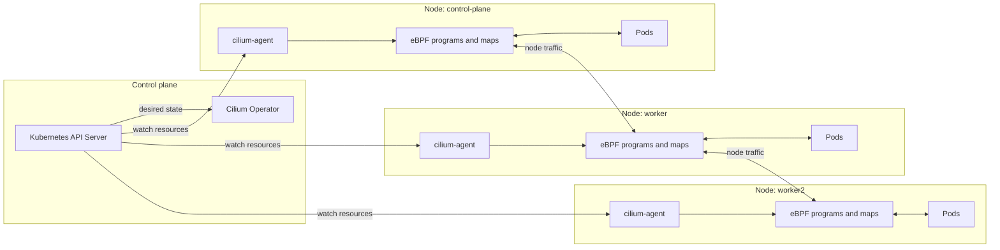

# 00 - Kind Cilium Foundation

This lab creates the baseline architecture used by the following modules: a local Kind cluster with Cilium as the CNI, kube-proxy disabled, and Cilium responsible for pod networking and service load balancing.

## Learning Goals

By the end of this lab, students should be able to explain:

- Why a Kubernetes cluster needs a CNI before Pods can communicate.
- What changes when kube-proxy is disabled.
- Which Cilium components are node-local and which are cluster-wide.
- Why the datapath is on every node instead of inside the Kubernetes API server.

This is the foundation for the rest of the architecture track. Later labs add policy, routing, observability, Gateway API, service mesh, egress, and Cluster Mesh, but they all depend on the same base idea: Cilium watches Kubernetes state and turns it into node-local datapath behavior.

## Architecture

Cilium runs one agent per node as a DaemonSet. The agent loads eBPF programs into the Linux kernel, manages endpoint identity, programs service load-balancing maps, and configures policy. The Cilium operator handles cluster-level tasks such as identity garbage collection and resource coordination. In later labs, Envoy is added for L7 processing and Gateway API.



Use this diagram to explain the control plane versus datapath split:

- The Kubernetes API stores desired state.
- The Cilium operator handles cluster-wide maintenance.
- Each node-local `cilium-agent` translates Kubernetes state into local eBPF state.
- Packets do not go through the operator. Packets hit eBPF programs on the node.

Read the diagram from left to right. The API server and operator are the control-plane side of the architecture. They coordinate what should exist. The agents and eBPF programs are the node-level implementation. They handle the actual traffic path. This distinction is important for troubleshooting: a healthy Kubernetes object does not automatically mean the node datapath is healthy, and a packet drop is usually investigated on the node where the packet was processed.

Other architectures you may see:

- Managed Kubernetes with Cilium installed by the cloud provider.
- Cilium in chaining mode with another CNI.
- Cilium with kube-proxy replacement disabled.
- Cilium with native routing instead of VXLAN overlay.
- Cilium with Cluster Mesh for multiple clusters.

## Step 1: Create the Kind Cluster

```bash
kind create cluster --name cilium-arch --config kind-config.yaml
```

The config disables the default Kind CNI and kube-proxy. The cluster will not have working pod networking until Cilium is installed.

Student note: this is intentional. A fresh Kind cluster normally installs simple networking for you. In this lab, that default is removed so it is obvious that Cilium is providing the networking layer. If Pods are not healthy before Cilium is installed, that does not mean the lab is broken; it means the cluster is waiting for its CNI.

## Step 2: Install Cilium

```bash
cilium install \
  --version 1.19.5 \
  --set kubeProxyReplacement=true \
  --set routingMode=tunnel \
  --set tunnelProtocol=vxlan
```

Wait for Cilium:

```bash
cilium status --wait
```

What this install means:

- `kubeProxyReplacement=true` tells Cilium to implement Kubernetes Service handling instead of relying on kube-proxy.
- `routingMode=tunnel` tells Cilium to encapsulate cross-node pod traffic.
- `tunnelProtocol=vxlan` chooses VXLAN as the overlay protocol, which works well in local Kind environments.

## Step 3: Validate Cluster Networking

```bash
kubectl get nodes -o wide
kubectl -n kube-system get pods -l k8s-app=cilium -o wide
cilium connectivity test --test '!no-unexpected-packet-drops'
```

Expected result:

- All nodes are `Ready`.
- One Cilium agent runs on each node.
- Connectivity tests pass.

If this step fails, check the problem in layers. First confirm that the nodes exist. Then confirm that Cilium Pods are running. Then inspect `cilium status`. Finally run connectivity tests. This order mirrors the architecture: Kubernetes node state, Cilium control plane, then datapath behavior.

## Step 4: Inspect the Architecture

```bash
kubectl -n kube-system get ds cilium
kubectl -n kube-system get deploy cilium-operator
kubectl -n kube-system exec ds/cilium -- cilium status
kubectl -n kube-system exec ds/cilium -- cilium bpf map list
```

Important components:

- `cilium-agent`: node-local datapath and policy controller.
- `cilium-operator`: cluster-level controller.
- eBPF maps: kernel-resident state for services, endpoints, identities, and policy.
- Cilium CRDs: Kubernetes API objects for Cilium-specific policy and networking.

## Student Checkpoint

Before continuing, make sure you can answer these questions:

- Which Cilium component runs on every node?
- Which component handles cluster-wide maintenance?
- Why do packets not need to travel through the Kubernetes API server?
- Why is kube-proxy not required in this cluster?

The key understanding is that Kubernetes stores desired state, while Cilium programs the Linux kernel on each node so traffic follows that desired state.

## Cleanup

```bash
kind delete cluster --name cilium-arch
```
