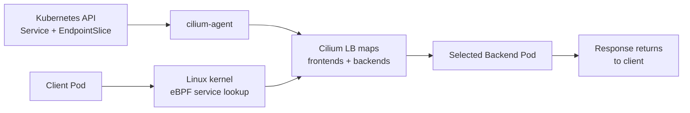

# 01 - eBPF Datapath and Kube-Proxy Replacement

This lab shows how Cilium replaces kube-proxy with eBPF service load balancing.

## Learning Goals

By the end of this lab, students should be able to explain:

- What kube-proxy normally does for Kubernetes Services.
- How Cilium implements the same Service abstraction with eBPF.
- Why Services still exist even when kube-proxy is not running.
- How to inspect Cilium's view of Service frontends and backends.

## Architecture

In a traditional Kubernetes cluster, kube-proxy watches Services and writes iptables or IPVS rules. With Cilium kube-proxy replacement, Cilium watches the same Kubernetes Service and EndpointSlice objects, then writes service state into eBPF maps. Packets and sockets are translated by eBPF programs instead of iptables chains.

This matters because Cilium can make service decisions earlier, avoid large iptables rule sets, and share service state with policy, observability, and L7 proxy features.



Teaching point: kube-proxy replacement does not mean Services disappear. Services still exist in Kubernetes. The difference is that Cilium implements their datapath behavior with eBPF maps and programs instead of kube-proxy's iptables or IPVS rules.

Think of a Service as the stable contract and eBPF as the implementation. The application still connects to a DNS name or ClusterIP. Kubernetes still stores the Service and EndpointSlice objects. Cilium changes how traffic is translated from the Service frontend to a backend Pod.

Other datapath options:

- Partial kube-proxy replacement for selected features.
- Strict kube-proxy replacement, used here.
- XDP acceleration on supported NICs.
- Host firewall and bandwidth management eBPF programs.

## Step 1: Create the Cluster

```bash
kind create cluster --name cilium-arch --config kind-config.yaml
```

## Step 2: Install Cilium

```bash
cilium install \
  --version 1.19.5 \
  --set kubeProxyReplacement=true \
  --set routingMode=tunnel \
  --set tunnelProtocol=vxlan
```

```bash
cilium status --wait
```

Verify kube-proxy is absent:

```bash
kubectl -n kube-system get ds kube-proxy
```

Expected result: Kubernetes reports that the `kube-proxy` DaemonSet is not found.

This is an important proof point. If kube-proxy is absent and Services still work later in the lab, then some other component must be implementing Service translation. That component is Cilium.

## Step 3: Deploy a Service

```bash
kubectl apply -f manifests/demo.yaml
kubectl wait --for=condition=Available deployment/echo --timeout=120s
kubectl wait --for=condition=Ready pod/client --timeout=120s
```

Open `manifests/demo.yaml` while studying this step. The important objects are:

- A backend Deployment that creates multiple echo Pods.
- A ClusterIP Service that gives those Pods one stable name.
- A client Pod that generates traffic from inside the cluster.

The Service is the architecture object being tested. The Deployment only gives the Service something to route to.

## Step 4: Test Service Load Balancing

```bash
kubectl exec client -- sh -c 'for i in 1 2 3 4 5; do curl -s http://echo.default.svc.cluster.local/headers | jq -r .hostname; done'
```

Expected result: requests succeed and may return different backend pod hostnames.

If the hostname changes between requests, you are seeing load balancing across backend Pods. If it does not change, the test can still be valid because load balancing is not guaranteed to pick a different backend on every request. The important result is that the client can reach the Service even without kube-proxy.

## Step 5: Inspect Cilium Service State

```bash
kubectl -n kube-system exec ds/cilium -- cilium service list
kubectl -n kube-system exec ds/cilium -- cilium bpf lb list
```

What happened:

- Kubernetes created a ClusterIP Service.
- Cilium observed the Service and endpoints.
- Cilium wrote frontend and backend entries into eBPF load-balancing maps.
- Client traffic to the ClusterIP was translated by the Cilium datapath.

## Student Checkpoint

Before moving on, connect each layer:

- Kubernetes layer: `Service`, `EndpointSlice`, and Pods.
- Cilium control-plane layer: `cilium-agent` watches those objects.
- Datapath layer: eBPF load-balancing maps select the backend.

This pattern repeats throughout the course. Kubernetes expresses intent, Cilium watches that intent, and the node datapath enforces it.

## Cleanup

```bash
kubectl delete -f manifests/demo.yaml
kind delete cluster --name cilium-arch
```
