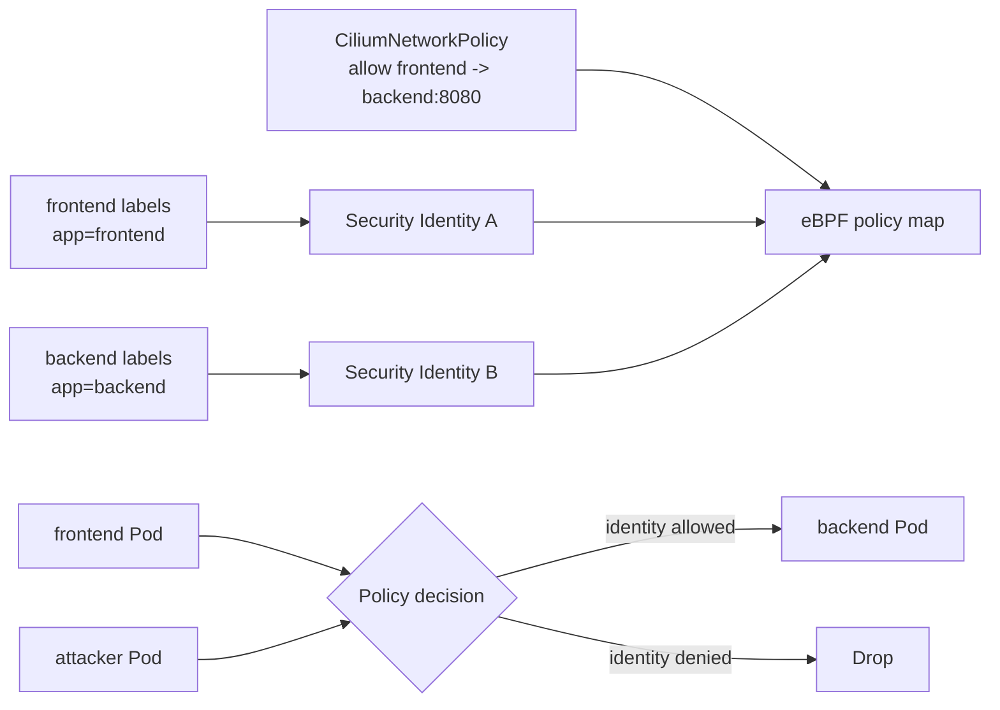

# 02 - Identity and Network Policy Architecture

This lab explains how Cilium turns Kubernetes labels into security identities and uses those identities for policy enforcement.

## Learning Goals

By the end of this lab, students should be able to explain:

- Why Cilium policy is based on identity instead of only Pod IP addresses.
- How labels become numeric security identities.
- The difference between L3/L4 policy and L7 HTTP policy.
- Why L7 policy requires proxy processing.

## Architecture

Cilium does not enforce policy by constantly matching pod IP addresses. It allocates numeric security identities from endpoint labels. eBPF policy maps then use those identities to decide whether traffic is allowed. This makes policy resilient when pods are recreated with new IP addresses.



Explain it this way: labels are human-readable intent, identities are the compact datapath representation, and eBPF maps are where the node makes fast allow/drop decisions.

This is one of the most important Cilium concepts. Pod IPs are temporary. Labels describe what a workload is. Cilium takes selected labels, assigns an identity, and then uses that identity in datapath decisions. When a Pod is replaced and receives a new IP, it can keep the same security meaning if its labels are the same.

Policy layers you may see:

- Kubernetes `NetworkPolicy` for portable L3/L4 policy.
- `CiliumNetworkPolicy` for Cilium-specific L3/L4/L7 policy.
- `CiliumClusterwideNetworkPolicy` for cluster-scoped rules.
- DNS-aware egress policy.
- HTTP, Kafka, and other L7 rules through Envoy.

## Step 1: Create the Cluster

```bash
kind create cluster --name cilium-arch --config kind-config.yaml
cilium install --version 1.19.5 --set kubeProxyReplacement=true
cilium status --wait
```

## Step 2: Deploy Workloads

```bash
kubectl apply -f manifests/apps.yaml
kubectl wait --for=condition=Available deployment/frontend --timeout=120s
kubectl wait --for=condition=Available deployment/attacker --timeout=120s
kubectl wait --for=condition=Available deployment/backend --timeout=120s
```

Get pod names:

```bash
FRONTEND=$(kubectl get pod -l app=frontend -o jsonpath='{.items[0].metadata.name}')
ATTACKER=$(kubectl get pod -l app=attacker -o jsonpath='{.items[0].metadata.name}')
```

Both clients can reach the backend before policy:

```bash
kubectl exec "$FRONTEND" -- curl -sS http://backend/healthz
kubectl exec "$ATTACKER" -- curl -sS http://backend/healthz
```

This baseline matters. Before policy exists, both clients can reach the backend. That proves the application and Service are working. When traffic is denied later, you can attribute the change to policy instead of a broken Deployment or Service.

## Step 3: Apply L3/L4 Policy

```bash
kubectl apply -f manifests/l3-l4-policy.yaml
```

Verify allowed frontend traffic:

```bash
kubectl exec "$FRONTEND" -- curl -sS --max-time 3 http://backend/healthz
```

Verify denied attacker traffic:

```bash
kubectl exec "$ATTACKER" -- curl -sS --max-time 3 http://backend/healthz
```

Expected result: frontend succeeds, attacker times out or is denied.

What changed: the backend became policy-selected. Once a workload is selected by Cilium policy, traffic must match an allow rule. The frontend matches the allowed identity and port. The attacker does not.

## Step 4: Inspect Identities

```bash
kubectl -n kube-system exec ds/cilium -- cilium endpoint list
kubectl -n kube-system exec ds/cilium -- cilium identity list
```

Notice that policy uses labels such as `app=frontend` and `app=backend`, but the datapath enforces using numeric identities.

When reading the output, look for the bridge between friendly names and datapath state. `cilium endpoint list` shows endpoints and labels. `cilium identity list` shows the numeric identities. The policy rule was written with selectors, but the fast path needs compact identity values.

## Step 5: Add L7 HTTP Policy

```bash
kubectl apply -f manifests/l7-policy.yaml
```

Allowed path:

```bash
kubectl exec "$FRONTEND" -- curl -sS -o /dev/null -w '%{http_code}\n' http://backend/healthz
```

Denied path:

```bash
kubectl exec "$FRONTEND" -- curl -sS -o /dev/null -w '%{http_code}\n' http://backend/headers
```

Expected result: `/healthz` is allowed and `/headers` is denied by the L7 proxy.

L7 policy adds a new enforcement layer. L3/L4 policy can decide based on identity, IP, port, and protocol. HTTP path decisions require understanding the HTTP request, so Cilium redirects selected traffic through Envoy. The datapath still matters, but Envoy performs the HTTP-aware part of the decision.

## Student Checkpoint

Make sure you can explain these three policy levels:

- L3: which source and destination identities may communicate.
- L4: which ports and protocols are allowed.
- L7: which application requests, such as HTTP paths or methods, are allowed.

The key architecture idea is that Cilium uses the cheapest enforcement layer that can answer the question. Identity and port decisions can happen in eBPF. HTTP decisions need L7 proxy awareness.

## Cleanup

```bash
kubectl delete -f manifests/l7-policy.yaml --ignore-not-found
kubectl delete -f manifests/l3-l4-policy.yaml --ignore-not-found
kubectl delete -f manifests/apps.yaml
kind delete cluster --name cilium-arch
```
