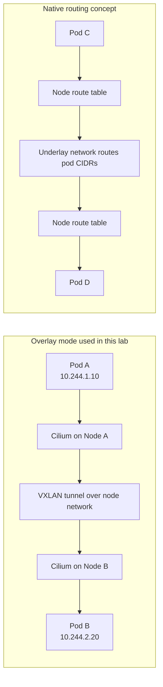

# 03 - Routing Architectures: Overlay vs Native

This lab uses VXLAN overlay routing because it works reliably on local Kind. It also explains native-routing designs that are common in cloud and bare-metal clusters.

## Learning Goals

By the end of this lab, students should be able to explain:

- Why Cilium needs a routing model for pod-to-pod traffic across nodes.
- How VXLAN overlay routing differs from native routing.
- Why Kind is a good fit for overlay mode.
- What operational tradeoffs exist between portability and underlay integration.

## Architecture

Cilium can move pod traffic in different ways:

- VXLAN or Geneve overlay: pod packets are encapsulated between nodes. This is portable and works well in Kind.
- Native routing: pod CIDRs are routed directly by the underlying network. This avoids encapsulation but requires the network to know pod routes.
- Cloud ENI/IPAM modes: pods receive IPs from cloud VPC address space.
- BGP control plane: Cilium advertises pod or service routes to routers.

Kind runs nodes as containers on a Docker network, so overlay mode is the right local teaching architecture.



Use the two halves of the diagram to compare operational tradeoffs:

- Overlay mode hides pod CIDRs from the underlay and is easy to run locally.
- Native routing removes encapsulation but requires the network to route pod CIDRs.

The routing question is simple: when a Pod on one node sends traffic to a Pod on another node, how does the packet get there? Overlay mode wraps the original pod packet inside a node-to-node packet. Native routing sends the pod packet directly through a network that already understands pod CIDRs.

## Step 1: Create the Cluster

```bash
kind create cluster --name cilium-arch --config kind-config.yaml
```

## Step 2: Install Cilium in VXLAN Overlay Mode

```bash
cilium install \
  --version 1.19.5 \
  --set kubeProxyReplacement=true \
  --set routingMode=tunnel \
  --set tunnelProtocol=vxlan
```

```bash
cilium status --wait
```

## Step 3: Inspect Routing Configuration

```bash
cilium config view | grep -E 'routing|tunnel|kube-proxy'
kubectl -n kube-system exec ds/cilium -- cilium status --verbose
```

Expected result: Cilium reports tunnel routing with VXLAN.

This output tells you which architecture the cluster is using. Do not treat routing mode as an installation detail only. It affects packet captures, MTU planning, cloud routing requirements, firewall rules, and troubleshooting.

## Step 4: Deploy Cross-Node Traffic

```bash
kubectl apply -f manifests/demo.yaml
kubectl wait --for=condition=Available deployment/node-spread-echo --timeout=120s
kubectl wait --for=condition=Ready pod/route-client --timeout=120s
kubectl get pods -o wide
```

Generate traffic:

```bash
kubectl exec route-client -- sh -c 'for i in 1 2 3 4 5; do curl -s http://node-spread-echo/headers | jq -r .hostname; done'
```

The demo spreads backend Pods across nodes so some requests are likely to cross a node boundary. Cross-node traffic is what makes the routing architecture visible. Same-node traffic would not prove how Cilium handles node-to-node pod networking.

## Step 5: Inspect Node Routes and Devices

```bash
kubectl -n kube-system exec ds/cilium -- ip route
kubectl -n kube-system exec ds/cilium -- ip link show cilium_vxlan
```

What happened:

- Pods kept their pod IP addresses.
- Traffic crossing nodes was encapsulated over the node network.
- The underlay only needed to route node-to-node traffic.

When you inspect `cilium_vxlan`, you are looking at the local tunnel device Cilium uses for overlay traffic. The underlay sees node container IPs, not every individual Pod IP.

## Native Routing Discussion

In native routing, Cilium does not encapsulate pod traffic. The underlay routes pod CIDRs directly. This is useful when:

- The network team controls pod CIDR routes.
- Cloud route tables can route pod ranges.
- You want lower overhead and simpler packet captures.

Native routing requires more infrastructure integration than overlay mode, so it is not the default for local Kind labs.

## Student Checkpoint

Use this comparison when reviewing architecture choices:

- Overlay: easier to deploy because the network only needs node reachability.
- Native routing: less encapsulation overhead, but the network must know pod routes.
- Cloud IPAM or ENI mode: integrates pod addressing with cloud networking.
- BGP: advertises routes dynamically to external routers.

There is no single best routing mode for every environment. The right choice depends on who controls the network, what IP ranges are available, and how much operational complexity the platform team can own.

## Cleanup

```bash
kubectl delete -f manifests/demo.yaml
kind delete cluster --name cilium-arch
```
