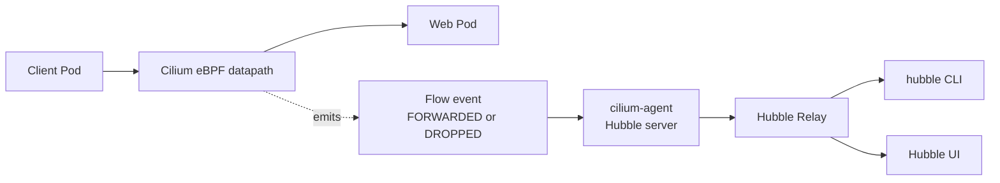

# 04 - Observability with Hubble

This lab enables Hubble and uses it to observe forwarded and dropped flows.

## Learning Goals

By the end of this lab, students should be able to explain:

- What Hubble adds on top of Cilium's datapath.
- How flow events help troubleshoot connectivity.
- The difference between a forwarded flow and a dropped flow.
- How to filter observations by pod, verdict, protocol, and drop type.

## Architecture

Hubble is Cilium's flow observability layer. Cilium agents observe datapath events and expose flow data. Hubble Relay aggregates flow streams from agents. The Hubble CLI and UI consume Relay to help operators debug connectivity, policy decisions, DNS, HTTP metadata, and drops.



When teaching troubleshooting, start from the symptom and walk backward:

- Did the flow exist?
- Was the verdict `FORWARDED` or `DROPPED`?
- Which identity, namespace, pod, DNS name, or HTTP path was involved?
- Did policy, DNS, service translation, or routing cause the problem?

This is a different way of debugging than only reading application logs. Application logs usually show what the application received. Hubble shows what happened in the network before or after the application was involved. That makes it useful when a request never reaches the server, when DNS resolution fails, or when policy drops traffic.

Other observability patterns:

- Hubble UI for visual exploration.
- Hubble CLI for live debugging.
- Flow export to observability backends.
- Metrics scraping through Prometheus.

## Step 1: Create the Cluster and Install Cilium

```bash
kind create cluster --name cilium-arch --config kind-config.yaml
cilium install --version 1.19.5 --set kubeProxyReplacement=true
cilium status --wait
```

## Step 2: Enable Hubble

```bash
cilium hubble enable --ui
cilium status --wait
hubble status
```

If `hubble status` cannot connect, run:

```bash
cilium hubble port-forward
```

Keep the port-forward running in another terminal.

Hubble has two parts to keep in mind. The Cilium agents produce local flow data. Hubble Relay provides a single API that clients can query. The CLI needs to reach Relay, so a port-forward may be required in local Kind labs.

## Step 3: Deploy Demo Traffic

```bash
kubectl apply -f manifests/demo.yaml
kubectl wait --for=condition=Available deployment/web --timeout=120s
kubectl wait --for=condition=Ready pod/observer --timeout=120s
```

Generate allowed traffic:

```bash
kubectl exec observer -- curl -sS http://web/headers
```

Observe it:

```bash
hubble observe --from-pod default/observer --to-pod default/$(kubectl get pod -l app=web -o jsonpath='{.items[0].metadata.name}') --last 10
```

Read the Hubble output as a timeline. The important fields are source, destination, protocol, verdict, and any L7 details. A `FORWARDED` verdict means Cilium allowed the flow through the datapath.

## Step 4: Create a Policy Drop

```bash
kubectl apply -f manifests/deny-web.yaml
kubectl exec observer -- curl -sS --max-time 3 http://web/headers
```

Observe denied flows:

```bash
hubble observe --verdict DROPPED --last 20
```

Expected result: Hubble shows drops caused by policy.

This is the main troubleshooting pattern. The user sees a timeout. Hubble shows a dropped flow. The drop reason points you toward policy instead of DNS, routing, or the application process.

## Step 5: Filter by Protocol

```bash
hubble observe --protocol http --last 20
hubble observe --type drop --last 20
```

What happened:

- Cilium made datapath decisions.
- Hubble exposed those decisions as flows.
- Policy drops were visible without packet captures.

## Student Checkpoint

Before moving on, practice answering these questions from Hubble output:

- Which workload initiated the connection?
- Which workload or service was the destination?
- Was the traffic forwarded or dropped?
- If dropped, was the drop caused by policy or another datapath reason?
- Is the flow L3/L4 only, or does it include DNS or HTTP details?

The key architecture idea is that observability is connected to the datapath. Hubble does not replace packet captures for every situation, but it gives Kubernetes-aware context that raw packets do not provide.

## Cleanup

```bash
kubectl delete -f manifests/deny-web.yaml --ignore-not-found
kubectl delete -f manifests/demo.yaml
kind delete cluster --name cilium-arch
```
