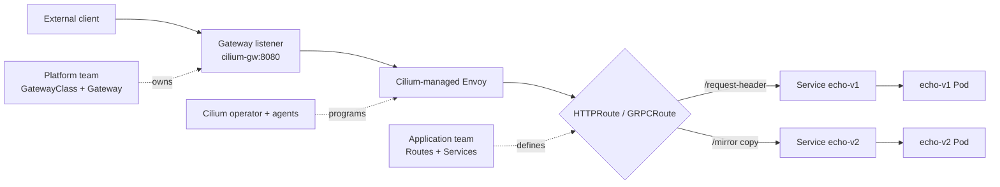
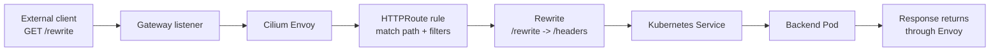

# 05 - Gateway API North-South Architecture

This lab teaches Cilium as a Gateway API controller for traffic entering the cluster.

## Learning Goals

By the end of this lab, students should be able to explain:

- How Gateway API models traffic entering a cluster.
- The responsibility split between `GatewayClass`, `Gateway`, and `HTTPRoute`.
- How Cilium programs Envoy from Gateway API resources.
- How listener attachment rules control which namespaces can use a shared Gateway.

## Architecture

Cilium watches Gateway API resources and programs Envoy listeners and routes. External traffic reaches a Gateway, Cilium's Envoy proxy evaluates HTTPRoute or GRPCRoute rules, and traffic is forwarded to Kubernetes Services. eBPF still handles service translation and policy under the proxy layer.



Gateway API separates responsibilities:

- Platform team owns `GatewayClass` and `Gateway`.
- Application teams own `HTTPRoute`, `GRPCRoute`, and backend Services.
- Namespace attachment is controlled by listener `allowedRoutes`.

This split is the main reason Gateway API is more expressive than the older Ingress model. Platform teams can provide shared entry points with clear policy boundaries, while application teams attach routes without owning the whole ingress infrastructure.

Other north-south architectures:

- Kubernetes Ingress with a Cilium ingress controller.
- Gateway API with dedicated LoadBalancer IPs.
- Shared gateways across namespaces.
- TLS termination, passthrough, and certificate automation.
- gRPC routes for protocol-aware service entry.

## Request Flow



Read the flow in two phases. First, the Gateway listener accepts traffic from outside the cluster. Second, Envoy evaluates route rules and sends the request to a Kubernetes Service. Cilium still uses its datapath for backend connectivity, but HTTP matching, rewriting, mirroring, and redirects are Envoy responsibilities.

## Step 1: Create the Cluster

```bash
kind create cluster --name cilium-arch --config kind-config.yaml
```

## Step 2: Install Cilium with Gateway API

Install the Gateway API CRDs before installing Cilium. Cilium 1.19 supports Gateway API v1.4.1.

```bash
kubectl apply -f https://raw.githubusercontent.com/kubernetes-sigs/gateway-api/v1.4.1/config/crd/standard/gateway.networking.k8s.io_gatewayclasses.yaml
kubectl apply -f https://raw.githubusercontent.com/kubernetes-sigs/gateway-api/v1.4.1/config/crd/standard/gateway.networking.k8s.io_gateways.yaml
kubectl apply -f https://raw.githubusercontent.com/kubernetes-sigs/gateway-api/v1.4.1/config/crd/standard/gateway.networking.k8s.io_httproutes.yaml
kubectl apply -f https://raw.githubusercontent.com/kubernetes-sigs/gateway-api/v1.4.1/config/crd/standard/gateway.networking.k8s.io_referencegrants.yaml
kubectl apply -f https://raw.githubusercontent.com/kubernetes-sigs/gateway-api/v1.4.1/config/crd/standard/gateway.networking.k8s.io_grpcroutes.yaml
```

```bash
cilium install \
  --version 1.19.5 \
  --set kubeProxyReplacement=true \
  --set gatewayAPI.enabled=true \
  --set gatewayAPI.hostNetwork.enabled=true \
  --set envoy.enabled=true
```

```bash
cilium status --wait
```

Verify Gateway API resources:

```bash
kubectl get gatewayclass
```

Expected result: a `cilium` GatewayClass exists.

The CRDs define the API types. The Cilium installation provides the controller implementation. Both are required. If the CRDs are missing, Kubernetes cannot store Gateway API objects. If Cilium is not installed with Gateway API support, the objects can exist but will not become a working datapath.

## Step 3: Deploy Gateway and Backends

```bash
kubectl apply -f manifests/gateway-demo.yaml
kubectl apply -f manifests/routes.yaml
kubectl wait --for=condition=Available deployment/echo-v1 --timeout=120s
kubectl wait --for=condition=Available deployment/echo-v2 --timeout=120s
kubectl wait --for=condition=Accepted gateway/cilium-gw --timeout=120s
```

The Kind config maps host port `8080` to the control-plane container port `8080`. The Gateway listener also uses port `8080`, so Docker-backed Kind normally exposes the Gateway at `http://localhost:8080`.

If you use Podman-backed Kind and host port publishing is not available from your shell, run the same curl checks from inside the control-plane node:

```bash
podman exec cilium-arch-control-plane curl -s http://127.0.0.1:8080/request-header
```

At this point, inspect the objects before testing traffic:

```bash
kubectl get gateway cilium-gw -o wide
kubectl get httproute
kubectl describe gateway cilium-gw
```

Look for `Accepted=True` and programmed listener status. Gateway API conditions are part of the architecture because they show whether the controller accepted the desired configuration.

## Step 4: Test Route Filters

Request header modification:

```bash
curl -s http://localhost:8080/request-header | jq '.request.headers."x-cilium-student"'
```

Podman-backed Kind equivalent:

```bash
podman exec cilium-arch-control-plane curl -s http://127.0.0.1:8080/request-header | jq '.request.headers."x-cilium-student"'
```

Response header modification:

```bash
curl -sI http://localhost:8080/response-header | grep -i x-cilium-response
```

URL rewrite:

```bash
curl -s http://localhost:8080/rewrite | jq '.path'
```

Redirect:

```bash
curl -sI http://localhost:8080/old | grep -Ei 'HTTP|location'
```

Traffic mirroring:

```bash
curl -s http://localhost:8080/mirror >/dev/null
kubectl logs deploy/echo-v1 --tail=5
kubectl logs deploy/echo-v2 --tail=5
```

Expected result: the main response comes from `echo-v1`, and mirrored traffic is visible in `echo-v2` logs.

Each route filter demonstrates that the proxy is making an HTTP-aware decision:

- Header modification changes request or response metadata.
- URL rewrite changes what the backend receives.
- Redirect returns a response directly from the gateway layer.
- Mirroring duplicates traffic to another backend without changing the client response.

## Step 5: Inspect a GRPCRoute Shape

The file `manifests/grpc-route.yaml` shows the same Gateway attachment model for gRPC. It is not applied by default because it needs a real gRPC backend named `grpc-echo`.

```bash
kubectl apply --dry-run=client -f manifests/grpc-route.yaml
```

Key point: `GRPCRoute` matches gRPC service and method names instead of HTTP paths, but the architecture is still Gateway API plus Cilium-managed Envoy.

Students should notice that the parent-child model stays consistent. A route attaches to a parent, rules match protocol-specific fields, and backend references identify where traffic should go.

## Step 6: Test Cross-Namespace Attachment

```bash
kubectl apply -f manifests/cross-namespace.yaml
kubectl wait --for=condition=Accepted gateway/shared-gateway -n infra-ns --timeout=120s
kubectl get httproute -A
```

Inspect attachment conditions:

```bash
kubectl -n careers describe httproute careers-route
kubectl -n product describe httproute product-route
kubectl -n hr describe httproute hr-route
```

Expected result:

- `careers-route` and `product-route` attach because their namespaces have `shared-gateway-access=true`.
- `hr-route` is rejected because its namespace is not allowed by the Gateway listener.

This is a platform governance example. The Gateway can be shared without allowing every namespace to attach routes. In production, this prevents accidental or unauthorized exposure through a shared listener.

## Student Checkpoint

Make sure you can map each object to its owner:

- `GatewayClass`: selects the controller, here Cilium.
- `Gateway`: defines listeners and infrastructure-level entry points.
- `HTTPRoute` or `GRPCRoute`: defines application routing rules.
- `ReferenceGrant`: allows selected cross-namespace references.
- `Service`: identifies backend endpoints.

The key architecture idea is that north-south traffic enters through a controlled gateway, then protocol-aware routing happens in Envoy before traffic reaches backend Services.

## Cleanup

```bash
kubectl delete -f manifests/cross-namespace.yaml --ignore-not-found
kubectl delete -f manifests/routes.yaml --ignore-not-found
kubectl delete -f manifests/gateway-demo.yaml --ignore-not-found
kind delete cluster --name cilium-arch
```
