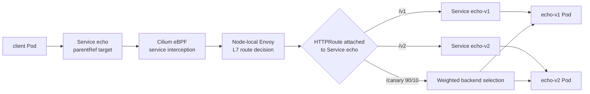
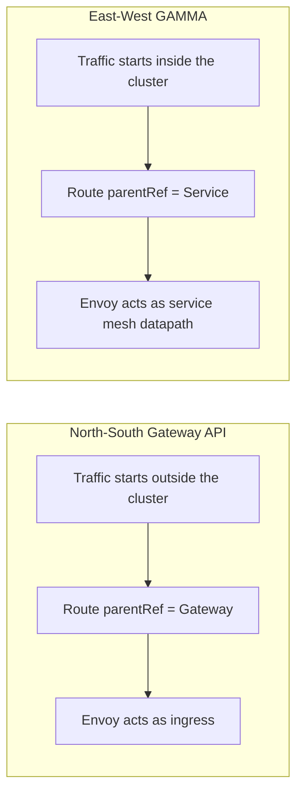

# 06 - GAMMA Service Mesh East-West Architecture

This lab teaches Gateway API for Mesh Architecture, usually called GAMMA. It uses service-attached HTTPRoutes for internal traffic without sidecar proxies.

## Learning Goals

By the end of this lab, students should be able to explain:

- How GAMMA differs from north-south Gateway API.
- Why an `HTTPRoute` can attach to a `Service`.
- How Cilium provides mesh-style L7 routing without sidecar injection.
- How path-based and weighted routing work for internal service calls.

## Architecture

North-south Gateway API routes attach to a `Gateway`. GAMMA routes attach directly to a Kubernetes `Service`. When a client calls the logical Service, Cilium can redirect the connection to Envoy for L7 routing decisions, then forward to the chosen backend.

This gives service mesh behavior without injecting a proxy into every pod.



The important distinction for students: the client still calls `http://echo`. The application does not know about Envoy and does not run a sidecar. Cilium performs the L7 steering at the node level.

This means the Service remains the application contract. Developers do not change their client URL when routing logic is added. Platform teams can introduce mesh behavior by attaching Gateway API routes to Services and enabling the Cilium features that intercept Service traffic for L7 processing.

Other east-west architectures:

- Traditional sidecar mesh.
- Ambient or node-proxy mesh designs.
- Cilium service mesh with Gateway API.
- Plain L3/L4 Cilium policy without L7 routing.

## Step 1: Create the Cluster

```bash
kind create cluster --name cilium-arch --config kind-config.yaml
```

## Step 2: Install Cilium with GAMMA Support

Install the Gateway API CRDs before installing Cilium:

```bash
kubectl apply -f https://raw.githubusercontent.com/kubernetes-sigs/gateway-api/v1.4.1/config/crd/standard/gateway.networking.k8s.io_gatewayclasses.yaml
kubectl apply -f https://raw.githubusercontent.com/kubernetes-sigs/gateway-api/v1.4.1/config/crd/standard/gateway.networking.k8s.io_gateways.yaml
kubectl apply -f https://raw.githubusercontent.com/kubernetes-sigs/gateway-api/v1.4.1/config/crd/standard/gateway.networking.k8s.io_httproutes.yaml
kubectl apply -f https://raw.githubusercontent.com/kubernetes-sigs/gateway-api/v1.4.1/config/crd/standard/gateway.networking.k8s.io_referencegrants.yaml
kubectl apply -f https://raw.githubusercontent.com/kubernetes-sigs/gateway-api/v1.4.1/config/crd/standard/gateway.networking.k8s.io_grpcroutes.yaml
```

```bash
cilium install \
  --version 1.19.5 \
  --set kubeProxyReplacement=true \
  --set gatewayAPI.enabled=true \
  --set gatewayAPI.enableAppProtocol=true \
  --set envoy.enabled=true
```

```bash
cilium status --wait
```

Two settings matter for this lab:

- `gatewayAPI.enabled=true` enables Cilium's Gateway API controller.
- `gatewayAPI.enableAppProtocol=true` allows Cilium to use the Service port `appProtocol` field to identify traffic that should receive L7 handling.

Without the `appProtocol` signal on the Service port, Cilium may treat traffic as ordinary Service load balancing instead of mesh traffic.

## Step 3: Deploy Internal Services

```bash
kubectl apply -f manifests/gamma-app.yaml
kubectl -n gamma wait --for=condition=Available deployment/echo-v1 --timeout=120s
kubectl -n gamma wait --for=condition=Available deployment/echo-v2 --timeout=120s
kubectl -n gamma wait --for=condition=Ready pod/client --timeout=120s
```

## Step 4: Apply Path-Based Service Route

```bash
kubectl apply -f manifests/path-route.yaml
kubectl -n gamma get httproute echo-path-route
```

Test:

```bash
kubectl -n gamma exec client -- sh -c 'curl -s http://echo/v1 | sed -n "s/.*\"HOSTNAME\":\"\([^\"]*\)\".*/\1/p"'
kubectl -n gamma exec client -- sh -c 'curl -s http://echo/v2 | sed -n "s/.*\"HOSTNAME\":\"\([^\"]*\)\".*/\1/p"'
```

Expected result:

- `/v1` reaches `echo-v1`.
- `/v2` reaches `echo-v2`.

The parent of the route is the logical `echo` Service. The backends are versioned Services. This lets the client use one stable name while the route decides which version receives each request.

If both paths still return a random mix of `echo-v1` and `echo-v2`, Cilium is doing normal Service load balancing and GAMMA interception is not active. Check:

```bash
cilium config view | grep enable-gateway-api-app-protocol
kubectl -n gamma get svc echo -o yaml | grep -A4 appProtocol
kubectl -n gamma describe httproute echo-path-route
```

The Cilium setting must be `true`, the Service port must have `appProtocol: http`, and the HTTPRoute parent status must show `Accepted=True` and `ResolvedRefs=True`.

Those three checks align with the architecture:

- Cilium feature enabled: the controller knows how to process the model.
- Service protocol declared: Cilium knows the traffic is HTTP.
- Route accepted: Gateway API attachment and references are valid.

## Step 5: Apply Canary Route

```bash
kubectl apply -f manifests/canary-route.yaml
```

Send sample traffic:

```bash
kubectl -n gamma exec client -- sh -c '
for i in $(seq 1 40); do
  curl -s http://echo/canary | sed -n "s/.*\"HOSTNAME\":\"\\(echo-v[12][^\"]*\\)\".*/\\1/p"
done | sort | uniq -c
'
```

Expected result: most responses come from `echo-v1`, with some from `echo-v2`.

Weighted routing is a common release pattern. A platform or application team can send a small percentage of traffic to a new version before moving all traffic. In this lab the sample size is small, so the exact count may not be perfectly 90/10, but `echo-v2` should appear less often than `echo-v1`.

## What Happened

- The route parent was a Kubernetes Service, not an edge Gateway.
- Cilium recognized that traffic to `echo` needed L7 processing.
- Envoy evaluated path and weight rules.
- The application pods did not run sidecars.

## Explain the Difference from North-South Gateway



## Student Checkpoint

Make sure you can explain this contrast:

- North-south Gateway API: route parent is a `Gateway`, traffic starts outside the cluster.
- GAMMA east-west routing: route parent is a `Service`, traffic starts inside the cluster.
- Sidecar mesh: each Pod usually has its own proxy.
- Cilium GAMMA: the node datapath redirects selected traffic to Cilium-managed Envoy.

The key architecture idea is that service mesh behavior can be implemented at the CNI and node-proxy layer instead of by modifying every workload Pod.

## Cleanup

```bash
kubectl delete -f manifests/canary-route.yaml --ignore-not-found
kubectl delete -f manifests/path-route.yaml --ignore-not-found
kubectl delete -f manifests/gamma-app.yaml
kind delete cluster --name cilium-arch
```
