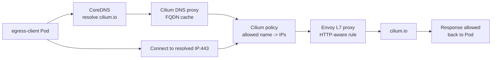

# 07 - Egress and L7 Proxy Architecture

This lab teaches Cilium egress policy with DNS-aware and HTTP-aware rules.

## Learning Goals

By the end of this lab, students should be able to explain:

- Why egress control is different from ingress control.
- How DNS-aware policy maps domain names to temporary IP knowledge.
- Why FQDN policy depends on observing DNS responses.
- When Cilium needs Envoy for HTTP-aware enforcement.

## Architecture

Egress control decides what workloads can reach outside the cluster. Cilium can combine DNS visibility, FQDN selectors, and L7 HTTP rules. DNS policy allows Cilium to learn which IPs a name resolves to. Envoy handles HTTP-aware enforcement when L7 rules are present.



Teaching point: FQDN policy is not magic string matching on every packet. DNS responses create temporary IP knowledge, and the datapath uses that knowledge for later connections.

This matters because external services often change IP addresses. Writing policy directly against a static IP can be fragile. FQDN policy lets the policy express the domain the workload is allowed to use, while Cilium tracks the current resolved IPs from DNS traffic.

Other egress architectures:

- Egress Gateway with fixed source IPs.
- NAT through cloud nodes or firewalls.
- DNS-only policy for SaaS allowlists.
- HTTP-aware policy for method/path restrictions.
- Cluster-wide default-deny egress baselines.

## Step 1: Create the Cluster

```bash
kind create cluster --name cilium-arch --config kind-config.yaml
cilium install --version 1.19.5 --set kubeProxyReplacement=true
cilium status --wait
```

## Step 2: Deploy Client

```bash
kubectl apply -f manifests/client.yaml
kubectl wait --for=condition=Ready pod/egress-client --timeout=120s
```

Before policy, external HTTPS works:

```bash
kubectl exec egress-client -- curl -sS -I https://cilium.io
```

This baseline proves that the cluster has general outbound connectivity. If this command fails before policy is applied, troubleshoot DNS, container runtime networking, or local internet access before studying policy behavior.

## Step 3: Apply DNS and HTTP Egress Policy

```bash
kubectl apply -f manifests/dns-http-egress-policy.yaml
```

Allowed:

```bash
kubectl exec egress-client -- curl -sS -I https://cilium.io
```

Denied or timed out:

```bash
kubectl exec egress-client -- curl -sS --max-time 5 -I https://example.com
```

The policy is intentionally narrow. It should allow the selected client to resolve and connect to the approved domain while denying unrelated destinations. Timeouts are common for denied egress because the connection attempt is dropped before an HTTP response exists.

## Step 4: Inspect Policy and Proxy State

```bash
kubectl -n kube-system exec ds/cilium -- cilium policy get
kubectl -n kube-system exec ds/cilium -- cilium fqdn cache list
kubectl -n kube-system exec ds/cilium -- cilium service list | grep envoy || true
```

What happened:

- The client was selected by label.
- DNS requests to CoreDNS were allowed only for Cilium domains.
- Resolved IPs were added to the FQDN cache.
- HTTPS traffic to allowed names was permitted.

## Student Checkpoint

Trace the egress decision in order:

1. The Pod sends a DNS query.
2. Cilium observes the DNS response.
3. Cilium stores allowed name-to-IP mappings in the FQDN cache.
4. The Pod connects to an external IP.
5. Cilium checks whether that IP is currently associated with an allowed name.
6. If L7 rules are present, Envoy evaluates HTTP-aware details.

The key architecture idea is that DNS policy and HTTP policy solve different problems. DNS policy decides which external names are allowed. HTTP policy can further restrict what the workload does after it reaches an allowed destination.

## Cleanup

```bash
kubectl delete -f manifests/dns-http-egress-policy.yaml --ignore-not-found
kubectl delete -f manifests/client.yaml
kind delete cluster --name cilium-arch
```
