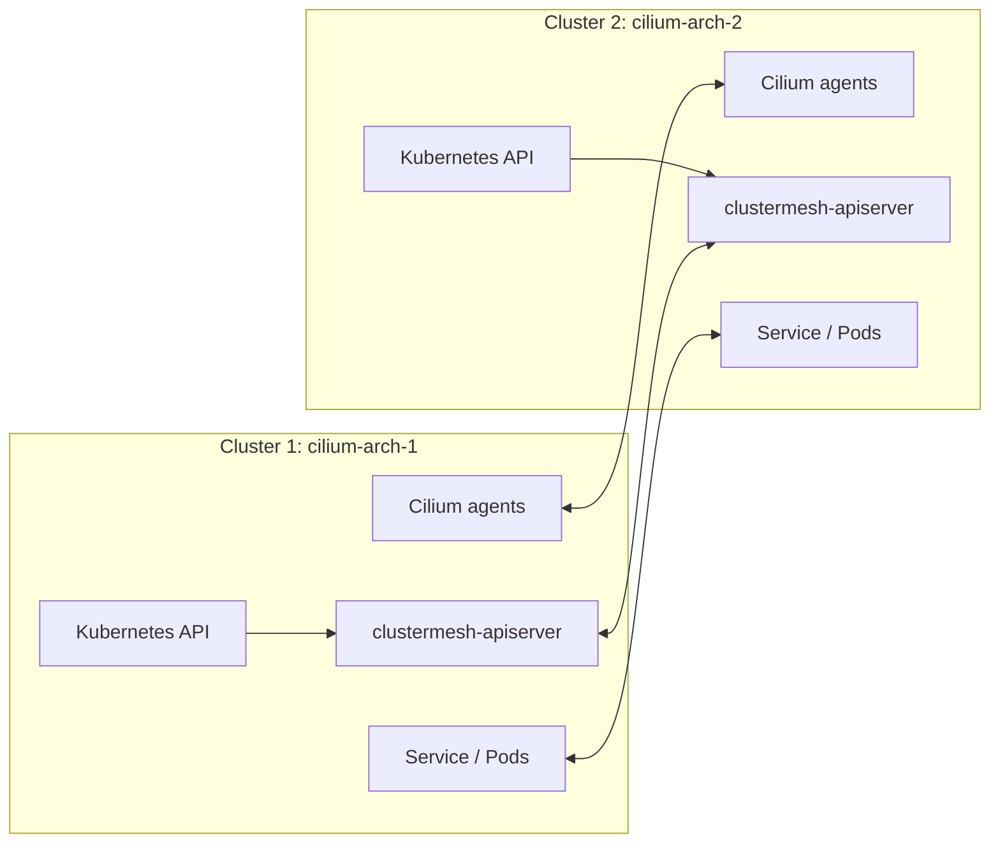

# 08 - Cluster Mesh Architecture on Kind

This lab creates two Kind clusters and joins them with Cilium Cluster Mesh.

## Learning Goals

By the end of this lab, students should be able to explain:

- Why organizations use multiple Kubernetes clusters instead of one large cluster.
- What Cluster Mesh shares between clusters.
- Why each Cilium cluster needs a unique name and ID.
- How cross-cluster service discovery differs from merging Kubernetes control planes.

## Architecture

Cluster Mesh connects multiple Kubernetes clusters while preserving Cilium identities and service discovery across cluster boundaries. Each cluster keeps its own Kubernetes API server and failure domain. Cilium's clustermesh-apiserver exposes cluster state to the other clusters.



Use this to explain failure boundaries:

- Each cluster keeps its own Kubernetes API server.
- Cluster Mesh shares selected Cilium service, endpoint, node, and identity state.
- A cluster can fail without turning the whole environment into one broken Kubernetes control plane.

Cluster Mesh is not a single stretched Kubernetes cluster. Each cluster still has its own API server, scheduler, nodes, and local workloads. Cilium creates a connectivity and discovery layer between clusters so selected services and identities can work across those boundaries.

Common uses:

- Multi-cluster service discovery.
- Global services with failover or load sharing.
- Shared identity and policy semantics across clusters.
- Region or environment isolation with selective connectivity.

Other architectures:

- One large cluster instead of multiple clusters.
- Service mesh federation.
- Cloud load-balancer based cross-cluster routing.
- Cilium Cluster Mesh with BGP or native cloud routing underneath.

## Step 1: Create Two Kind Clusters

```bash
kind create cluster --name cilium-arch-1 --config kind-config-1.yaml
kind create cluster --name cilium-arch-2 --config kind-config-2.yaml
```

## Step 2: Install Cilium with Unique Cluster Names and IDs

```bash
cilium install --context kind-cilium-arch-1 \
  --version 1.19.5 \
  --set kubeProxyReplacement=true \
  --set cluster.name=cilium-arch-1 \
  --set cluster.id=1

cilium install --context kind-cilium-arch-2 \
  --version 1.19.5 \
  --set kubeProxyReplacement=true \
  --set cluster.name=cilium-arch-2 \
  --set cluster.id=2
```

```bash
cilium status --context kind-cilium-arch-1 --wait
cilium status --context kind-cilium-arch-2 --wait
```

The cluster name and cluster ID are part of Cilium's multi-cluster identity model. They prevent two clusters from being confused with each other when endpoint, service, and identity information is exchanged.

## Step 3: Enable Cluster Mesh

```bash
cilium clustermesh enable --context kind-cilium-arch-1 --service-type NodePort
cilium clustermesh enable --context kind-cilium-arch-2 --service-type NodePort
```

```bash
cilium clustermesh status --context kind-cilium-arch-1 --wait
cilium clustermesh status --context kind-cilium-arch-2 --wait
```

Enabling Cluster Mesh deploys the components that expose Cilium state from each cluster. In this Kind lab the service type is `NodePort` because there is no cloud load balancer. In cloud environments, a LoadBalancer service or private network endpoint is more common.

## Step 4: Connect the Clusters

```bash
cilium clustermesh connect \
  --context kind-cilium-arch-1 \
  --destination-context kind-cilium-arch-2
```

Verify both sides:

```bash
cilium clustermesh status --context kind-cilium-arch-1 --wait
cilium clustermesh status --context kind-cilium-arch-2 --wait
```

The connect step exchanges access information so each cluster can read the other cluster's mesh state. If status is not healthy, check that both clusters are running, both Cilium installations are healthy, and the clustermesh API services are reachable.

## Step 5: Run Connectivity Test

```bash
cilium connectivity test \
  --context kind-cilium-arch-1 \
  --multi-cluster kind-cilium-arch-2
```

Expected result: Cilium validates cross-cluster pod and service connectivity.

The connectivity test is more than a ping. It validates that Cilium can discover remote endpoints, preserve identity context, and route traffic between clusters according to the installed architecture.

## What Happened

- Each cluster received a unique Cilium cluster ID.
- Cluster Mesh API servers were exposed through NodePorts.
- Cilium exchanged service, endpoint, and identity information.
- Connectivity remained Kubernetes-native from the student point of view.

## Student Checkpoint

Make sure you can describe the boundaries:

- Kubernetes API state remains per cluster.
- Cilium mesh state is shared between clusters.
- Identities can be understood across clusters.
- Services can be discovered or reached across cluster boundaries.
- Failure of one cluster should not require the other cluster's Kubernetes API to fail.

The key architecture idea is that Cluster Mesh connects independent clusters at the networking and service-discovery layer, while preserving separate administrative and failure domains.

## Cleanup

```bash
kind delete cluster --name cilium-arch-1
kind delete cluster --name cilium-arch-2
```
