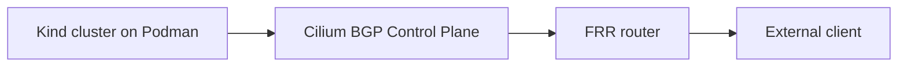
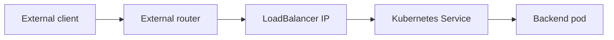
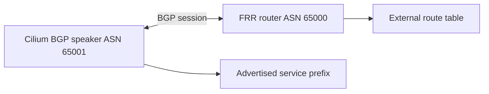

# External Networking And BGP Foundations

This lesson explains the problem Cilium BGP solves before you start applying
configuration. The goal is to understand how traffic from outside a Kubernetes
cluster finds a Service IP on a bare-metal or local cluster.

You should be able to answer two questions by the end:

- How does Kubernetes expose applications to clients outside the cluster?
- Why does a LoadBalancer IP need a route in the external network?

## Architecture



## External Networking Foundations

Kubernetes gives applications stable names and virtual IPs inside the cluster,
but clients outside the cluster do not automatically know how to reach those
IPs. External networking is the set of mechanisms that make a workload reachable
from outside the Kubernetes node network.

When a user connects to an application, the traffic usually follows this path:

1. The external client sends traffic to an IP address.
2. The external network routes that traffic toward the Kubernetes cluster.
3. Kubernetes Service load balancing selects a backend Pod.
4. The Pod sends a response back through the network.

The important detail is that Kubernetes can create a Service object, but the
network outside the cluster still needs to know where the Service IP lives.

## Step 1: Understand Kubernetes Service Types

- `ClusterIP`: Creates an internal virtual IP for other Pods and Services.
  This is the default Service type. It is not reachable directly from outside
  the cluster.
- `NodePort`: Opens the same port on every Kubernetes node. External clients
  can connect to `nodeIP:nodePort`, but the client still needs to know which
  node IPs are reachable.
- `LoadBalancer`: Requests an externally reachable IP from the infrastructure.
  In cloud environments, the cloud provider usually creates a real load
  balancer and points it at the cluster.
- Gateway or Ingress: Provides Layer 7 HTTP or HTTPS routing. These resources
  still need an underlying way to receive traffic from outside the cluster.

## Step 2: Understand The Bare-Metal Gap

In a cloud Kubernetes cluster, a `LoadBalancer` Service usually triggers cloud
infrastructure. The cloud provider allocates an external IP, programs a load
balancer, and updates the Service status.

On local, lab, or bare-metal clusters, there may be no cloud provider waiting to
do that work. If you create a `LoadBalancer` Service without another component,
the Service may stay in a pending state or receive an IP that the outside
network cannot reach.

Cilium can help in two separate ways:

1. It can allocate LoadBalancer IPs from a configured pool.
2. It can advertise those IPs to routers with BGP.

These are related, but they are not the same thing. Allocating an IP gives the
Service an address. Advertising the IP tells the external network how to reach
that address.

## Step 3: Separate IP Allocation From Routing

Think of a LoadBalancer IP as a destination and BGP as the way the external
network learns directions to that destination.

If Cilium allocates `172.19.100.10` to a Service, Kubernetes now has a Service
IP. But an external client does not read the Kubernetes API. It only uses its
normal network route table. Unless a router learns a route for
`172.19.100.10`, the client does not know where to send packets for that IP.

That is why the lab uses an external router. Cilium announces the Service IP to
the router, and the router installs a route. After that, clients that use the
router can send traffic toward the cluster.

## Step 4: Follow The Packet Flow



At a high level:

1. The client sends traffic to the LoadBalancer IP.
2. The router has learned that the LoadBalancer IP is reachable through the
   cluster.
3. Traffic arrives at the cluster node where Cilium is running.
4. Cilium and Kubernetes Service handling forward the traffic to a backend Pod.
5. The response returns to the client.

## Student Check

Explain this in your own words:

- Why is a `ClusterIP` not enough for an external client?
- What does a `LoadBalancer` Service add?
- Why is allocating a LoadBalancer IP still not enough on bare metal?
- What must the external router learn before clients can reach the Service?

## Exam Notes

- Cilium BGP Control Plane advertises routes.
- BGP does not create Pods, Services, or application endpoints.
- BGP does not replace every router function in the network.
- For the exam, keep the responsibility clear: Kubernetes defines the Service,
  Cilium can allocate and advertise the Service IP, and the external router uses
  the advertisement to route traffic.

## BGP Foundations

Border Gateway Protocol, or BGP, is a routing protocol. Routers use it to tell
each other which IP prefixes they can reach. In this lesson, Cilium behaves like
a BGP speaker and advertises Service IPs to an external router.

BGP is not used to forward the application traffic itself. It is used to teach
the network a route. After the route is installed, normal IP forwarding carries
the actual client traffic.

You do not need to become a full network engineer for this lab. Focus on the
small set of BGP terms that explain how a route for a Kubernetes Service reaches
the external network.

## Architecture



## Step 1: Understand What BGP Does

BGP answers this network question:

```text
Which router knows how to reach this IP prefix?
```

For this lesson, the IP prefix is usually a LoadBalancer Service IP, such as
`172.19.100.10/32`. Cilium tells FRR that the Service IP is reachable through
the Kubernetes cluster. FRR can then use that information when forwarding
traffic from external clients.

A simple way to think about it:

- Kubernetes creates the Service.
- Cilium assigns or uses a LoadBalancer IP for the Service.
- Cilium advertises that IP as a BGP route.
- FRR learns the route.
- External clients can reach the Service through the routed network.

## Step 2: Why BGP Instead Of ARP

ARP and BGP solve different problems.

ARP, or Address Resolution Protocol, works on a local Layer 2 network. It asks:

```text
Who has this IP address on this local network segment?
```

The answer is a MAC address. ARP is useful when the client and the destination
are on the same broadcast domain, such as the same VLAN or local subnet. It does
not teach routers in other networks how to reach a prefix. ARP messages are not
routed across Layer 3 boundaries.

BGP works at Layer 3 between routing systems. It asks:

```text
Which network path should be used to reach this IP prefix?
```

The answer is a route. This makes BGP a better fit when the Kubernetes
LoadBalancer IPs should be reachable from outside the local node subnet, across
routers, or across a larger data center network.

In short:

- ARP maps an IP address to a MAC address on the local network.
- BGP advertises IP prefixes between routers.
- ARP is local to a broadcast domain.
- BGP is designed for routed networks.
- Cilium BGP is useful when external routers need to learn where Kubernetes
  Service IPs are.

Some bare-metal load balancer solutions use ARP or Layer 2 announcements. That
can work when clients and nodes are on the same Layer 2 network. BGP is more
explicit and scalable for routed environments because the router learns real
routes instead of relying on local neighbor discovery.

## Step 3: What BGP Requires

For BGP to work, both sides need enough configuration and network reachability
to form a peering session.

At minimum, the lab needs:

- A BGP speaker on the Kubernetes side. In this lesson, that is Cilium.
- A BGP peer on the network side. In this lesson, that is FRR.
- An ASN for each side. The lab uses private ASNs `65001` and `65000`.
- IP reachability between the BGP speakers. Cilium must be able to connect to
  FRR, and FRR must be able to reply.
- Matching peer configuration. Each side must know the other side's peer IP and
  ASN.
- A LoadBalancer IP pool. Cilium needs Service IPs that it can advertise.
- A policy or advertisement configuration that tells Cilium which Service IPs to
  announce.
- Router acceptance of the route. FRR must accept the advertised prefix and add
  it to its routing table.
- Client routing through the router. External clients must use a path that can
  reach the router that learned the route.

If any of these pieces are missing, the Service may exist and the IP may be
allocated, but external traffic can still fail.

## Step 4: Learn The Terms

- ASN: Autonomous System Number. This identifies a routing domain. In the lab,
  Cilium and FRR use different private ASNs so they can form an external BGP
  session.
- BGP speaker: A system that can send or receive BGP route information. Cilium
  is a BGP speaker in this lab.
- Peer: Another BGP speaker that this speaker connects to. Cilium peers with
  FRR.
- Prefix: The destination being announced, such as `172.19.100.10/32`. A `/32`
  means one exact IPv4 address.
- Next hop: The next network location packets should be sent to in order to
  reach the prefix.
- Advertisement: A BGP message that announces a reachable prefix to a peer.
- FRR: Free Range Routing, the routing software used as the external router in
  the lab.

## Step 5: Map Terms To The Lab

```text
Cilium ASN: 65001
FRR ASN:    65000
FRR IP:     172.18.0.254
LB pool:    172.19.100.10-172.19.100.250
```

In this mapping:

- Cilium uses ASN `65001`.
- FRR uses ASN `65000`.
- Cilium and FRR form a BGP peering session.
- LoadBalancer Services receive IPs from the `172.19.100.10-172.19.100.250`
  pool.
- Cilium advertises those Service IPs to FRR.
- FRR adds the learned routes to its routing table.

## Step 6: Understand What Changes When BGP Works

Before BGP is working, the Service may have an IP, but the external router has
no route for it. From the external client's point of view, the destination is
unknown or unreachable.

After BGP is working, the router learns a route like this:

```text
Destination: 172.19.100.10/32
Learned from: Cilium BGP speaker
Next hop: Kubernetes cluster/node network
```

The exact route output depends on the lab environment, but the concept is the
same: the router now has an entry that points traffic for the LoadBalancer IP
toward the cluster.

## Step 7: Common Mistakes

- Confusing Service creation with external reachability. A Service can exist
  before any external route exists.
- Assuming `LoadBalancer` always means cloud load balancer. On bare metal, you
  need components such as Cilium to allocate and advertise the IP.
- Thinking BGP sends application traffic. BGP does not carry HTTP, DNS, or other
  application data. It only exchanges routing information.
- Forgetting that both sides need compatible BGP settings. ASN, peer address,
  and reachability between speakers must be correct.
- Using ARP and BGP interchangeably. ARP is local neighbor discovery. BGP is
  route exchange between routing systems.

## Student Check

Answer these before moving to the hands-on lab:

- Which system advertises the LoadBalancer IP?
- Which system learns the route?
- What does `/32` mean when advertising a single LoadBalancer IP?
- What is the difference between the Service IP and the next hop?
- Why would ARP not be enough if clients are outside the local Layer 2 network?
- What basic requirements must be in place before a BGP peering session can
  form?

When Cilium advertises a LoadBalancer IP, FRR learns a route for that IP. Once
the route exists, external clients can send traffic toward the Kubernetes
cluster and reach the Service.
