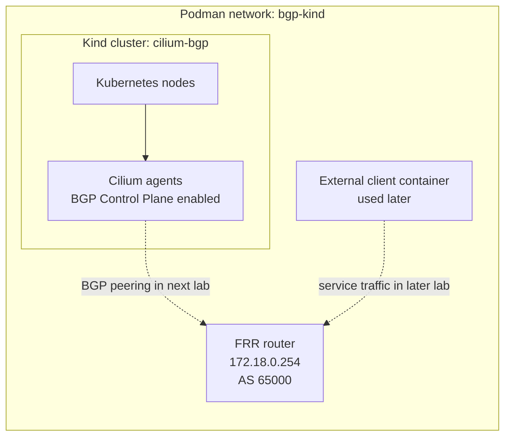

# Kind, Podman, FRR, And Cilium Setup

This student case builds the shared local lab environment used by the rest of
the BGP labs.

By the end of this lab you will have:

- a Podman network named `bgp-kind`
- a Kind cluster named `cilium-bgp`
- an FRR router container at `172.18.0.254`
- Cilium installed as the cluster CNI
- Cilium BGP Control Plane enabled

The goal is still not to advertise a Kubernetes service yet. The goal is to
prepare the underlay network, the Kubernetes cluster, the external router, and
the Cilium feature gate that later labs use for BGP peering and route
advertisement.

## What You Are Building

The lab has four main pieces:

| Component | Purpose |
| --- | --- |
| `bgp-kind` Podman network | Shared local network where Kind nodes and FRR can reach each other. |
| Kind cluster | Local Kubernetes cluster running on Podman containers. |
| FRR router | External router for the lab, using IP `172.18.0.254` and ASN `65000`. |
| Cilium | Kubernetes CNI and future BGP speaker, using ASN `65001` in later labs. |

The first half of the lab creates the infrastructure. The second half installs
Cilium into the cluster. Cilium must be installed because the Kind cluster is
created without the default CNI.

## Architecture



Important details:

- FRR is outside Kubernetes but on the same Podman network as the Kind nodes.
- Cilium runs inside Kubernetes as a `DaemonSet`, one agent per node.
- Cilium becomes the cluster CNI for pod networking and service handling.
- `bgpControlPlane.enabled=true` makes Cilium capable of BGP, but it does not
  create a BGP session by itself.
- The next lab creates the actual Cilium BGP peer resources.

## Files In This Lab

| File | Purpose |
| --- | --- |
| `kind-config.yaml` | Creates one control-plane node and three worker nodes, with the default CNI disabled. |
| `compose.yaml` | Starts the FRR router container on the `bgp-kind` network. |
| `frr/frr.conf` | Configures FRR with ASN `65000`, router ID `172.18.0.254`, and a dynamic Cilium peer range. |
| `frr/daemons` | Enables the FRR daemons required by the router container. |
| `frr/vtysh.conf` | Configures FRR CLI behavior. |

This folder has no Kubernetes manifests because Cilium is installed with Helm
in this lab. The Cilium BGP custom resources are created in the next lab.

## Step 1: Create The Podman Network

Create the shared network:

```bash
podman network create --subnet 172.18.0.0/16 bgp-kind
```

Inspect it:

```bash
podman network inspect bgp-kind
```

What this does:

- Creates a local container network named `bgp-kind`.
- Reserves `172.18.0.0/16` for lab containers on that network.
- Gives FRR and the Kind node containers direct IP reachability.

Why this matters:

BGP neighbors must be able to reach each other before they can exchange routes.
In this module, the BGP sessions run over the `bgp-kind` Podman network.

If the network already exists, Podman may return an error. That is usually fine
if the existing network uses the same subnet. Confirm the subnet with:

```bash
podman network inspect bgp-kind
```

## Step 2: Create The Kind Cluster

Create the cluster:

```bash
KIND_EXPERIMENTAL_PROVIDER=podman \
KIND_EXPERIMENTAL_PODMAN_NETWORK=bgp-kind \
kind create cluster --name cilium-bgp --config kind-config.yaml
```

What this does:

- Creates a Kubernetes cluster named `cilium-bgp`.
- Uses Podman as the Kind provider.
- Places the Kind node containers on the existing `bgp-kind` network.
- Creates one control-plane node and three worker nodes.
- Disables the default Kind CNI.

Why the Podman network setting matters:

Kind normally manages its own provider network. This lab needs the Kind nodes
and FRR router on the same network so Cilium can later peer with FRR directly.
`KIND_EXPERIMENTAL_PODMAN_NETWORK=bgp-kind` tells Kind to attach the node
containers to the network you created in Step 1.

Why the default CNI is disabled:

Cilium will be the CNI for this cluster. Disabling Kind's default CNI keeps the
networking model consistent with the rest of the BGP labs.

Expected state after this step:

- The Kubernetes API server is reachable.
- The node containers exist.
- Nodes may show `NotReady` until Cilium is installed.

Useful checks:

```bash
kubectl cluster-info --context kind-cilium-bgp
kubectl get nodes
podman ps --filter name=cilium-bgp
```

## Step 3: Start The FRR Router

Start FRR:

```bash
podman compose up -d
```

Verify the container is running:

```bash
podman ps --filter name=cilium-bgp-frr
```

Check BGP status:

```bash
podman exec cilium-bgp-frr vtysh -c 'show bgp summary'
```

What this does:

- Starts an FRR router container named `cilium-bgp-frr`.
- Attaches it to the `bgp-kind` network.
- Assigns it the static IP address `172.18.0.254`.
- Loads the BGP configuration from `frr/frr.conf`.

The key FRR configuration is:

```text
router bgp 65000
 bgp router-id 172.18.0.254
 neighbor CILIUM peer-group
 neighbor CILIUM remote-as 65001
 bgp listen range 172.18.0.0/16 peer-group CILIUM
```

This means:

- FRR runs BGP as ASN `65000`.
- FRR expects Cilium peers to use ASN `65001`.
- FRR accepts dynamic BGP peers from the `172.18.0.0/16` lab network.
- Matching peers are placed into the `CILIUM` peer group.

No BGP peer should be established yet. Cilium has not been installed or
configured to connect to FRR.

## Step 4: Install Cilium With BGP Control Plane

Install Cilium:

```bash
helm repo add cilium https://helm.cilium.io/
helm repo update
helm install cilium cilium/cilium --version 1.19.5 \
  --namespace kube-system \
  --set ipam.mode=kubernetes \
  --set kubeProxyReplacement=true \
  --set bgpControlPlane.enabled=true
cilium status --wait
```

What this does:

- Adds the official Cilium Helm chart repository.
- Installs Cilium into the `kube-system` namespace.
- Starts a Cilium agent on every Kubernetes node.
- Makes Cilium the active CNI for the cluster.
- Enables Cilium BGP Control Plane.
- Waits until Cilium reports healthy status.

The Helm settings matter:

| Setting | Meaning |
| --- | --- |
| `ipam.mode=kubernetes` | Cilium uses Kubernetes node pod CIDR allocation, which fits this Kind setup. |
| `kubeProxyReplacement=true` | Cilium handles Kubernetes service forwarding with eBPF instead of kube-proxy. |
| `bgpControlPlane.enabled=true` | Enables the Cilium BGP controllers and CRDs used by later labs. |

## Step 5: Understand What Is Ready

Cilium now has two roles in the lab:

- CNI role: pod networking, service handling, and cluster network policy.
- BGP speaker role: ability to advertise routes after BGP resources are
  created.

These layers are separate:

| Layer | Created in | Purpose |
| --- | --- | --- |
| Local topology | This lab | Provides network reachability between Kind nodes and FRR. |
| Cilium installation | This lab | Makes the cluster usable and enables BGP support. |
| BGP peering | Next lab | Tells Cilium which router to peer with. |
| IP pool | Later lab | Tells Cilium which `LoadBalancer` IPs it may assign. |
| BGP advertisement | Later lab | Tells Cilium which service IPs to export to FRR. |

Enabling BGP Control Plane does not automatically peer with FRR and does not
advertise every service. That is intentional. Later labs add the BGP session,
then the service IP pool, then the route advertisement.

## Step 6: Verify The Setup

Check Cilium:

```bash
cilium status
kubectl -n kube-system get pods -l k8s-app=cilium -o wide
kubectl -n kube-system get deployment cilium-operator
```

Check the nodes:

```bash
kubectl get nodes
```

Check that Cilium installed the BGP CRDs:

```bash
kubectl get crd | grep -i ciliumbgp
```

Check FRR:

```bash
podman ps --filter name=cilium-bgp-frr
podman exec cilium-bgp-frr vtysh -c 'show bgp summary'
```

Expected result:

- Cilium is healthy.
- Kubernetes nodes are `Ready`.
- Cilium BGP CRDs exist.
- The FRR container is running.
- FRR has BGP configured, but no established Cilium peers yet.

That final point is important. The router is ready and Cilium can speak BGP,
but no `CiliumBGPClusterConfig` or `CiliumBGPPeerConfig` exists yet. The next
lab creates those resources.

## Next Lab Readiness

Do not clean up this lab if you are continuing to the next lab. The next lab
needs the Kind cluster, FRR router, and Cilium installation to stay running.

Run this compact check before moving on:

```bash
cilium status
kubectl get nodes
kubectl get crd | grep -i ciliumbgp
podman ps --filter name=cilium-bgp-frr
podman exec cilium-bgp-frr vtysh -c 'show bgp summary'
```

Expected state:

- Cilium is healthy.
- All nodes are `Ready`.
- FRR is running at `172.18.0.254`.
- FRR shows no established BGP peers yet.

## How This Is Used Later

Later labs build on this setup:

1. Configure Cilium to peer with FRR.
2. Confirm the BGP session reaches `Established`.
3. Create a `LoadBalancer` IP pool.
4. Deploy a test `LoadBalancer` service.
5. Advertise the service IP to FRR.
6. Test access from an external client container.

The key idea is that BGP does not carry application traffic. BGP advertises
routes. Once FRR learns a route to a Kubernetes service IP, external clients
can send traffic toward that service IP through the router.

## Troubleshooting

Check whether the Podman network exists:

```bash
podman network inspect bgp-kind
```

Check whether the Kind cluster exists:

```bash
kind get clusters
kubectl cluster-info --context kind-cilium-bgp
kubectl get nodes
```

Check whether FRR is running:

```bash
podman ps --filter name=cilium-bgp-frr
podman logs cilium-bgp-frr
```

Open the FRR CLI:

```bash
podman exec -it cilium-bgp-frr vtysh
```

Useful FRR commands inside `vtysh`:

```text
show running-config
show bgp summary
show ip route
```

Check Cilium:

```bash
helm -n kube-system list
cilium status
kubectl -n kube-system get pods -l k8s-app=cilium -o wide
kubectl -n kube-system logs -l k8s-app=cilium --tail=100
kubectl -n kube-system get pods -l io.cilium/app=operator
```

Common issues:

- `network bgp-kind not found`: create the Podman network before starting FRR.
- `container name is already in use`: an old FRR container already exists;
  inspect it before replacing it.
- Nodes stay `NotReady`: Cilium may not be running yet, or the install may have
  failed.
- Helm says the Cilium release already exists: use `helm upgrade` instead of
  `helm install`.
- BGP CRDs are missing: confirm the install used
  `--set bgpControlPlane.enabled=true`.
- `show bgp summary` has no peers: expected in this lab. Peering is configured
  in the next lab.

## Cleanup

Use cleanup only when you want to reset the shared environment. Do not run
these commands if you are continuing to `02-bgp-peering-with-frr`.

Remove Cilium:

```bash
helm -n kube-system uninstall cilium
```

Remove FRR, the Kind cluster, and the Podman network:

```bash
podman compose down
KIND_EXPERIMENTAL_PROVIDER=podman kind delete cluster --name cilium-bgp
podman network rm bgp-kind
```

Do not remove `bgp-kind` if another lab container is still using it.
