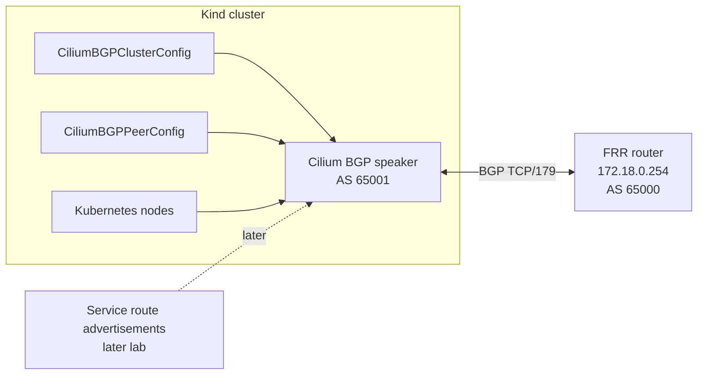

# BGP Peering With FRR

This student case configures Cilium to peer with the external FRR router.

The previous labs created the local topology and installed Cilium with BGP
Control Plane enabled. At this point Cilium can speak BGP, but it still does
not know which router to connect to. This lab adds that missing configuration.

## Shared Topology Dependency

This lab reuses the central Kind, Podman, FRR, and Cilium setup from
`../01-kind-podman-frr-cilium-setup/`. Do not expect a second `compose.yaml`,
`kind-config.yaml`, `frr/` directory, or Cilium install guide in this folder.

The manifest in this folder points Cilium at the shared FRR router:

- FRR router IP: `172.18.0.254`
- FRR ASN: `65000`
- Cilium ASN: `65001`

Create a separate topology here only if this lab is changed to teach a
different router, ASN plan, or network layout.

The goal is to create a BGP session between Cilium and FRR. This is the control
plane relationship that later labs use to advertise Kubernetes `LoadBalancer`
service IPs to the external network.

By the end of this lab you should understand:

- What a BGP peer is in this lab environment.
- Why Cilium and FRR use different ASN values.
- How `CiliumBGPClusterConfig` and `CiliumBGPPeerConfig` work together.
- What an `Established` BGP session proves.
- Why creating a BGP session is separate from advertising service IPs.

## Architecture



Important details:

- FRR is the external router at `172.18.0.254`.
- FRR uses ASN `65000`.
- Cilium uses ASN `65001`.
- Cilium initiates BGP peering from the Kubernetes nodes to FRR.
- BGP runs over TCP port `179`.
- This lab creates the BGP neighbor relationship only. It does not advertise a
  `LoadBalancer` service IP yet.

## What BGP Peering Means Here

BGP is a routing protocol. Two BGP speakers form a neighbor relationship, then
exchange route information. In this lab the two BGP speakers are:

| Speaker | Role | ASN |
| --- | --- | --- |
| FRR | External router outside the Kubernetes cluster | `65000` |
| Cilium | BGP speaker running on Kubernetes nodes | `65001` |

The ASN, or autonomous system number, identifies the routing domain that a BGP
speaker belongs to. Because FRR and Cilium are configured with different ASN
values, this is an external BGP, or eBGP, session.

The session itself does not mean traffic is already flowing to a Kubernetes
service. It only means Cilium and FRR trust each other enough to exchange route
information. Later, when a service IP is advertised, FRR can learn that route
from this session.

## Files In This Lab

| File | Purpose |
| --- | --- |
| `manifests/frr-peer-config.yaml` | Creates the reusable Cilium BGP peer settings for FRR. |
| `manifests/cilium-bgp-cluster-config.yaml` | Creates the Cilium BGP instance and points it at FRR. |

The manifests contain two Cilium custom resources:

| Resource | Purpose |
| --- | --- |
| `CiliumBGPPeerConfig` | Defines reusable peer behavior such as timers and which advertisement labels are accepted. |
| `CiliumBGPClusterConfig` | Defines the local Cilium BGP instance, local ASN, remote peer ASN, remote peer address, and which nodes the config applies to. |

These resources are separate on purpose. The cluster config says "connect to
this router," while the peer config says "use these peer settings."

## Step 1: Apply The BGP Configuration

Inspect the manifests before applying them:

```bash
ls manifests/
sed -n '1,160p' manifests/frr-peer-config.yaml
sed -n '1,160p' manifests/cilium-bgp-cluster-config.yaml
```

Apply the peer config first:

```bash
kubectl apply -f manifests/frr-peer-config.yaml
```

Then apply the cluster config that references it:

```bash
kubectl apply -f manifests/cilium-bgp-cluster-config.yaml
```

What this creates:

- A `CiliumBGPPeerConfig` named `frr-peer`.
- A `CiliumBGPClusterConfig` named `cilium-bgp`.
- A Cilium BGP instance named `instance-65001` with local ASN `65001`.
- A BGP peer pointing at FRR on `172.18.0.254`.
- A peer ASN of `65000`, matching FRR.

The peer configuration lives in `manifests/frr-peer-config.yaml`.

What this means:

- `holdTimeSeconds: 9` tells BGP how long a peer may be silent before it is
  considered unavailable.
- `keepAliveTimeSeconds: 3` tells BGP how often keepalive messages are sent.
- `afi: ipv4` and `safi: unicast` mean this peer is prepared to exchange IPv4
  unicast routes.
- `advertisements.matchLabels` says Cilium will only send advertisements that
  have the label `advertise: bgp`.

No advertisement exists yet. The label selector becomes important in the next
lab, where a `CiliumBGPAdvertisement` is created with the matching label.

The cluster configuration lives in
`manifests/cilium-bgp-cluster-config.yaml`.

What this means:

- `nodeSelector.matchLabels: {}` applies the BGP config to all Kubernetes
  nodes.
- `localASN: 65001` makes Cilium speak BGP as AS `65001`.
- `peerASN: 65000` tells Cilium that the remote router is AS `65000`.
- `peerAddress: 172.18.0.254` points Cilium at the FRR router.
- `peerConfigRef.name: frr-peer` attaches the reusable peer settings from the
  `CiliumBGPPeerConfig`.

## Step 2: Confirm The Kubernetes Resources

```bash
kubectl get ciliumbgpclusterconfig
kubectl get ciliumbgppeerconfig
```

Expected result:

- `cilium-bgp` exists as a `CiliumBGPClusterConfig`.
- `frr-peer` exists as a `CiliumBGPPeerConfig`.

Inspect the full resource details:

```bash
kubectl describe ciliumbgpclusterconfig cilium-bgp
kubectl describe ciliumbgppeerconfig frr-peer
```

These checks confirm that Kubernetes accepted the resources. They do not prove
that the BGP session is established. For that, check FRR.

## Step 3: Confirm The BGP Session From FRR

```bash
podman exec cilium-bgp-frr vtysh -c 'show bgp summary'
```

Expected result:

- FRR shows one or more Cilium peers.
- The BGP session state reaches `Established`.
- The peer ASN is `65001`.

`Established` is the important state. It means:

- FRR and Cilium can reach each other over the Podman network.
- TCP port `179` is reachable.
- FRR accepts Cilium's ASN.
- Cilium accepts FRR's ASN.
- The BGP control plane relationship is working.

The number of peers can depend on how many Kubernetes nodes Cilium applies the
configuration to. Because this lab uses `nodeSelector.matchLabels: {}`, Cilium
is allowed to configure BGP on all nodes.

## Step 4: Check From The Cilium Side

FRR is usually the clearest place to confirm the session, but you can also
inspect Cilium:

```bash
cilium bgp peers
```

Useful Kubernetes checks:

```bash
kubectl -n kube-system get pods -l k8s-app=cilium -o wide
kubectl -n kube-system logs -l k8s-app=cilium --tail=100
```

These commands help you confirm that Cilium agents are running and whether they
report BGP-related errors.

## Expected Result

At the end of this lab:

- Cilium has a BGP instance using ASN `65001`.
- Cilium is configured to peer with FRR at `172.18.0.254`.
- FRR uses ASN `65000`.
- The BGP session reaches `Established`.
- No Kubernetes `LoadBalancer` service IP is advertised yet.

That final point is important. A working BGP session is necessary, but it is
not the same as route advertisement. The next lab adds the service IP pool and
advertisement resources.

## Next Lab Readiness

Do not delete the BGP peering resources if you are continuing to the next lab.
The next lab needs the Cilium to FRR session to stay `Established`.

Run these checks before moving on:

```bash
kubectl get ciliumbgpclusterconfig,ciliumbgppeerconfig
podman exec cilium-bgp-frr vtysh -c 'show bgp summary'
cilium bgp peers
```

Expected state:

- `cilium-bgp` exists as a `CiliumBGPClusterConfig`.
- `frr-peer` exists as a `CiliumBGPPeerConfig`.
- FRR shows one or more Cilium peers in `Established`.
- No `LoadBalancer` service route is required yet.

## How This Is Used Later

Later labs build on this BGP session:

1. Create a Cilium `LoadBalancer` IP pool.
2. Create a Kubernetes `LoadBalancer` service.
3. Create a `CiliumBGPAdvertisement` with label `advertise: bgp`.
4. Cilium matches that label through the `CiliumBGPPeerConfig`.
5. Cilium advertises the service IP route to FRR.
6. External clients send traffic toward the service IP through the learned
   route.

The relationship between this lab and the next lab is:

| This lab | Next lab |
| --- | --- |
| Creates the BGP neighbor session | Creates service IPs and route advertisements |
| Proves Cilium and FRR can exchange BGP messages | Proves FRR can learn Kubernetes service routes |
| Does not expose an application | Makes an externally reachable service possible |

## Troubleshooting

Check that the FRR container is running:

```bash
podman ps --filter name=cilium-bgp-frr
```

Check FRR BGP status:

```bash
podman exec cilium-bgp-frr vtysh -c 'show bgp summary'
```

Show FRR configuration:

```bash
podman exec cilium-bgp-frr vtysh -c 'show running-config'
```

Check that the Cilium BGP resources exist:

```bash
kubectl get ciliumbgpclusterconfig,ciliumbgppeerconfig
```

Check Cilium agent logs:

```bash
kubectl -n kube-system logs -l k8s-app=cilium --tail=100
```

Common issues:

- BGP session stays `Idle`: Cilium may not be able to reach FRR, or FRR may not
  be running.
- BGP session stays `Active`: the TCP connection is not completing. Check the
  FRR IP address, Podman network, and port `179` reachability.
- ASN mismatch: Cilium must use local ASN `65001`, and FRR must expect remote
  ASN `65001`. Cilium must expect FRR peer ASN `65000`.
- Wrong peer IP: `peerAddress` must point to the FRR router at `172.18.0.254`.
- Missing Cilium CRDs: confirm Cilium was installed with
  `bgpControlPlane.enabled=true`.
- No service route appears in FRR: expected in this lab. Route advertisement is
  configured in the next lab.

## Cleanup

Remove only this lab's BGP configuration if you want to reset the peering
exercise. Do not run this if you are continuing to
`03-loadbalancer-ip-pools-and-advertisements`:

```bash
kubectl delete -f manifests/cilium-bgp-cluster-config.yaml
kubectl delete -f manifests/frr-peer-config.yaml
```

After deleting the resources, FRR should no longer show the Cilium BGP session
as established. Cilium itself remains installed as the cluster CNI.
