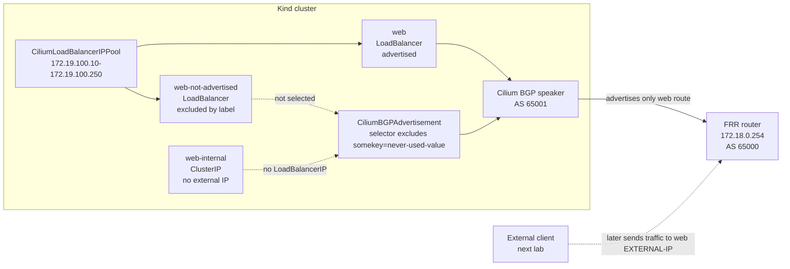

# LoadBalancer IP Pools And BGP Advertisements

This student case shows the difference between assigning a Kubernetes
`LoadBalancer` IP and advertising that IP to an external router with BGP.

The previous labs created the shared Kind, Podman, FRR, and Cilium setup, then
configured Cilium to peer with FRR. At the start of this lab, the BGP session
should be `Established`, but FRR still has no Kubernetes service route to
learn. This lab adds the service IPs and controls which of them Cilium exports.

By the end of this lab you should understand:

- Why a `LoadBalancer` service needs an allocated external IP.
- Why an allocated external IP is not the same as an advertised route.
- What `CiliumLoadBalancerIPPool` controls.
- What `CiliumBGPAdvertisement` controls.
- How a service selector can include one `LoadBalancer` IP and exclude another.
- Why a `ClusterIP` service has no `EXTERNAL-IP` to advertise.

## Lab Goal

You will create three services that all point at the same nginx pod:

| Service | Type | External IP | BGP advertisement |
| --- | --- | --- | --- |
| `web` | `LoadBalancer` | Yes | Yes |
| `web-internal` | `ClusterIP` | No, shows `<none>` | No |
| `web-not-advertised` | `LoadBalancer` | Yes | No, excluded by label |

This gives you three useful observations in one lab:

- A `LoadBalancer` service can receive an external IP from Cilium.
- A `ClusterIP` service does not receive an external IP.
- A `LoadBalancer` service can have an external IP but still be excluded from
  BGP advertisement.

## Shared Topology Dependency

This lab reuses:

- the Kind cluster, FRR router, and Cilium installation from
  `../01-kind-podman-frr-cilium-setup/`
- the Cilium to FRR BGP peering from `../02-bgp-peering-with-frr/`

There is no local FRR, Kind, or Cilium installation in this folder. This folder
only adds the IP pool, services, and BGP advertisement used in this stage.

## Architecture



## The Core Difference

A Kubernetes `LoadBalancer` service needs two separate things before an
external client can use it:

| Requirement | Resource | Question it answers |
| --- | --- | --- |
| Allocate an external service IP | `CiliumLoadBalancerIPPool` | Which IPs may services use? |
| Advertise the service IP to routers | `CiliumBGPAdvertisement` | Which service IPs should BGP export? |

The pool does not advertise anything. It only gives Cilium an address range for
`LoadBalancer` services.

The advertisement does not allocate service IPs. It only tells Cilium which
already allocated service IPs should be announced to BGP peers.

This separation is useful in real clusters. Platform teams often want to allow
a service to receive an IP while still controlling whether that route is
announced outside the cluster.

## Files In This Lab

| File | Purpose |
| --- | --- |
| `manifests/ip-pools/loadbalancer-ip-pool.yaml` | Creates the `CiliumLoadBalancerIPPool` named `bgp-lb-pool`. |
| `manifests/advertisements/nginx-loadbalancer-service.yaml` | Creates namespace `bgp-lab`, the nginx deployment, and the advertised `LoadBalancer` service `web`. |
| `manifests/advertisements/nginx-clusterip-service.yaml` | Creates `web-internal`, a `ClusterIP` service with no external IP. |
| `manifests/advertisements/nginx-excluded-loadbalancer-service.yaml` | Creates `web-not-advertised`, a `LoadBalancer` service that receives an external IP but is excluded from advertisement. |
| `manifests/advertisements/bgp-advertisement.yaml` | Creates the `CiliumBGPAdvertisement` that exports selected `LoadBalancer` IPs. |

Apply these files one at a time. That makes it easier to see which resource
changes which part of the system.

## Step 1: Create The LoadBalancer IP Pool

Inspect the pool:

```bash
sed -n '1,160p' manifests/ip-pools/loadbalancer-ip-pool.yaml
```

Apply it:

```bash
kubectl apply -f manifests/ip-pools/loadbalancer-ip-pool.yaml
```

Check it:

```bash
kubectl get ciliumloadbalancerippool
kubectl describe ciliumloadbalancerippool bgp-lb-pool
```

What this creates:

- Cilium may assign IPs from `172.19.100.10` through `172.19.100.250`.
- The range is outside the `172.18.0.0/16` Podman underlay network.
- External clients need a route to these IPs before they can reach them.

Expected result:

- The pool exists.
- The pool is not disabled.
- No service IP has been allocated yet if no `LoadBalancer` service exists.

## Step 2: Create The Advertised LoadBalancer Service

Inspect the service and workload manifest:

```bash
sed -n '1,220p' manifests/advertisements/nginx-loadbalancer-service.yaml
```

Apply it:

```bash
kubectl apply -f manifests/advertisements/nginx-loadbalancer-service.yaml
```

This creates:

| Object | Name | Purpose |
| --- | --- | --- |
| `Namespace` | `bgp-lab` | Keeps the lab workload separate. |
| `Deployment` | `bgp-lab/web` | Runs one nginx pod. |
| `Service` | `bgp-lab/web` | Creates a `LoadBalancer` service for nginx. |

Check the service:

```bash
kubectl -n bgp-lab get svc web -o wide
```

Expected result:

- `web` has type `LoadBalancer`.
- `web` has an `EXTERNAL-IP` from `172.19.100.10-172.19.100.250`.

At this point the service has an external IP, but FRR should not have a route
for it yet. The IP exists in Kubernetes, but it has not been advertised.

## Step 3: Create A ClusterIP Comparison Service

Inspect the internal service:

```bash
sed -n '1,120p' manifests/advertisements/nginx-clusterip-service.yaml
```

Apply it:

```bash
kubectl apply -f manifests/advertisements/nginx-clusterip-service.yaml
```

This service selects the same nginx pod, but it uses `type: ClusterIP`.

Check it:

```bash
kubectl -n bgp-lab get svc web-internal -o wide
```

Expected result:

- `web-internal` has type `ClusterIP`.
- `web-internal` shows `EXTERNAL-IP` as `<none>`.

This service is useful because it proves that not every service has an external
address. A `ClusterIP` service is cluster-internal and has no `LoadBalancerIP`
for Cilium to advertise.

## Step 4: Create An Excluded LoadBalancer Service

Inspect the excluded service:

```bash
sed -n '1,160p' manifests/advertisements/nginx-excluded-loadbalancer-service.yaml
```

Apply it:

```bash
kubectl apply -f manifests/advertisements/nginx-excluded-loadbalancer-service.yaml
```

This service is also `type: LoadBalancer`, so it should receive an external IP.
The important difference is its label:

```yaml
labels:
  somekey: never-used-value
```

Check it:

```bash
kubectl -n bgp-lab get svc web-not-advertised -o wide
```

Expected result:

- `web-not-advertised` has type `LoadBalancer`.
- `web-not-advertised` has an `EXTERNAL-IP`.
- Later, this IP should not appear in FRR's BGP routes.

## Step 5: Compare The Three Services

List all services in the lab namespace:

```bash
kubectl -n bgp-lab get svc -o wide
```

Expected shape:

```text
NAME                 TYPE           CLUSTER-IP      EXTERNAL-IP     PORT(S)
web                  LoadBalancer   10.x.x.x        172.19.100.10   80:xxxxx/TCP
web-internal         ClusterIP      10.x.x.x        <none>          80/TCP
web-not-advertised   LoadBalancer   10.x.x.x        172.19.100.11   80:xxxxx/TCP
```

Read the table like this:

- `web` has an external IP and should be advertised.
- `web-internal` has no external IP because it is `ClusterIP`.
- `web-not-advertised` has an external IP but will be excluded from BGP export.

If either `LoadBalancer` service is missing its `EXTERNAL-IP`, debug IP
allocation before debugging BGP:

```bash
kubectl get ciliumloadbalancerippool
kubectl describe ciliumloadbalancerippool bgp-lb-pool
kubectl -n kube-system logs deployment/cilium-operator --tail=100
```

## Step 6: Understand The Advertisement Selector

Now inspect the BGP advertisement:

```bash
sed -n '1,160p' manifests/advertisements/bgp-advertisement.yaml
```

The key selector is:

```yaml
selector:
  matchExpressions:
    - {key: somekey, operator: NotIn, values: ['never-used-value']}
```

This means:

- Match services where `somekey` is missing.
- Match services where `somekey` exists but has a different value.
- Do not match services where `somekey=never-used-value`.

That gives this result:

| Service | Why it is or is not advertised |
| --- | --- |
| `web` | Matches because it does not have `somekey=never-used-value`. |
| `web-internal` | Not useful for this advertisement because it has no `LoadBalancerIP`. |
| `web-not-advertised` | Excluded because it has `somekey=never-used-value`. |

The advertisement also has this metadata label:

```yaml
labels:
  advertise: bgp
```

That label connects this advertisement to the `CiliumBGPPeerConfig` from the
previous lab, where the peer accepted advertisements matching `advertise: bgp`.

## Step 7: Apply The BGP Advertisement

Apply the advertisement:

```bash
kubectl apply -f manifests/advertisements/bgp-advertisement.yaml
```

Check it:

```bash
kubectl get ciliumbgpadvertisement --show-labels
kubectl describe ciliumbgpadvertisement advertise-loadbalancer-ips
```

Expected result:

- The advertisement exists.
- It has label `advertise=bgp`.
- It advertises service addresses of type `LoadBalancerIP`.
- It selects `web`.
- It excludes `web-not-advertised`.

Important: applying this advertisement should not remove a service external IP.
If an external IP disappears, debug the IP pool or service allocation. The BGP
advertisement controls route export, not IP assignment.

## Step 8: Confirm FRR Learned Only The Selected Route

First confirm the BGP session is still established:

```bash
podman exec cilium-bgp-frr vtysh -c 'show bgp summary'
```

Store the two `LoadBalancer` IPs:

```bash
WEB_LB_IP=$(kubectl -n bgp-lab get svc web -o jsonpath='{.status.loadBalancer.ingress[0].ip}')
EXCLUDED_LB_IP=$(kubectl -n bgp-lab get svc web-not-advertised -o jsonpath='{.status.loadBalancer.ingress[0].ip}')
echo "web=${WEB_LB_IP}"
echo "web-not-advertised=${EXCLUDED_LB_IP}"
```

Check both routes from FRR:

```bash
podman exec cilium-bgp-frr vtysh -c "show bgp ipv4 unicast ${WEB_LB_IP}/32"
podman exec cilium-bgp-frr vtysh -c "show bgp ipv4 unicast ${EXCLUDED_LB_IP}/32"
podman exec cilium-bgp-frr vtysh -c 'show ip route bgp'
```

Expected result:

- FRR has a BGP route for `${WEB_LB_IP}/32`.
- FRR does not have a BGP route for `${EXCLUDED_LB_IP}/32`.
- The route for `web` points toward one or more Kubernetes node addresses.

The exact next hop can vary depending on which nodes advertise the service.
The important part is that FRR learns the selected service IP, not every
allocated service IP.

## Expected Result

At the end of this lab:

- `CiliumLoadBalancerIPPool` named `bgp-lb-pool` exists.
- `bgp-lab/web` has an external IP and is advertised to FRR.
- `bgp-lab/web-internal` has no external IP.
- `bgp-lab/web-not-advertised` has an external IP but is not advertised.
- `CiliumBGPAdvertisement` named `advertise-loadbalancer-ips` exists.
- FRR has a BGP route only for the selected `web` service IP.

The mental model is:

```text
IP pool controls allocation.
Service type controls whether a service can receive a LoadBalancer IP.
Advertisement selector controls which LoadBalancer IPs are exported to BGP.
FRR only learns routes that Cilium advertises.
```

## Next Lab Readiness

Do not delete these resources if you are continuing to the next lab. The
external client test needs the `web` service IP and the FRR route to stay in
place.

Run these checks before moving on:

```bash
kubectl -n bgp-lab get svc -o wide
kubectl -n bgp-lab get pods,endpoints
kubectl get ciliumloadbalancerippool,ciliumbgpadvertisement --show-labels
podman exec cilium-bgp-frr vtysh -c 'show bgp summary'
podman exec cilium-bgp-frr vtysh -c 'show ip route bgp'
```

Expected state:

- `web` has an `EXTERNAL-IP`.
- `web-internal` has `EXTERNAL-IP` set to `<none>`.
- `web-not-advertised` has an `EXTERNAL-IP`.
- FRR has a BGP route for `web`.
- FRR does not have a BGP route for `web-not-advertised`.

## How This Is Used Later

The next lab sends traffic from a temporary external client container to the
`web` service `EXTERNAL-IP`.

That test proves the complete path:

```text
external client -> FRR -> Kubernetes node -> Cilium service handling -> nginx
```

## Troubleshooting

Check service IP allocation:

```bash
kubectl -n bgp-lab get svc -o wide
kubectl get ciliumloadbalancerippool
kubectl describe ciliumloadbalancerippool bgp-lb-pool
```

Check the BGP advertisement:

```bash
kubectl get ciliumbgpadvertisement --show-labels
kubectl describe ciliumbgpadvertisement advertise-loadbalancer-ips
```

Check BGP from FRR:

```bash
podman exec cilium-bgp-frr vtysh -c 'show bgp summary'
podman exec cilium-bgp-frr vtysh -c 'show bgp ipv4 unicast'
podman exec cilium-bgp-frr vtysh -c 'show ip route bgp'
```

Common issues:

- `web` has no `EXTERNAL-IP`: check the IP pool and Cilium operator.
- `web-internal` has `<none>`: expected, because it is `ClusterIP`.
- `web-not-advertised` has an `EXTERNAL-IP` but no FRR route: expected,
  because the advertisement selector excludes it.
- `web` has an `EXTERNAL-IP` but FRR has no route: check the
  `CiliumBGPAdvertisement`, its `advertise=bgp` label, and the BGP peer state.
- BGP is not `Established`: return to `02-bgp-peering-with-frr` and fix the
  Cilium to FRR session first.

## Cleanup

Use cleanup only when you want to reset this lab. Do not run it if you are
continuing to `04-external-client-testing`.

Delete resources in reverse order:

```bash
kubectl delete -f manifests/advertisements/bgp-advertisement.yaml
kubectl delete -f manifests/advertisements/nginx-excluded-loadbalancer-service.yaml
kubectl delete -f manifests/advertisements/nginx-clusterip-service.yaml
kubectl delete -f manifests/advertisements/nginx-loadbalancer-service.yaml
kubectl delete -f manifests/ip-pools/loadbalancer-ip-pool.yaml
```

After cleanup:

- The nginx deployment and three services are removed.
- Allocated `LoadBalancer` IPs are released.
- FRR should stop learning the `web` service route.
- The Cilium BGP peering from the previous lab remains in place.
