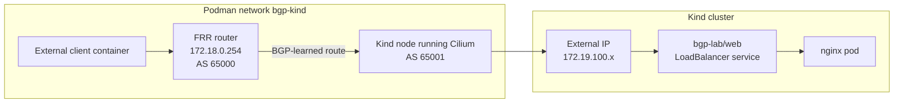

# External Client Testing

This student case tests the full external access path to a Kubernetes
`LoadBalancer` service.

The previous labs created the Podman and Kind topology, installed Cilium,
configured Cilium BGP peering with FRR, created a `LoadBalancer` IP pool, and
advertised service IPs over BGP. This lab uses those pieces together and proves
that a client outside the Kubernetes cluster can reach the nginx service through
the advertised IP address.

## Shared Topology Dependency

This lab does not create persistent files because it tests the shared
environment built by `01-*` through `03-*`.

It reuses:

- the `bgp-kind` Podman network from `01-kind-podman-frr-cilium-setup`
- the `cilium-bgp-frr` router from `01-kind-podman-frr-cilium-setup`
- the Cilium BGP peering from `02-bgp-peering-with-frr`
- the `bgp-lab/web` service from `03-loadbalancer-ip-pools-and-advertisements`

The client is created as a temporary `podman run --rm` container, so there is
no manifest to store in this folder.

By the end of this lab you should understand:

- What the external client represents in this local lab.
- Why the client uses the service `EXTERNAL-IP` instead of the Kubernetes
  `ClusterIP`.
- How FRR uses the BGP-learned route to forward traffic toward Cilium.
- How to verify the path one layer at a time when the request fails.
- The difference between "FRR learned the route" and "the application is
  reachable."

## Architecture



Important details:

- The external client is not a Kubernetes pod. It is a temporary Podman
  container attached to the same `bgp-kind` network as FRR and the Kind nodes.
- The client sends HTTP traffic to the `LoadBalancer` service IP, not to a pod
  IP and not to the service `ClusterIP`.
- FRR learned the route to the `LoadBalancer` IP from Cilium over BGP in the
  previous lab.
- Cilium receives the traffic on a Kubernetes node and forwards it to the
  nginx service backend.

## The Big Idea

This lab is the first time the full data path is tested.

The previous lab proved the control-plane part:

```text
Cilium advertises service IP -> FRR learns route
```

This lab proves the data-plane part:

```text
External client -> FRR -> Kubernetes node -> Cilium service handling -> nginx pod
```

BGP does not carry the HTTP request. BGP only teaches FRR where the
`LoadBalancer` IP lives. After FRR has the route, normal IP forwarding carries
the client traffic toward the Kubernetes node.

## Prerequisites

Complete the earlier labs in this section before starting:

1. `01-kind-podman-frr-cilium-setup`
2. `02-bgp-peering-with-frr`
3. `03-loadbalancer-ip-pools-and-advertisements`

Expected starting state:

- The Kind cluster named `cilium-bgp` is running.
- The FRR container named `cilium-bgp-frr` is running.
- Cilium is installed with BGP Control Plane enabled.
- BGP peering between Cilium and FRR is `Established`.
- The `bgp-lab/web` service exists and has an `EXTERNAL-IP`.
- FRR has a BGP route for that service IP.

## Step 1: Get The LoadBalancer IP

Store the service IP in a shell variable:

```bash
LB_IP=$(kubectl -n bgp-lab get svc web -o jsonpath='{.status.loadBalancer.ingress[0].ip}')
echo "$LB_IP"
```

Expected result:

```text
172.19.100.x
```

The exact last number can vary. It should come from the pool created in the
previous lab:

```text
172.19.100.10-172.19.100.250
```

If the command prints nothing, the service does not have a `LoadBalancer` IP
yet. Check it directly:

```bash
kubectl -n bgp-lab get svc web -o wide
kubectl get ciliumloadbalancerippool
```

## Step 2: Confirm The Service Backend Is Ready

Before testing external access, confirm Kubernetes has a healthy backend for
the service:

```bash
kubectl -n bgp-lab get pods -o wide
kubectl -n bgp-lab get endpoints web
```

Expected result:

- The nginx pod is `Running`.
- The `web` endpoint has at least one IP and port.

Why this matters:

The BGP route can be correct even when the application is not ready. If the
service has no endpoints, traffic may reach the cluster but still fail because
there is no backend pod to receive it.

## Step 3: Confirm FRR Learned The Route

Ask FRR whether it knows the specific `LoadBalancer` IP:

```bash
podman exec cilium-bgp-frr vtysh -c "show bgp ipv4 unicast ${LB_IP}/32"
```

Also check the installed BGP routes:

```bash
podman exec cilium-bgp-frr vtysh -c 'show ip route bgp'
```

Expected result:

- FRR shows a route for `${LB_IP}/32`.
- The next hop points toward one or more Kind node addresses.

The `/32` matters. Cilium advertises the individual service IP as a host route,
not the whole `172.19.100.0/24` range. That keeps routing precise: FRR learns
only the service addresses Cilium advertises.

If FRR does not show the route, return to the previous lab and check:

```bash
podman exec cilium-bgp-frr vtysh -c 'show bgp summary'
kubectl get ciliumbgpadvertisement --show-labels
kubectl -n bgp-lab get svc web -o wide
```

## Step 4: Test From An External Client

Run a temporary client container on the `bgp-kind` Podman network and add a
route for the service IP through FRR:

```bash
podman run --rm --network bgp-kind --cap-add NET_ADMIN alpine:3.20 sh -c \
  "ip route add ${LB_IP}/32 via 172.18.0.254 && wget -qO- http://${LB_IP}"
```

Expected result:

The command returns the default nginx HTML page. Seeing the nginx response means
the full path works:

```text
external client -> routed network -> FRR -> Cilium node -> service -> nginx pod
```

This test is different from running `curl` inside a Kubernetes pod. A pod test
only proves cluster-internal service networking. This test proves that traffic
from outside the cluster can use the BGP-advertised service IP.

What this does:

- Starts a temporary Alpine container outside Kubernetes.
- Adds a host route for the service IP.
- Uses FRR at `172.18.0.254` as the next hop.
- Sends an HTTP request to the `LoadBalancer` IP.

The route exists only inside the throwaway client container. It does not change
Kubernetes, FRR, Cilium, or the Podman network.

## Step 5: Optional Plain Client Test

You may also try a client without adding a route:

```bash
podman run --rm --network bgp-kind quay.io/curl/curl:8.8.0 -sS "http://${LB_IP}"
```

This may fail with a timeout such as:

```text
curl: (7) Failed to connect to 172.19.100.x port 80
```

That failure does not automatically mean BGP or Cilium is broken. It usually
means the temporary client container does not have a route for the
`172.19.100.x` service IP range through FRR. The successful test in Step 4 adds
that route explicitly.

The plain client only works if the container's default route or the Podman
network already sends traffic for the service IP through FRR. In this lab, the
explicit route test is the reliable expected test.

## Step 6: Understand The Return Path

The request path and response path both matter.

Request path:

```text
client -> FRR -> Kubernetes node -> Cilium -> nginx
```

Response path:

```text
nginx -> Cilium -> Kubernetes node -> client
```

Cilium handles the service translation and forwarding inside the cluster. FRR's
job is to know where to send packets for the service IP. The external client's
job is to send traffic toward FRR for that service IP.

If the route exists but HTTP still fails, think in layers:

1. Is the service IP allocated?
2. Is the nginx backend ready?
3. Did Cilium advertise the service IP?
4. Did FRR learn the route?
5. Does the external client route traffic through FRR?
6. Does Cilium forward the traffic to the service backend?

## Expected Result

At the end of this lab:

- `bgp-lab/web` has a `LoadBalancer` IP from the Cilium IP pool.
- FRR has a BGP route for that IP.
- A client outside Kubernetes can send HTTP traffic to the service IP.
- The response comes from nginx.

The main mental model is:

```text
Kubernetes owns the service.
Cilium assigns and advertises the service IP.
FRR learns where that IP is.
The external client uses that route to reach the service.
```

## Next Lab Readiness

There is normally nothing persistent to clean up before moving to the
troubleshooting lab. The client containers use `--rm`, so they should exit and
remove themselves automatically.

Run these checks before moving on:

```bash
podman ps --filter ancestor=quay.io/curl/curl:8.8.0
podman ps --filter ancestor=alpine:3.20
kubectl -n bgp-lab get svc web -o wide
podman exec cilium-bgp-frr vtysh -c 'show ip route bgp'
```

Expected state:

- No temporary client container is still running.
- `bgp-lab/web` still has its `LoadBalancer` IP.
- FRR still has the BGP route for the service IP.

## Troubleshooting

Check the service IP:

```bash
kubectl -n bgp-lab get svc web -o wide
```

Check the backend:

```bash
kubectl -n bgp-lab get pods -o wide
kubectl -n bgp-lab get endpoints web
```

Check the BGP session:

```bash
podman exec cilium-bgp-frr vtysh -c 'show bgp summary'
```

Check the advertised route:

```bash
podman exec cilium-bgp-frr vtysh -c "show bgp ipv4 unicast ${LB_IP}/32"
podman exec cilium-bgp-frr vtysh -c 'show ip route bgp'
```

Check Cilium status:

```bash
cilium status
cilium bgp peers
```

Common issues:

- `LB_IP` is empty: the `bgp-lab/web` service does not have an external IP yet.
  Check the `CiliumLoadBalancerIPPool`.
- FRR has no route for `${LB_IP}/32`: check the `CiliumBGPAdvertisement`, its
  `advertise=bgp` label, and the BGP peer state.
- BGP is not `Established`: return to the BGP peering lab and fix the Cilium to
  FRR session first.
- The service has no endpoints: fix the nginx deployment before debugging BGP.
- Plain curl fails but FRR has the route: expected in many Podman setups. Use
  the explicit route through `172.18.0.254`, as shown in Step 4.
- Curl connects but returns an unexpected response: confirm you are testing
  `http://${LB_IP}` and not the Kubernetes `ClusterIP` or a stale shell
  variable.

## Cleanup

This lab only runs temporary client containers, so there is usually nothing to
clean up.

If a temporary client container is still running, stop it by container ID:

```bash
podman ps
podman stop <container-id>
```

If you want to remove the test application and the previous lab resources, use
the cleanup from `03-loadbalancer-ip-pools-and-advertisements`. Removing the
service will also remove the service IP that FRR learned from Cilium. Do not do
that if you are continuing to `05-bgp-troubleshooting`.
