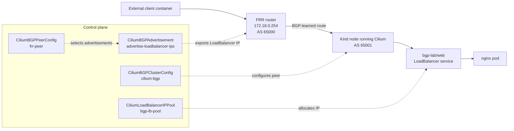

# BGP Troubleshooting

This student case teaches a practical troubleshooting flow for Cilium BGP.

The earlier labs built the full path:

1. A Podman network connects an FRR router and Kind nodes.
2. Cilium runs in the Kind cluster with BGP Control Plane enabled.
3. Cilium peers with FRR over BGP.
4. Cilium assigns a `LoadBalancer` IP to the `bgp-lab/web` service.
5. Cilium advertises that service IP to FRR.
6. An external client reaches nginx through the advertised service IP.

This lab focuses on what to check when that path does not work.

## Shared Topology Dependency

This troubleshooting lab inspects the same running environment created by the
previous labs. It intentionally does not include its own `compose.yaml`,
`kind-config.yaml`, FRR config, or Kubernetes manifests.

Use the files from earlier labs as the source of truth:

- topology and FRR config: `../01-kind-podman-frr-cilium-setup/`
- Cilium BGP peering manifest: `../02-bgp-peering-with-frr/manifests/`
- IP pool, test service, and advertisement manifests:
  `../03-loadbalancer-ip-pools-and-advertisements/manifests/`

Add new files here only for troubleshooting scenarios that need their own
intentional broken manifests or recovery exercises.

By the end of this lab you should understand:

- How to separate BGP control-plane problems from service data-plane problems.
- What each troubleshooting command proves.
- Why a working BGP session does not automatically mean the application is
  reachable.
- How to confirm that Cilium allocated, advertised, and forwarded the service
  IP.
- How to use FRR as the external network's point of view.

## Architecture



There are two paths to think about:

```text
Control plane: Cilium BGP resources -> BGP session -> FRR learns route
Data plane:    external client -> FRR -> Cilium node -> service -> nginx pod
```

BGP does not proxy HTTP traffic and does not create Kubernetes services. BGP
only teaches the external router where the service IP is reachable. After FRR
has the route, normal IP forwarding carries packets toward the Kubernetes node,
and Cilium handles the service forwarding inside the cluster.

## Prerequisites

Complete the previous labs before starting:

1. `01-kind-podman-frr-cilium-setup`
2. `02-bgp-peering-with-frr`
3. `03-loadbalancer-ip-pools-and-advertisements`
4. `04-external-client-testing`

Expected starting state:

- The Kind cluster named `cilium-bgp` is running.
- The FRR container named `cilium-bgp-frr` is running.
- Cilium is installed and healthy.
- `CiliumBGPClusterConfig` named `cilium-bgp` exists.
- `CiliumBGPPeerConfig` named `frr-peer` exists.
- `CiliumLoadBalancerIPPool` named `bgp-lb-pool` exists.
- `CiliumBGPAdvertisement` named `advertise-loadbalancer-ips` exists.
- The `bgp-lab/web` service exists and should have an `EXTERNAL-IP`.

## Troubleshooting Method

Troubleshoot from the outside in, then from the inside out.

Outside in:

```text
Can the external network learn and reach the service IP?
client -> FRR -> BGP route -> Kubernetes node
```

Inside out:

```text
Does Kubernetes have something ready to receive the traffic?
service IP -> service endpoints -> nginx pod
```

This order matters because many failures look similar from `curl`. A timeout
can mean FRR has no route, the client has no route to FRR, Cilium did not
advertise the service IP, or the service has no backend. The checks below turn
one vague failure into a specific broken layer.

## Step 1: Confirm The Lab Containers Are Running

Start with the local infrastructure:

```bash
podman ps --filter name=cilium-bgp-frr
kind get clusters
kubectl cluster-info
```

Expected result:

- `cilium-bgp-frr` is running.
- The Kind cluster `cilium-bgp` exists.
- `kubectl` can reach the Kubernetes API server.

If FRR is not running, BGP cannot work because Cilium has no external router to
peer with. If `kubectl` cannot reach the cluster, fix the cluster access before
debugging BGP resources.

Check FRR logs if the container is unhealthy:

```bash
podman logs cilium-bgp-frr
```

Useful signs:

- FRR started successfully.
- The BGP daemon is running.
- There are no repeated configuration or daemon startup errors.

## Step 2: Confirm Cilium Is Healthy

Check the Cilium installation before inspecting BGP details:

```bash
cilium status
kubectl -n kube-system get pods -l k8s-app=cilium -o wide
kubectl -n kube-system get deployment cilium-operator
```

Expected result:

- Cilium agents are running.
- The Cilium operator is available.
- `cilium status` does not report failing components.

Why this matters:

- The Cilium agents run the BGP speaker logic on the nodes.
- The Cilium operator handles `LoadBalancer` IP allocation from the pool.
- If Cilium is not healthy, BGP and service IP allocation can fail for reasons
  unrelated to the specific BGP manifests.

## Step 3: Check The BGP Session

Ask FRR what it sees:

```bash
podman exec cilium-bgp-frr vtysh -c 'show bgp summary'
```

Expected result:

- One or more Cilium peers appear.
- The peer ASN is `65001`.
- The session state is `Established`.

`Established` proves the BGP control-plane connection is working:

- FRR and the Kind nodes can reach each other on the Podman network.
- TCP port `179` is reachable.
- FRR expects Cilium to use ASN `65001`.
- Cilium expects FRR to use ASN `65000`.

If the session is not `Established`, inspect the Cilium BGP configuration:

```bash
kubectl get ciliumbgpclusterconfig,ciliumbgppeerconfig
kubectl describe ciliumbgpclusterconfig cilium-bgp
kubectl describe ciliumbgppeerconfig frr-peer
```

Common causes:

- `peerAddress` does not point to FRR at `172.18.0.254`.
- `peerASN` does not match FRR's ASN `65000`.
- `localASN` does not match what FRR expects from Cilium, `65001`.
- The Cilium pods are not running on the nodes selected by the BGP config.

## Step 4: Check The LoadBalancer Service IP

Get the service IP:

```bash
kubectl -n bgp-lab get svc web -o wide
LB_IP=$(kubectl -n bgp-lab get svc web -o jsonpath='{.status.loadBalancer.ingress[0].ip}')
echo "$LB_IP"
```

Expected result:

```text
172.19.100.x
```

The exact last number can vary, but it should come from the pool created in the
previous lab:

```text
172.19.100.10-172.19.100.250
```

If `LB_IP` is empty or `EXTERNAL-IP` is pending, check the IP pool:

```bash
kubectl get ciliumloadbalancerippool
kubectl describe ciliumloadbalancerippool bgp-lb-pool
kubectl -n kube-system logs deployment/cilium-operator --tail=100
```

What this proves:

- The service exists.
- Cilium assigned an external service IP.
- The service IP is available for advertisement.

What it does not prove:

- FRR learned the route.
- The external client can reach the service.
- The nginx backend is healthy.

## Step 5: Check The Service Backend

Before blaming BGP, confirm that Kubernetes has a backend pod for the service:

```bash
kubectl -n bgp-lab get pods -o wide
kubectl -n bgp-lab get endpoints web
kubectl -n bgp-lab describe svc web
```

Expected result:

- The nginx pod is `Running`.
- The `web` service has at least one endpoint.
- The service selector matches the nginx pod labels.

Why this matters:

FRR can have a perfect BGP route and the client can still fail if the service
has no backend. BGP only solves routing to the service IP. It does not make a
pod ready, fix a wrong service selector, or create service endpoints.

## Step 6: Check The BGP Advertisement

Check the advertisement object:

```bash
kubectl get ciliumbgpadvertisement --show-labels
kubectl describe ciliumbgpadvertisement advertise-loadbalancer-ips
```

Expected result:

- The advertisement exists.
- It has the label `advertise=bgp`.
- It advertises `Service` routes.
- It includes `LoadBalancerIP` under service addresses.

The label is important. The `CiliumBGPPeerConfig` from the peering lab accepts
advertisements with:

```yaml
matchLabels:
  advertise: bgp
```

That means the advertisement must have the matching label:

```yaml
labels:
  advertise: bgp
```

If the label does not match, the service IP can exist but Cilium will not send
that route to FRR through this peer configuration.

## Step 7: Check Whether FRR Learned The Service Route

Use the `LB_IP` from Step 4:

```bash
podman exec cilium-bgp-frr vtysh -c "show bgp ipv4 unicast ${LB_IP}/32"
podman exec cilium-bgp-frr vtysh -c 'show ip route bgp'
```

Expected result:

- FRR shows a BGP route for `${LB_IP}/32`.
- The route points toward one or more Kind node addresses.
- The route appears in the BGP routing table.

The `/32` is important. Cilium advertises the individual service IP as a host
route. It does not advertise the whole `172.19.100.0/24` range. This keeps the
external router from learning routes for addresses that are not actually
assigned to services.

If the BGP session is `Established` but FRR does not have the service route,
focus on advertisement and service selection:

```bash
kubectl -n bgp-lab get svc web -o wide
kubectl get ciliumbgpadvertisement --show-labels
kubectl describe ciliumbgpadvertisement advertise-loadbalancer-ips
kubectl describe ciliumbgppeerconfig frr-peer
```

Likely causes:

- The service has no `EXTERNAL-IP`.
- The advertisement is missing.
- The advertisement does not include `LoadBalancerIP`.
- The advertisement label does not match the peer config selector.
- The BGP peer is established, but no matching route is selected for export.

## Step 8: Test From The External Client

Run a temporary client container on the Podman network and add an explicit
route through FRR:

```bash
podman run --rm --network bgp-kind --cap-add NET_ADMIN alpine:3.20 sh -c \
  "ip route add ${LB_IP}/32 via 172.18.0.254 && wget -qO- http://${LB_IP}"
```

Expected result:

- The command returns the default nginx HTML page.

This proves the full data path:

```text
external client -> FRR -> Kubernetes node -> Cilium service handling -> nginx pod
```

You can also try a plain client without the route:

```bash
podman run --rm --network bgp-kind quay.io/curl/curl:8.8.0 -sS "http://${LB_IP}"
```

If that plain test times out while the explicit-route test works, client
routing is the problem. BGP and Cilium are already good enough for the routed
test to succeed.

## How To Read Common Failures

Use the symptom to choose the next check.

| Symptom | Most likely layer | What to check |
| --- | --- | --- |
| `kubectl` cannot reach the cluster | Kind or kubeconfig | `kind get clusters`, `kubectl cluster-info` |
| FRR container is not running | Local topology | `podman ps`, `podman logs cilium-bgp-frr` |
| BGP is not `Established` | BGP peering | ASN values, FRR IP, Cilium BGP config |
| Service `EXTERNAL-IP` is pending | IP allocation | `CiliumLoadBalancerIPPool`, Cilium operator logs |
| Service has no endpoints | Kubernetes service backend | Pod readiness, service selector, endpoints |
| FRR has no `${LB_IP}/32` route | Advertisement | `CiliumBGPAdvertisement`, label match, peer config |
| FRR has route but plain client times out | Client routing | Explicit client route through `172.18.0.254` |
| Curl returns unexpected content | Wrong target | Confirm `http://${LB_IP}` and refresh the `LB_IP` variable |

## Quick Command Checklist

Run these commands when you need a compact end-to-end check:

```bash
podman ps --filter name=cilium-bgp-frr
cilium status
kubectl -n bgp-lab get svc web -o wide
kubectl -n bgp-lab get pods,endpoints
kubectl get ciliumbgpclusterconfig,ciliumbgppeerconfig,ciliumbgpadvertisement,ciliumloadbalancerippool
podman exec cilium-bgp-frr vtysh -c 'show bgp summary'
LB_IP=$(kubectl -n bgp-lab get svc web -o jsonpath='{.status.loadBalancer.ingress[0].ip}')
podman exec cilium-bgp-frr vtysh -c "show bgp ipv4 unicast ${LB_IP}/32"
podman exec cilium-bgp-frr vtysh -c 'show ip route bgp'
podman run --rm --network bgp-kind --cap-add NET_ADMIN alpine:3.20 sh -c \
  "ip route add ${LB_IP}/32 via 172.18.0.254 && wget -qO- http://${LB_IP}"
```

## Expected Result

At the end of the troubleshooting flow:

- The Cilium BGP session with FRR is `Established`.
- The `bgp-lab/web` service has a `LoadBalancer` IP.
- The nginx pod is running and selected by the service.
- The `CiliumBGPAdvertisement` matches the `frr-peer` advertisement selector.
- FRR has a BGP route for the service IP.
- An external client can reach nginx through `http://${LB_IP}`.

The main mental model is:

```text
Kubernetes owns the service.
Cilium assigns and advertises the service IP.
FRR learns where that IP is.
The external client sends traffic through FRR.
Cilium forwards the traffic to the service backend.
```

## Cleanup

This is the final lab in the sequence, so cleanup depends on whether you want
to keep the environment for more practice or return your machine to a clean
state.

To remove only the test workload, IP pool, advertisement, and BGP peering while
keeping the Kind cluster and Cilium installed:

```bash
kubectl delete -f ../03-loadbalancer-ip-pools-and-advertisements/manifests/advertisements/bgp-advertisement.yaml
kubectl delete -f ../03-loadbalancer-ip-pools-and-advertisements/manifests/advertisements/nginx-excluded-loadbalancer-service.yaml
kubectl delete -f ../03-loadbalancer-ip-pools-and-advertisements/manifests/advertisements/nginx-clusterip-service.yaml
kubectl delete -f ../03-loadbalancer-ip-pools-and-advertisements/manifests/advertisements/nginx-loadbalancer-service.yaml
kubectl delete -f ../03-loadbalancer-ip-pools-and-advertisements/manifests/ip-pools/loadbalancer-ip-pool.yaml
kubectl delete -f ../02-bgp-peering-with-frr/manifests/cilium-bgp-cluster-config.yaml
kubectl delete -f ../02-bgp-peering-with-frr/manifests/frr-peer-config.yaml
```

To also remove Cilium:

```bash
helm -n kube-system uninstall cilium
```

To remove the full local environment:

```bash
podman compose -f ../01-kind-podman-frr-cilium-setup/compose.yaml down
KIND_EXPERIMENTAL_PROVIDER=podman kind delete cluster --name cilium-bgp
podman network rm bgp-kind
```
