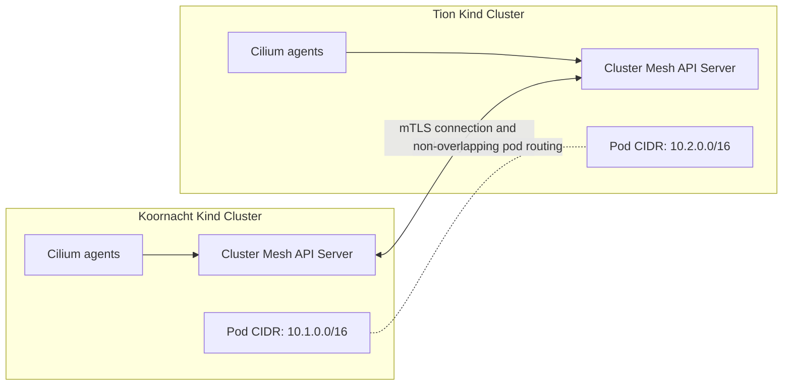

# Module 1: Cluster Mesh Setup & Workloads

The goal of this module is to bootstrap a two-cluster Kind environment, install Cilium on both clusters, establish the Cluster Mesh connection, and deploy small test workloads that make cross-cluster behavior easy to observe.

---

## 🛠️ Step-by-Step Instructions

### Step 1: Create the Kind Clusters
We disable default CNI on Kind to let Cilium manage the networking datapath. We also define custom non-overlapping IP subnets to make routing between pods simple and conflict-free.

```bash
# In the Koornacht terminal tab
kind create cluster --name koornacht --config kind_koornacht.yaml

# In the Tion terminal tab
kind create cluster --name tion --config kind_tion.yaml
```

After this step you have two independent Kubernetes clusters. They cannot talk to each other through Cilium Cluster Mesh yet; they only share the same local Docker/Kind environment.

### Step 2: Install Cilium CNI on Both Clusters
Each cluster in the mesh must have a unique identifier (`cluster.id`) and name (`cluster.name`). Put the required Cilium configuration in the install command so the cluster starts with the intended settings instead of changing them afterward.

```bash
# In the Koornacht terminal tab
cilium install \
  --context kind-koornacht \
  --set cluster.name=koornacht \
  --set cluster.id=1 \
  --set ipam.mode=kubernetes \
  --set hubble.relay.enabled=true \
  --set hubble.ui.enabled=true

cilium status --context kind-koornacht --wait

# In the Tion terminal tab
cilium install \
  --context kind-tion \
  --set cluster.name=tion \
  --set cluster.id=2 \
  --set ipam.mode=kubernetes

cilium status --context kind-tion --wait
```

Hubble is enabled during the Koornacht install. That gives you flow visibility for the cluster you will use as the main observation point in this lab.

Do not continue until both clusters report healthy Cilium agents; Cluster Mesh depends on each cluster having a working Cilium datapath first.

### Step 3: Enable & Link the Cluster Mesh
We initialize the Cluster Mesh API Server on each side. We expose them using `NodePort` since the clusters run locally on the same Docker bridge network.

```bash
# Enable Cluster Mesh on both clusters
cilium clustermesh enable --context kind-koornacht --service-type NodePort
cilium clustermesh enable --context kind-tion --service-type NodePort

# Wait for both Cluster Mesh API servers to start
cilium clustermesh status --context kind-koornacht --wait
cilium clustermesh status --context kind-tion --wait

# Connect the Koornacht cluster to the Tion cluster
# Fresh local Kind clusters have separate Cilium CAs, so allow the CLI to add
# each remote CA to the trust bundle.
cilium clustermesh connect \
  --context kind-koornacht \
  --destination-context kind-tion \
  --allow-mismatching-ca

# Verify connection status (look for "Connected clusters: tion" and green status)
cilium clustermesh status --context kind-koornacht --wait
```

At this point, the important control-plane relationship looks like this:



The Cluster Mesh API servers exchange cluster information and security identities. The agents then use that information to understand remote pods and services without merging the two Kubernetes control planes.

### Step 4: Deploy the Workloads
Deploy the pods and local services. Notice that the deployment in each cluster has a custom config map that defines a unique response message.

```bash
# In the Koornacht terminal tab
kubectl apply -f manifests/rebel-base-koornacht.yaml --context kind-koornacht

# In the Tion terminal tab
kubectl apply -f manifests/rebel-base-tion.yaml --context kind-tion
```

Wait until all pods are running:
```bash
kubectl get pods --context kind-koornacht -w
kubectl get pods --context kind-tion -w
```

---

## 🔍 What Happened Under the Hood?

1. **Kind creates two separate clusters**: `kind_koornacht.yaml` and `kind_tion.yaml` define separate control planes, workers, pod CIDRs, and service CIDRs. This is not one stretched Kubernetes cluster; it is two clusters running side by side.
2. **Default Kind CNI is disabled**: The Kind configs set `disableDefaultCNI: true` so Kubernetes starts without its default networking plugin. Cilium is installed next and becomes responsible for pod networking, service handling, and policy enforcement.
3. **Non-overlapping CIDRs avoid routing ambiguity**: Koornacht uses pod CIDR `10.1.0.0/16`; Tion uses pod CIDR `10.2.0.0/16`. When Cilium learns about remote pods, those address ranges are distinct, so traffic can be routed to the correct cluster.
4. **Cluster Mesh adds cross-cluster knowledge**: `cilium clustermesh enable` creates a `clustermesh-apiserver` in each cluster. `cilium clustermesh connect` links the two API servers and allows them to share remote cluster metadata.
5. **Identity sync keeps policy meaningful**: Cilium security identities are based on pod labels and namespaces. After the mesh is connected, Cilium can reason about identities from both clusters, which is the foundation for cross-cluster policy enforcement.
6. **The workload manifests give you something to test**: Both clusters run the same `rebel-base` Service name and an `x-wing` client pod, but each `rebel-base` returns a different JSON message. That makes it easy to see which cluster answered a request in later exercises.

---

## 🧹 Cleanup

When you are finished with the lab, delete both Kind clusters. This removes the Kubernetes nodes, Cilium installation, Cluster Mesh API servers, Hubble components, and the test workloads.

```bash
kind delete cluster --name koornacht
kind delete cluster --name tion
```

Verify that the local Kind clusters are gone:

```bash
kind get clusters
```

If the command returns no `koornacht` or `tion` entries, the lab environment has been cleaned up.
