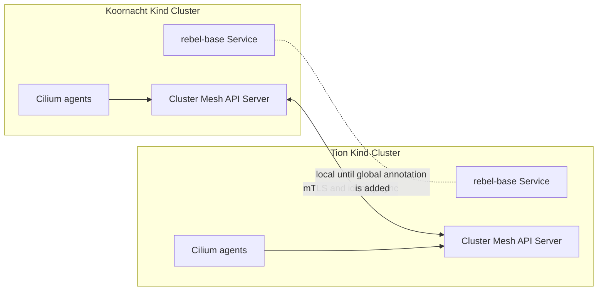

# 01: Cross-Cluster Service Discovery

This lab shows what Cilium Cluster Mesh shares before you start changing traffic behavior with global services. You will create two Kind clusters, install Cilium, connect Cluster Mesh, inspect local Kubernetes services, and confirm what changes when a service opts in to global discovery.

The main point is to separate two ideas that are easy to mix up:

1. Cluster Mesh lets Cilium learn about remote clusters, identities, and services.
2. A normal Kubernetes `Service` still routes only to local endpoints until you explicitly mark it as global.

By the end of the lab, you should be able to explain why two clusters can be connected but still return only local service responses, and what changes when the `service.cilium.io/global: "true"` annotation is added.


## Step 1: Create the Kind Clusters

Start by creating two separate Kubernetes clusters. This matters because Cluster Mesh is not one large Kubernetes cluster; it is a connection between independent clusters that keep their own API servers, nodes, services, and workloads.

We disable Kind's default CNI so Cilium owns pod networking from the start. The two Kind configs also use non-overlapping pod and service CIDRs, which avoids address conflicts once Cilium starts learning about remote endpoints.

```bash
kind create cluster --name koornacht --config kind_koornacht.yaml
kind create cluster --name tion --config kind_tion.yaml
```

After this step, you have two Kubernetes clusters running side by side. They are not meshed yet. The useful outcome is that both contexts exist, but no cross-cluster Cilium state exists yet.

## Step 2: Install Cilium in Both Clusters

Cilium becomes the networking layer for each cluster. In a Cluster Mesh, each cluster also needs a unique Cilium cluster name and numeric cluster ID. Cilium uses those values when it exchanges identity and service information with other clusters.

Put these settings directly in the install command so the agents start with the identity they will use in the mesh. Installing first and changing core mesh identity later is harder to reason about in a lab because students may see intermediate states that are not part of the intended exercise.

```bash
cilium install \
  --context kind-koornacht \
  --set cluster.name=koornacht \
  --set cluster.id=1 \
  --set ipam.mode=kubernetes \
  --set hubble.relay.enabled=true \
  --set hubble.ui.enabled=true

cilium status --context kind-koornacht --wait

cilium install \
  --context kind-tion \
  --set cluster.name=tion \
  --set cluster.id=2 \
  --set ipam.mode=kubernetes

cilium status --context kind-tion --wait
```

The status checks are part of the lab, not just validation. They prove that the datapath is ready before Cluster Mesh is introduced. If the Cilium agents are not healthy locally, later cross-cluster failures will be noisy and misleading.

Do not continue until both clusters report healthy Cilium agents. The desired outcome is `Cilium: OK` in both clusters.

If Koornacht briefly reports `Hubble Relay: 1 errors`, check the relay logs before changing the install command:

```bash
kubectl logs -n kube-system --context kind-koornacht -l k8s-app=hubble-relay --tail=20
```

If the log says a certificate is `not yet valid`, the local Kind node clock is behind the certificate timestamp. Wait for `cilium status --context kind-koornacht --wait` to finish; the relay should become ready once the node clock catches up.

## Step 3: Enable and Connect Cluster Mesh

Now add the cross-cluster control plane. `cilium clustermesh enable` creates the Cluster Mesh API server in each cluster. That API server is what the other cluster connects to when it needs remote Cilium state.

Expose the Cluster Mesh API servers with `NodePort` because both clusters are local Kind clusters on the same Docker network. In a cloud environment you might use a load balancer; in this local lab, `NodePort` is the practical choice.

```bash
cilium clustermesh enable --context kind-koornacht --service-type NodePort
cilium clustermesh enable --context kind-tion --service-type NodePort
```

Wait for both Cluster Mesh API servers. At this point you are checking that each cluster is ready to participate in a mesh, but they are not connected to each other yet.

```bash
cilium clustermesh status --context kind-koornacht --wait
cilium clustermesh status --context kind-tion --wait
```

Connect Koornacht to Tion. This creates the actual relationship between the two Cilium control planes. Fresh local Kind clusters have separate Cilium CAs, so let the CLI add each remote CA to the trust bundle.

```bash
cilium clustermesh connect \
  --context kind-koornacht \
  --destination-context kind-tion \
  --allow-mismatching-ca

cilium clustermesh status --context kind-koornacht --wait
```

Expected result: Koornacht reports Tion as a connected cluster, and the Cilium agents are healthy in both clusters. The important outcome is that Cilium can now exchange remote identity and service information. Kubernetes itself has not merged anything; `kubectl --context kind-koornacht` still talks only to Koornacht, and `kubectl --context kind-tion` still talks only to Tion.

The control-plane path now looks like this:



Cluster Mesh synchronizes remote identities and service metadata. It does not automatically turn every Kubernetes `Service` into a global service.

## Step 4: Deploy the Same App in Both Clusters

Deploy the same service name in both clusters. Each cluster gets a `rebel-base` service and an `x-wing` client deployment, but the server response is different in each cluster. That difference gives you a simple signal for which cluster answered a request.

This step intentionally uses normal Kubernetes manifests. Nothing here is Cilium-specific yet; the point is to create a baseline that behaves like ordinary per-cluster Kubernetes.

```bash
kubectl apply -f manifests/rebel-base-koornacht.yaml --context kind-koornacht
kubectl apply -f manifests/rebel-base-tion.yaml --context kind-tion
```

Wait for the workloads so later curl tests measure service behavior, not pod startup timing.

```bash
kubectl rollout status deployment/rebel-base --context kind-koornacht
kubectl rollout status deployment/x-wing --context kind-koornacht
kubectl rollout status deployment/rebel-base --context kind-tion
kubectl rollout status deployment/x-wing --context kind-tion
```

The desired outcome is one working client and one working `rebel-base` deployment in each cluster.

## Step 5: Prove Services Are Still Local by Default

Now test the important baseline: two clusters are connected by Cluster Mesh, but a plain Kubernetes `Service` still selects only endpoints in its own cluster.

Run the curl from the `x-wing` deployment in each cluster. Because both clusters have a service named `rebel-base`, the DNS name resolves locally in both places. The response body tells you which backend answered.

From Koornacht:

```bash
kubectl exec deployment/x-wing --context kind-koornacht -- /bin/sh -c 'for i in $(seq 1 5); do curl -s rebel-base; done'
```

Expected result:

```json
{"Cluster": "Koornacht", "Planet": "N'Zoth"}
```

From Tion:

```bash
kubectl exec deployment/x-wing --context kind-tion -- /bin/sh -c 'for i in $(seq 1 5); do curl -s rebel-base; done'
```

Expected result:

```json
{"Cluster": "Tion", "Planet": "Foran Tutha"}
```

At this point, Cluster Mesh is connected, but the plain Kubernetes `Service` remains local to each cluster.

## Step 6: Inspect Cilium's Cluster-Aware View

Now look at Cilium's view of the world. Kubernetes still presents local services by default, but Cilium has added cluster-aware metadata underneath.

Check Cilium endpoints and identities. You are not looking for a traffic change here; you are confirming that Cilium is managing the workloads and can assign identities that Cluster Mesh can share.

```bash
kubectl get ciliumendpoints --context kind-koornacht
kubectl get ciliumendpoints --context kind-tion
```

Then inspect the Cilium status. This connects the earlier control-plane setup to the data-plane state you just tested.

```bash
cilium status --context kind-koornacht
cilium status --context kind-tion
```

The important teaching point: Cluster Mesh synchronizes remote identities and service metadata, but Kubernetes service routing does not become global until you opt in. This is a useful default because it avoids accidentally sending production service traffic to another cluster just because the mesh is connected.

## Step 7: Opt In to Global Service Discovery

Now opt in. The global service manifest keeps the same service name and selector, but adds the Cilium annotation that marks the service as global.

Apply the global service annotation in both clusters. Both sides need the global service definition so Cilium can treat the matching service name as a shared service across the mesh.

```bash
kubectl apply -f manifests/rebel-base-global.yaml --context kind-koornacht
kubectl apply -f manifests/rebel-base-global.yaml --context kind-tion
```

Now test from Koornacht. Repeating the request several times gives Cilium enough chances to return endpoints from both clusters.

```bash
kubectl exec deployment/x-wing --context kind-koornacht -- /bin/sh -c 'for i in $(seq 1 10); do curl -s rebel-base; done'
```

Expected result: responses now include both clusters.

```json
{"Cluster": "Koornacht", "Planet": "N'Zoth"}
{"Cluster": "Tion", "Planet": "Foran Tutha"}
```

This is the behavior change the lab is designed to reveal. The clusters were already connected before this step, but traffic stayed local. After the global annotation is present in both clusters, Cilium can include remote service endpoints when answering traffic for `rebel-base`.

## Step 8: Reset the Service

Leave the global service in place if you are continuing to lab `02-global-services-load-balancing`.

To return to local-only services, re-apply the original per-cluster service manifests. This removes the global service annotation and puts the lab back in the baseline state from Step 5.

```bash
kubectl apply -f manifests/rebel-base-koornacht.yaml --context kind-koornacht
kubectl apply -f manifests/rebel-base-tion.yaml --context kind-tion
```

## Cleanup

When you are finished with the lab, delete both Kind clusters. Cleanup matters because Kind clusters are local containers; leaving them running keeps consuming local CPU, memory, disk, and Docker network resources.

Deleting the clusters removes the Kubernetes nodes, Cilium installation, Cluster Mesh API servers, Hubble components, and the test workloads.

```bash
kind delete cluster --name koornacht
kind delete cluster --name tion
```

Verify that the local Kind clusters are gone:

```bash
kind get clusters
```

If the command returns no `koornacht` or `tion` entries, the lab environment has been cleaned up.
