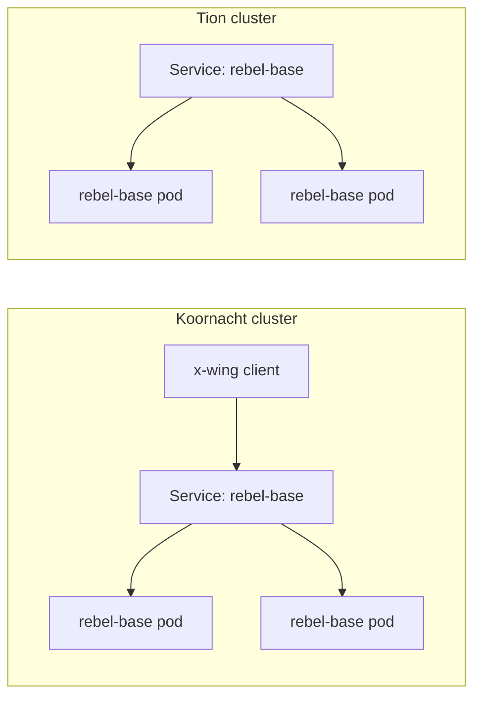
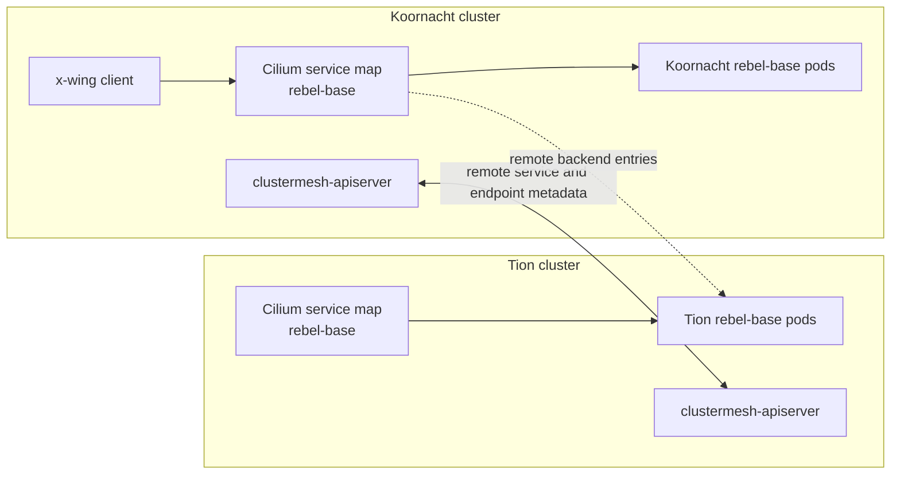
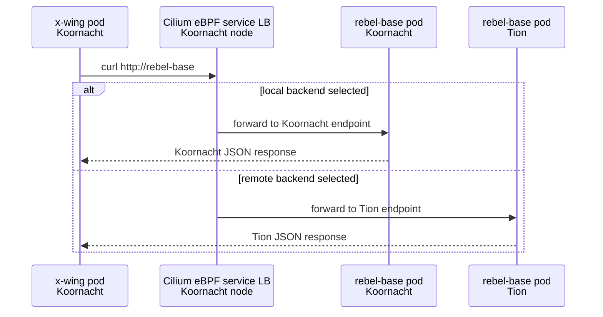
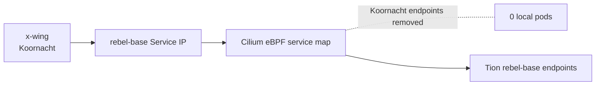

# Module 2: Cilium Global Services

By default, a Kubernetes `ClusterIP` Service only load balances to endpoints in the same cluster. In this module, you will turn the `rebel-base` Service into a Cilium Global Service so clients can use the same service name while Cilium load balances across both Kind clusters.

The lab demonstrates two behaviors:

- **Active-active service routing**: healthy backends from Koornacht and Tion are both eligible for traffic.
- **Automatic backend failover**: when local backends disappear, Cilium removes them from the service map and keeps routing to remote healthy backends.

---

## Service Flow

Before the global annotation is applied, both clusters have a local Service named `rebel-base`, but each Service only knows about same-cluster pods. The service name exists in both clusters, but the backend lists are separate because Kubernetes Services are scoped to one cluster.

In this starting state, a Koornacht client can resolve and call `rebel-base`, but that traffic stays inside Koornacht. Tion has its own `rebel-base` Service and pods, but they are not part of Koornacht's service backend list yet.



After the Service is marked global in both clusters, Cilium treats matching Services as one shared service identity. The match is based on namespace and service name, so `default/rebel-base` in Koornacht lines up with `default/rebel-base` in Tion.

The Kubernetes Services still exist independently in each cluster. Cluster Mesh does not merge the Kubernetes API servers. Instead, the Cilium agents learn remote service and endpoint metadata through the Cluster Mesh API servers, then program their local eBPF service maps with both local and remote backends.

That means a Koornacht pod still sends traffic to the normal Koornacht `rebel-base` Service IP, but Cilium can select either a Koornacht backend or a Tion backend when it performs service load balancing.



Read the second diagram from left to right:

1. The `x-wing` client sends traffic to the local `rebel-base` Service.
2. Cilium handles the Service translation on the Koornacht node.
3. Local Koornacht endpoints remain valid choices.
4. Remote Tion endpoints are also valid choices because Cluster Mesh has shared the endpoint metadata.
5. The application does not change its URL, DNS name, headers, or client logic.

---

## Prerequisites

Before starting the global service exercise, set up the two Kind clusters with Cilium and Cluster Mesh. The global service annotation only works after Cilium is installed in both clusters and the clusters are connected through Cluster Mesh.

If you already completed module `00-kind-clustermesh-setup`, you can skip directly to the verification commands at the end of this section.

Create the two Kind clusters from the root-level configs in this module:

```bash
kind create cluster --name koornacht --config kind_koornacht.yaml
kind create cluster --name tion --config kind_tion.yaml
```

Install Cilium in both clusters. Each cluster must have a unique `cluster.name` and `cluster.id`; Cilium uses those values when it exchanges identities and service information across the mesh.

```bash
cilium install \
  --context kind-koornacht \
  --set cluster.name=koornacht \
  --set cluster.id=1 \
  --set ipam.mode=kubernetes \
  --set hubble.relay.enabled=true \
  --set hubble.ui.enabled=true

cilium install \
  --context kind-tion \
  --set cluster.name=tion \
  --set cluster.id=2 \
  --set ipam.mode=kubernetes
```

Wait until Cilium is healthy in both clusters:

```bash
cilium status --context kind-koornacht --wait
cilium status --context kind-tion --wait
```

Enable Cluster Mesh in both clusters, then connect Koornacht to Tion:

```bash
cilium clustermesh enable --context kind-koornacht --service-type NodePort
cilium clustermesh enable --context kind-tion --service-type NodePort

cilium clustermesh status --context kind-koornacht --wait
cilium clustermesh status --context kind-tion --wait

cilium clustermesh connect \
  --context kind-koornacht \
  --destination-context kind-tion \
  --allow-mismatching-ca
```

Verify the expected contexts exist and the mesh is connected before applying any workload manifests:

```bash
kubectl config get-contexts kind-koornacht kind-tion
cilium clustermesh status --context kind-koornacht --wait
cilium clustermesh status --context kind-tion --wait
```

The status output should show both Cluster Mesh API servers as available and the remote cluster connection as ready.

---

## Step 1: Deploy or Refresh the Base Workloads

Apply the cluster-specific workload manifests. These manifests intentionally create the same `Deployment` and `Service` names in both clusters, but each cluster's ConfigMap returns a different JSON response.

```bash
kubectl apply -f manifests/rebel-base-koornacht.yaml --context kind-koornacht
kubectl apply -f manifests/rebel-base-tion.yaml --context kind-tion
```

Wait for the server and client deployments to become ready:

```bash
kubectl rollout status deployment/rebel-base --context kind-koornacht
kubectl rollout status deployment/x-wing --context kind-koornacht
kubectl rollout status deployment/rebel-base --context kind-tion
kubectl rollout status deployment/x-wing --context kind-tion
```

At this point, `rebel-base` is still a normal local Kubernetes Service. A client in Koornacht should only receive the Koornacht response because the Service has not been made global yet.

```bash
kubectl exec deployment/x-wing --context kind-koornacht -- curl -s rebel-base
```

Expected result:

```json
{"Cluster": "Koornacht", "Planet": "N'Zoth"}
```

---

## Step 2: Declare the Service as Global on Both Clusters

Apply the global Service manifest to both clusters. The important field is the annotation:

```yaml
service.cilium.io/global: "true"
```

That annotation tells Cilium that `default/rebel-base` is not only a local service. Cilium should export this cluster's ready backends and import matching ready backends from connected clusters.

```bash
kubectl apply -f manifests/rebel-base-global.yaml --context kind-koornacht
kubectl apply -f manifests/rebel-base-global.yaml --context kind-tion
```

Verify that both Services carry the global annotation:

```bash
kubectl get svc rebel-base --context kind-koornacht -o jsonpath='{.metadata.annotations.service\.cilium\.io/global}{"\n"}'
kubectl get svc rebel-base --context kind-tion -o jsonpath='{.metadata.annotations.service\.cilium\.io/global}{"\n"}'
```

Both commands should print:

```text
true
```

---

## Step 3: Test Active-Active Load Balancing

Run several requests from the Koornacht `x-wing` pod. The client still uses the normal Kubernetes service name, `rebel-base`; it does not need a remote-cluster hostname or a different port.

```bash
kubectl exec deployment/x-wing --context kind-koornacht -- /bin/sh -c 'for i in $(seq 1 10); do curl -s rebel-base; echo; done'
```

Expected result: responses include both clusters.

```json
{"Cluster": "Koornacht", "Planet": "N'Zoth"}
{"Cluster": "Tion", "Planet": "Foran Tutha"}
{"Cluster": "Koornacht", "Planet": "N'Zoth"}
{"Cluster": "Tion", "Planet": "Foran Tutha"}
```

The exact order can vary. The key observation is that a pod in Koornacht can receive responses from Tion through the same `rebel-base` Service.

The request path now looks like this after the global Service is active. The first decision happens on the Koornacht node where the client pod is running. Cilium intercepts the Service traffic, looks up the global backend set for `rebel-base`, and picks one healthy backend from that set.

If the chosen backend is local, the request stays in Koornacht. If the chosen backend is remote, Cilium forwards the request across the Cluster Mesh datapath to a Tion pod. In both cases, the client only sees a normal HTTP response from `rebel-base`.



This is active-active behavior: both clusters are serving traffic at the same time. It is not standby failover yet, because the local Koornacht pods are still healthy and remain part of the backend pool.

---

## Step 4: Simulate Loss of Local Backends

Scale Koornacht's `rebel-base` Deployment to zero replicas. This removes the local endpoints from the Koornacht Service, but it does not delete the Service itself and it does not affect the Tion backends.

```bash
kubectl scale deployment rebel-base --replicas 0 --context kind-koornacht
kubectl rollout status deployment/rebel-base --context kind-koornacht
```

Confirm Koornacht has no local `rebel-base` pods ready:

```bash
kubectl get pods -l name=rebel-base --context kind-koornacht
kubectl get endpoints rebel-base --context kind-koornacht
```

The local endpoint list should be empty or show no ready addresses. That is the condition Cilium uses to remove Koornacht pod IPs from the service load-balancing map.

---

## Step 5: Test Automatic Failover

Run the same curl loop from Koornacht again:

```bash
kubectl exec deployment/x-wing --context kind-koornacht -- /bin/sh -c 'for i in $(seq 1 10); do curl -s rebel-base; echo; done'
```

Expected result: every successful response comes from Tion.

```json
{"Cluster": "Tion", "Planet": "Foran Tutha"}
{"Cluster": "Tion", "Planet": "Foran Tutha"}
{"Cluster": "Tion", "Planet": "Foran Tutha"}
```

The failover path is now narrower because Koornacht no longer has ready local endpoints for this Service. The Service object still exists, and the client still connects to `rebel-base`, but the local backend list has been emptied by scaling the Deployment to zero.

Cilium reacts to that endpoint change by removing Koornacht pod IPs from the service map. Since Tion still advertises healthy global backends, those remote endpoints become the only usable choices.



No DNS change is required. The client continues to resolve and call `rebel-base`; Cilium changes the backend selection underneath the Service. This is the important difference from DNS-based failover: the application does not wait for a record update or retry against a different hostname.

---

## What Happened Under the Hood?

1. **The Service identity stayed stable**: `default/rebel-base` remained the Service name in each Kubernetes cluster. The client did not need to know whether a backend was local or remote.
2. **The global annotation changed Cilium behavior**: `service.cilium.io/global: "true"` made Cilium treat matching Services across connected clusters as one global backend pool.
3. **Cluster Mesh shared endpoint metadata**: The `clustermesh-apiserver` components exchanged remote service and endpoint information. Kubernetes itself did not become one shared control plane.
4. **Cilium programmed the datapath**: Cilium agents updated eBPF service load-balancing maps so the `rebel-base` service entry could select from local and remote backends.
5. **Failover followed endpoint readiness**: When Koornacht replicas were scaled to zero, Koornacht no longer had ready local endpoints. Cilium removed those backends and continued selecting the healthy Tion endpoints.
6. **Traffic avoided external load balancers**: The request path stayed inside the Cilium datapath. There was no external load balancer, DNS failover delay, or application-side cluster selection logic.

---

## Restore the Lab State

Scale Koornacht's `rebel-base` Deployment back to two replicas before continuing to the next module:

```bash
kubectl scale deployment rebel-base --replicas 2 --context kind-koornacht
kubectl rollout status deployment/rebel-base --context kind-koornacht
```

Confirm traffic can use both clusters again:

```bash
kubectl exec deployment/x-wing --context kind-koornacht -- /bin/sh -c 'for i in $(seq 1 10); do curl -s rebel-base; echo; done'
```

Expected result: responses should again include both `Koornacht` and `Tion`.

## Cleanup: Remove the Kind Clusters

When you are finished with the lab, remove both Kind clusters:

```bash
kind delete cluster --name koornacht
kind delete cluster --name tion
```

Verify they are gone:

```bash
kind get clusters
```
