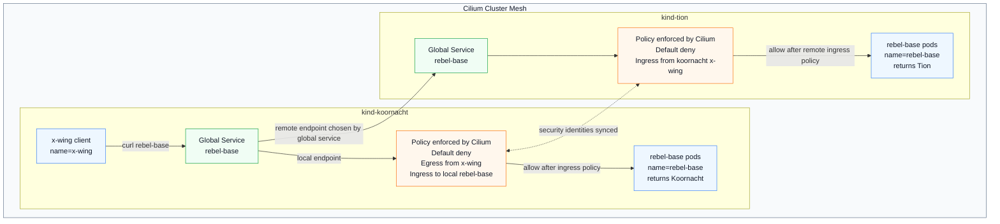

# Module 5: Multi-Cluster Network Policies

In this module, you will learn how Cilium extends its **identity-based firewall** across multiple clusters. You will implement a zero-trust architecture across your cluster mesh and observe how policies are enforced on cross-cluster traffic at the eBPF layer.

The idea of this lab is to make cross-cluster policy behavior visible. A normal Kubernetes Service only sends traffic to endpoints inside one cluster. With Cilium Cluster Mesh and a global service, the same service name can represent endpoints in multiple clusters. That is powerful, but it also means security has to work across cluster boundaries. In this exercise, you start from a denied state and then open only the paths that should be allowed.

By the end, `x-wing` in the `koornacht` cluster will be able to call the global `rebel-base` service. Some responses will come from `koornacht`, and some responses will come from `tion`. The important part is not only that the request works. The important part is that it works because Cilium recognizes the source workload identity across the mesh and each destination cluster explicitly allows that identity.

---

## 💡 The Core Concept: Multi-Cluster Identity

Traditional firewalls enforce security using IP addresses, which is brittle and complex in multi-cluster environments with thousands of transient pods. 

Cilium avoids this by using **Security Identities**.
1. When a pod is scheduled, Cilium assigns it a numeric identity based on its labels (e.g., `name=x-wing`).
2. Cilium synchronizes these identity mappings across the Cluster Mesh.
3. Every packet sent over the mesh is encapsulated. The source pod's security identity is embedded directly inside the vxlan/geneve tunnel header.
4. The receiving node extracts the security identity and enforces policies instantly, without needing to perform DNS lookups or check external databases.

This changes how you should think about network policy. You are not saying "allow traffic from IP address `10.x.y.z`". You are saying "allow traffic from a workload with this identity". That identity is built from Kubernetes labels and cluster metadata, so the policy can still make sense after pods restart, move to another node, or receive a new IP address.

In this module, the most important identity fields are:

- `name=x-wing`: identifies the client workload.
- `name=rebel-base`: identifies the server workload.
- `io.cilium.k8s.policy.cluster=koornacht`: identifies which cluster the source identity belongs to.

The cluster label is what makes the cross-cluster part explicit. Without it, a policy could accidentally match a workload with the same labels in another cluster. With it, the policy can say exactly which cluster the trusted source must come from.

---

## 🧭 Architecture Flow

The lab uses two Kind clusters joined by Cilium Cluster Mesh. Each cluster has a local `rebel-base` deployment, and the `rebel-base` Service is marked as a Cilium global service so traffic from `koornacht` can be load-balanced to endpoints in both clusters.



Read the flow from left to right:

- The Kind configs create two separate Kubernetes clusters with different pod and service CIDRs. The different CIDRs matter because Cluster Mesh must be able to route traffic between clusters without address overlap.
- Each cluster runs `rebel-base` behind a `rebel-base` Service. The service is global, so a request from `x-wing` in `koornacht` can land on either the local `koornacht` pods or the remote `tion` pods.
- The session first applies default deny on both clusters. That gives every selected workload a closed policy posture before any allow rule is added.
- The next policy opens egress from `x-wing` in `koornacht` to `rebel-base` endpoints in the mesh. This only opens the client side; the server side still needs ingress.
- Applying the ingress policy in `koornacht` opens the local path only. Requests that the global service sends to `tion` still fail because `tion` enforces policy for its own local pods.
- Applying the same ingress policy in `tion` opens the remote path. Tion allows the packet because the synced Cilium identity says the source is `name=x-wing` from cluster `koornacht`, not because of the source IP address.

The main design lesson is that each cluster remains responsible for protecting its own workloads. The source cluster can allow a client to send traffic, but the destination cluster still decides whether its local pods may receive that traffic.

---

## 🧱 Start Here: Lab Requirements

Before starting this module, the student needs:

- A local container runtime running, such as Docker Desktop or a compatible Docker runtime.
- `kubectl`, `kind`, and the Cilium CLI installed.
- Internet access for pulling the Cilium, nginx, and `cilium/json-mock` container images.
- Two Kubernetes clusters with non-overlapping pod and service CIDRs.
- Cilium installed in both clusters with unique cluster names and cluster IDs.
- Cilium Cluster Mesh enabled and connected between the two clusters.

These requirements matter because this lab depends on features that plain Kind does not provide by itself. Kind creates Kubernetes clusters, but it does not create the multi-cluster datapath, identity synchronization, or global service behavior. Cilium provides those pieces.

This lesson includes two Kind config files in the lesson root:

- `kind-koornacht.yaml`
- `kind-tion.yaml`

They disable the default CNI and kube-proxy because Cilium will provide pod networking, service load-balancing, policy enforcement, and Cluster Mesh behavior. The pod and service CIDRs are different in each file so cross-cluster routing does not overlap.

The unique cluster names and IDs are also important. Cilium uses them to distinguish identities that may otherwise look identical. For example, both clusters can have a pod labeled `name=x-wing`, but the full cross-cluster identity also includes the cluster where that workload exists.

Create the clusters:

```bash
kind create cluster --name koornacht --config kind-koornacht.yaml
kind create cluster --name tion --config kind-tion.yaml
```

At this point, the nodes may show `NotReady`. That is expected because no CNI is installed yet.

Install Cilium into both clusters:

```bash
cilium install --context kind-koornacht \
  --set cluster.name=koornacht \
  --set cluster.id=1 \
  --set ipam.mode=kubernetes \
  --set kubeProxyReplacement=true

cilium install --context kind-tion \
  --set cluster.name=tion \
  --set cluster.id=2 \
  --set ipam.mode=kubernetes \
  --set kubeProxyReplacement=true
```

The install command gives Cilium ownership of networking in each Kind cluster. `ipam.mode=kubernetes` tells Cilium to use the Kubernetes-assigned pod CIDRs from the Kind config. `kubeProxyReplacement=true` lets Cilium replace kube-proxy service handling with eBPF service load-balancing, which is the datapath this module is meant to demonstrate.

Wait for Cilium to become healthy:

```bash
cilium status --context kind-koornacht --wait
cilium status --context kind-tion --wait
```

Enable Cluster Mesh in both clusters. With Kind, expose the Cluster Mesh control plane as `NodePort`:

```bash
cilium clustermesh enable --context kind-koornacht --service-type NodePort
cilium clustermesh enable --context kind-tion --service-type NodePort
```

Cluster Mesh needs a way for the Cilium control planes in both clusters to talk to each other. In cloud environments this is often exposed with a load balancer. In local Kind clusters, `NodePort` is the practical option because the clusters run inside local containers.

Wait for the Cluster Mesh components:

```bash
cilium clustermesh status --context kind-koornacht --wait
cilium clustermesh status --context kind-tion --wait
```

Connect the clusters. This command is run once; Cilium establishes the connection in both directions:

```bash
cilium clustermesh connect --context kind-koornacht --destination-context kind-tion --allow-mismatching-ca
```

The `--allow-mismatching-ca` flag is useful for this local Kind lab because each cluster may generate its own Cilium CA during installation. The flag lets Cilium add the remote cluster CA to the trust bundle. In a production environment, you would normally plan CA handling more deliberately instead of relying on this lab shortcut.

After the connection is established, Cilium can synchronize service information and identities between the clusters. That synchronization is what allows `koornacht` to know that the global `rebel-base` service also has endpoints in `tion`, and what allows `tion` to recognize traffic from `x-wing` in `koornacht`.

Verify the mesh before applying the lesson manifests:

```bash
cilium clustermesh status --context kind-koornacht --wait
cilium clustermesh status --context kind-tion --wait
```

Optional but useful before the lesson:

```bash
cilium connectivity test --context kind-koornacht --multi-cluster kind-tion
```

Start Step 0 only after both clusters are healthy and Cluster Mesh reports that the clusters are connected.

---

## 🛠️ Lab Walkthrough

The lab is intentionally staged. Each stage changes only one part of the traffic path so you can connect the command you ran with the behavior you see.

Traffic from `x-wing` to `rebel-base` has three important requirements:

- The global `rebel-base` Service must be able to discover endpoints in both clusters.
- The source pod, `x-wing`, must be allowed to send egress traffic.
- The destination pods, `rebel-base`, must be allowed to receive ingress traffic in whichever cluster owns the selected endpoint.

This is the core idea of the module: cross-cluster service discovery and cross-cluster policy are related, but they are not the same thing. Cluster Mesh can make remote endpoints available, but network policy still decides whether traffic is allowed.

### Manifest Map

| File | Apply to | Purpose |
| --- | --- | --- |
| `manifests/rebel-base-koornacht.yaml` | `kind-koornacht` | Creates the Koornacht `rebel-base` server, `x-wing` client, and Service. |
| `manifests/rebel-base-tion.yaml` | `kind-tion` | Creates the Tion `rebel-base` server, `x-wing` client, and Service. |
| `manifests/rebel-base-global.yaml` | both clusters | Marks the `rebel-base` Service as a Cilium global service. |
| `manifests/default-deny.yaml` | both clusters | Applies namespace-wide default deny with DNS egress allowed. |
| `manifests/x-wing-to-rebel-base.yaml` | `kind-koornacht` | Allows `x-wing` in Koornacht to send egress to `rebel-base` endpoints in the mesh. |
| `manifests/rebel-base-from-x-wing.yaml` | both clusters, one stage at a time | Allows local `rebel-base` pods to receive ingress from `x-wing` in Koornacht. |

### Step 0: Deploy Workloads and Prove the Global Service Works

Start by applying the full workload and service manifests:

```bash
kubectl apply -f manifests/rebel-base-koornacht.yaml --context kind-koornacht
kubectl apply -f manifests/rebel-base-tion.yaml --context kind-tion
kubectl apply -f manifests/rebel-base-global.yaml --context kind-koornacht
kubectl apply -f manifests/rebel-base-global.yaml --context kind-tion
```

Use the full manifest file path each time. Do not apply copied fragments from the README, because the workload files contain multiple Kubernetes objects separated by `---`.

These files create the baseline application:

- `manifests/rebel-base-koornacht.yaml` creates the `rebel-base` server, the `x-wing` client, and a normal `rebel-base` Service in `koornacht`.
- `manifests/rebel-base-tion.yaml` creates the same workload shape in `tion`, but the server response identifies itself as Tion.
- `manifests/rebel-base-global.yaml` marks the `rebel-base` Service as global in both clusters.

The different response bodies are intentional. They let you see which cluster handled each request.

Before adding policies, prove that Cluster Mesh and the global service are working. First, check that the clusters are connected:

```bash
cilium clustermesh status --context kind-koornacht --wait
cilium clustermesh status --context kind-tion --wait
```

If `cilium clustermesh status` says `No cluster connected`, the global service cannot import Tion endpoints yet. Re-run the connect command from the setup section and wait for both clusters to report connected:

```bash
cilium clustermesh connect --context kind-koornacht --destination-context kind-tion --allow-mismatching-ca
cilium clustermesh status --context kind-koornacht --wait
cilium clustermesh status --context kind-tion --wait
```

Next, check that the global Service definition exists in both clusters:

```bash
kubectl get service rebel-base --context kind-koornacht -o yaml
kubectl get service rebel-base --context kind-tion -o yaml
```

Both Service objects must have the same name, the same namespace, and the annotation `service.cilium.io/global: "true"`. Cilium's global service behavior depends on that matching service definition in both clusters.

Now run a smoke test from `x-wing` in `koornacht`:

```bash
kubectl exec deployment/x-wing --context kind-koornacht -- /bin/sh -c 'for i in $(seq 1 20); do curl -sS --max-time 2 rebel-base; done'
```

Expected observation before any policy is applied:

```json
{"Cluster": "Koornacht", "Planet": "N'Zoth"}
{"Cluster": "Tion", "Planet": "Foran Tutha"}
```

You do not need a perfect alternating pattern. Load-balancing can choose one cluster several times in a row. The important signal is that Tion appears at least once. If you only see Koornacht responses, do not continue yet; the policy stages will not demonstrate cross-cluster behavior until the global service can reach Tion endpoints.

### Step 1: Apply Default Deny on Both Clusters

Now close the application network path:

```bash
kubectl apply -f manifests/default-deny.yaml --context kind-koornacht
kubectl apply -f manifests/default-deny.yaml --context kind-tion
```

This file uses a standard Kubernetes `NetworkPolicy` for default deny. Cilium enforces Kubernetes NetworkPolicy objects, and using the Kubernetes type here makes the default-deny behavior explicit: all ingress is denied, and egress is denied except DNS.

The policy selects all pods in the namespace with `podSelector: {}`. The empty `ingress: []` list means selected pods do not accept incoming traffic unless another policy allows it. The egress section allows only DNS to CoreDNS on port 53.

DNS is intentionally allowed because the test uses the service name `rebel-base`. If DNS were blocked, the client could fail before reaching the network-policy behavior this module is teaching.

Verify that both clusters have the default-deny policy before moving on:

```bash
kubectl get networkpolicy --context kind-koornacht
kubectl get networkpolicy --context kind-tion
```

Expected policy objects:

```text
kind-koornacht: default-deny
kind-tion:      default-deny
```

Do not test application traffic yet. At this point both the client and server sides are locked down, so application traffic should not work.

### Step 2: Authorize Egress from x-wing to rebel-base

Open the source side of the path:

```bash
kubectl apply -f manifests/x-wing-to-rebel-base.yaml --context kind-koornacht
```

This Cilium policy selects `x-wing` in the `koornacht` cluster and allows it to send egress traffic to endpoints labeled `name=rebel-base`. The destination selector includes `io.cilium.k8s.policy.cluster Exists`, which makes the destination match `rebel-base` endpoints from any cluster in the mesh.

This is only half of the conversation:

- The source pod must be allowed to send egress.
- The destination pod must be allowed to receive ingress.

After this step, `x-wing` is allowed to send traffic toward `rebel-base`, including remote `rebel-base` endpoints. However, no `rebel-base` pod has been told to accept that traffic yet.

Verify the policy state before testing:

```bash
kubectl get networkpolicy,cnp --context kind-koornacht
kubectl get networkpolicy,cnp --context kind-tion
```

Expected policy state before the first failure test:

```text
kind-koornacht: networkpolicy/default-deny, ciliumnetworkpolicy/x-wing-to-rebel-base
kind-tion:      networkpolicy/default-deny
```

If `rebel-base-from-x-wing` already exists in either cluster, remove it before running the expected failure test:

```bash
kubectl delete -f manifests/rebel-base-from-x-wing.yaml --context kind-koornacht --ignore-not-found
kubectl delete -f manifests/rebel-base-from-x-wing.yaml --context kind-tion --ignore-not-found
```

### Step 3: Test Initial Connection (Expected Failure)

Run the request loop from `x-wing` in `koornacht`:

```bash
kubectl exec deployment/x-wing --context kind-koornacht -- /bin/sh -c 'for i in $(seq 1 10); do curl -sS --max-time 2 rebel-base; done'
```

Expected observation:

```sh
curl: (28) Connection timed out after 2001 milliseconds
curl: (28) Connection timed out after 2000 milliseconds
...
command terminated with exit code 28
```

This failure is expected and useful. It proves that allowing egress from the client is not enough. The selected `rebel-base` endpoint is still protected by default deny, so the destination side drops the traffic before it reaches the application container.

This is the first key lesson: in a zero-trust policy model, both sides matter. A source cluster can allow a client to send traffic, but each destination cluster still decides whether its local pods may receive it.

If you see successful JSON responses here, the lab is not in the expected state. Check the active policies:

```bash
kubectl get networkpolicy,cnp --context kind-koornacht
kubectl get networkpolicy,cnp --context kind-tion
kubectl describe networkpolicy default-deny --context kind-koornacht
```

For this step, `networkpolicy/default-deny` must exist in both clusters, `ciliumnetworkpolicy/x-wing-to-rebel-base` must exist in `koornacht`, and `ciliumnetworkpolicy/rebel-base-from-x-wing` must not exist yet.

---

### Step 4: Allow Ingress on Koornacht's rebel-base

Now open the destination side only in the local cluster:

```bash
kubectl apply -f manifests/rebel-base-from-x-wing.yaml --context kind-koornacht
```

Run the request loop again:

```bash
kubectl exec deployment/x-wing --context kind-koornacht -- /bin/sh -c 'for i in $(seq 1 10); do curl -sS --max-time 2 rebel-base; done'
```

Expected observation:

```sh
{"Cluster": "Koornacht", "Planet": "N'Zoth"}
curl: (28) Connection timed out after 2001 milliseconds
{"Cluster": "Koornacht", "Planet": "N'Zoth"}
curl: (28) Connection timed out after 2000 milliseconds
...
```

The mixed result is the point of this step.

- Requests routed to local Koornacht endpoints succeed.
- Requests routed to remote Tion endpoints still time out.

This happens because you only changed policy in `koornacht`. Tion still owns and protects the Tion `rebel-base` pods, and Tion has not been given an ingress allow rule yet.

---

### Step 5: Allow Ingress on Tion's rebel-base (Cross-Cluster Ingress)

Now apply the same ingress policy in the remote cluster:

```bash
kubectl apply -f manifests/rebel-base-from-x-wing.yaml --context kind-tion
```

Run the request loop one final time:

```bash
kubectl exec deployment/x-wing --context kind-koornacht -- /bin/sh -c 'for i in $(seq 1 10); do curl -sS --max-time 2 rebel-base; done'
```

Expected observation:

```json
{"Cluster": "Tion", "Planet": "Foran Tutha"}
{"Cluster": "Koornacht", "Planet": "N'Zoth"}
{"Cluster": "Tion", "Planet": "Foran Tutha"}
{"Cluster": "Koornacht", "Planet": "N'Zoth"}
...
```

Now every endpoint behind the global `rebel-base` service has both sides of the policy path open:

- `x-wing` in `koornacht` has egress to `rebel-base`.
- `rebel-base` in `koornacht` has ingress from `x-wing` in `koornacht`.
- `rebel-base` in `tion` has ingress from `x-wing` in `koornacht`.

Seeing both response bodies proves two things at the same time: the global service is routing to both clusters, and the remote cluster is accepting traffic based on the synced Cilium identity for `x-wing` from `koornacht`.

---

## 🔍 What Happened Under the Hood?

- **Enforcing `rebel-base-from-x-wing.yaml`**: Look at the policy:
  ```yaml
  ingress:
  - fromEndpoints:
    - matchLabels:
        name: x-wing
        io.cilium.k8s.policy.cluster: koornacht
  ```
  This policy selects `name: x-wing` but crucially restricts it to `io.cilium.k8s.policy.cluster: koornacht`.
- **Identity Matching**: When the `x-wing` pod in `koornacht` makes a connection to Tion's `rebel-base` pod, Tion's node receives the vxlan-encapsulated packet. The node reads the security identity from the tunnel header. It checks if that identity is associated with the cluster label `koornacht` and the pod label `name: x-wing`. Since we applied the ingress policy on Tion, the packet is allowed into the pod.
- **Kernel-Level Defense**: All checking and filtering happen at the eBPF layer (socket buffers / traffic control hooks), meaning blocked packets are dropped immediately in the kernel before they consume any user-space CPU or network stack memory!

The important detail is that the policy is not tied to the current pod IP. If the `x-wing` pod is recreated and receives a new IP, the policy still works because the replacement pod receives the same Cilium identity as long as its labels still match. This is why identity-based policy is a better fit for dynamic Kubernetes environments than static IP allow lists.

The second important detail is that the policy is local to the enforcing cluster. Applying `manifests/rebel-base-from-x-wing.yaml` to `koornacht` does not configure Tion's datapath. You apply the same policy file to `tion` because Tion owns and protects the Tion `rebel-base` endpoints.

In real environments, this pattern is used to build controlled service access between clusters. A platform team can expose a service globally, but each destination cluster can still require explicit policy for which remote workloads are trusted to call it.

---

## 🧹 Cleanup

Use the reset cleanup when you want to keep the Kind clusters and Cilium Cluster Mesh running for another attempt.

```bash
kubectl delete -f manifests/default-deny.yaml --context kind-koornacht
kubectl delete -f manifests/default-deny.yaml --context kind-tion
kubectl delete -f manifests/x-wing-to-rebel-base.yaml --context kind-koornacht
kubectl delete -f manifests/rebel-base-from-x-wing.yaml --context kind-koornacht
kubectl delete -f manifests/rebel-base-from-x-wing.yaml --context kind-tion
kubectl delete -f manifests/rebel-base-global.yaml --context kind-koornacht
kubectl delete -f manifests/rebel-base-global.yaml --context kind-tion
kubectl delete -f manifests/rebel-base-koornacht.yaml --context kind-koornacht
kubectl delete -f manifests/rebel-base-tion.yaml --context kind-tion
```

Use the full cleanup when you are finished with the module and want to remove the clusters too:

```bash
kind delete cluster --name koornacht
kind delete cluster --name tion
```

Deleting the Kind clusters also removes the Cilium installation, Cluster Mesh state, workloads, services, and policies inside those clusters.
