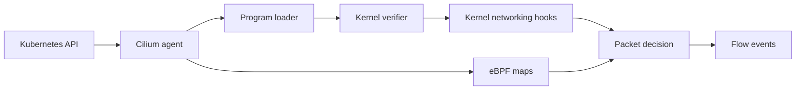

# eBPF Foundations

This student case explains the eBPF concepts that Cilium builds on. It is conceptual, so there is no Kind cluster for this case.

You do not need to write eBPF programs for the CCA exam. You do need to understand what Cilium means when it says that policy, service load balancing, and observability are implemented in the datapath.

## What You Will Learn

- what eBPF is
- what programs, hooks, maps, and the verifier do
- why Cilium uses eBPF instead of only iptables
- why labels and identities matter more than pod IPs
- how the Cilium agent and kernel datapath work together
- how this connects to later Cilium labs

## Architecture



## Step 1: Understand The Problem

Traditional Linux networking often relies on rule chains and packet traversal through many tables. In Kubernetes this can become hard to reason about because pods are created and deleted constantly, Services change backend endpoints, and NetworkPolicies must be enforced dynamically.

eBPF gives Cilium a programmable datapath. Cilium can load verified programs into kernel hooks and use maps for fast lookups. Instead of rebuilding long rule chains for every change, the Cilium agent updates map entries that the datapath reads when packets arrive.

For a student, the important idea is:

```text
Cilium separates control-plane decisions from datapath execution.
The agent calculates state. The eBPF datapath uses that state quickly.
```

## Step 2: Learn The Vocabulary

- Program: verified code loaded into the kernel. Cilium uses programs to handle packet processing logic.
- Hook: a place in the kernel where a program attaches. Examples include XDP, traffic control, socket, and cgroup hooks.
- Map: a key/value data structure shared between kernel programs and user space. Cilium maps store service, endpoint, identity, policy, connection-tracking, and NAT state.
- Verifier: the kernel safety checker that rejects unsafe programs before they can run.
- Datapath: the path a packet takes through networking logic.
- Identity: a numeric representation of a label set. Cilium policy uses identities instead of only IP addresses.
- Tail call: a way for one eBPF program to jump to another eBPF program. This lets complex datapaths be split into smaller pieces.
- XDP: an early hook at the network device driver layer. It is used for very fast packet handling before the normal network stack.

## Step 3: Understand The Control Plane And Datapath Split

The Cilium agent runs in user space as a DaemonSet. It watches Kubernetes resources such as Pods, Services, Endpoints, Nodes, and CiliumNetworkPolicies. From those resources, it derives the desired networking state.

The eBPF datapath runs in the kernel. When traffic arrives, the datapath does not ask the Kubernetes API what to do. It looks up current state in eBPF maps and applies the programmed behavior.

This split is why Cilium can react to Kubernetes changes while keeping packet handling efficient.

## Step 4: Know The Common Hook Points

Cilium can attach eBPF programs at several hook points. You do not need to memorize every internal detail, but you should understand the rough purpose:

- XDP: earliest packet handling at the network device. Useful for very fast drop, redirect, or load-balancing paths.
- TC ingress and egress: packet handling as traffic enters or leaves an interface. This is central to pod datapath processing.
- Socket hooks: useful for socket-level acceleration and policy decisions.
- Cgroup hooks: useful for decisions tied to container or process context.

When troubleshooting, remember that "Cilium uses eBPF" does not mean there is only one program. It means Cilium installs multiple programs at the right kernel hooks and connects them with maps.

## Step 5: Connect It To Cilium Features

Cilium uses eBPF for:

- pod networking
- service load balancing
- kube-proxy replacement
- policy enforcement
- identity lookup
- connection tracking
- NAT
- flow visibility
- transparent encryption integration

When you inspect Cilium with `cilium-dbg`, `cilium status`, or Hubble, you are inspecting the control-plane and datapath state that makes those features work.

## Student Check

Explain this in your own words:

```text
The Cilium agent watches Kubernetes and Cilium resources, then programs eBPF maps and programs. Packets hit eBPF hooks in the kernel, and the datapath uses map lookups to decide forwarding, service translation, policy, and visibility.
```

Now answer these:

1. Why are eBPF maps important for Cilium?
2. Why does Cilium use identities instead of only pod IP addresses?
3. What does the verifier protect the kernel from?
4. Why is Hubble able to show flow verdicts?

## Exam Notes

You should be comfortable with the vocabulary and the mental model. If an exam task asks you to inspect service translation, policy, or flow visibility, think about which Cilium state backs that behavior: endpoints, identities, services, maps, policies, or Hubble flows.

## Exam Memory Model

Remember eBPF in Cilium as three layers:

```text
1. User space control plane: Cilium agent watches Kubernetes.
2. Kernel datapath: eBPF programs run at hooks.
3. Shared state: eBPF maps connect the agent and datapath.
```

The agent does not process every packet. It prepares the state. The kernel datapath handles packets using that state.

This distinction is important in exam troubleshooting. If a Kubernetes Service exists but `cilium-dbg service list` does not show it, the problem is between Kubernetes state and Cilium programmed state. If Cilium service state exists but traffic is dropped, the problem is likely in datapath behavior, policy, routing, CT/NAT, or endpoint reachability.

## What Students Often Confuse

- eBPF program versus eBPF map: programs execute logic; maps store lookup state.
- Cilium identity versus pod IP: identity comes from labels; IP is network addressing.
- Hubble versus Cilium state: Hubble shows observed traffic; `cilium-dbg` shows programmed state.
- XDP versus TC: XDP is earlier at the device layer; TC is an interface ingress/egress hook.
- Policy versus routing: policy decides allowed or denied; routing decides where packets go.

## Packet Walk

For a simple client-to-Service request:

```text
client pod sends packet
packet reaches Cilium eBPF datapath
datapath looks up Service frontend in a map
datapath selects or reuses a backend
datapath checks policy state if policy applies
datapath forwards, redirects, drops, or translates the packet
Hubble can emit the observed flow and verdict
```

This walk is the base for most later modules.
