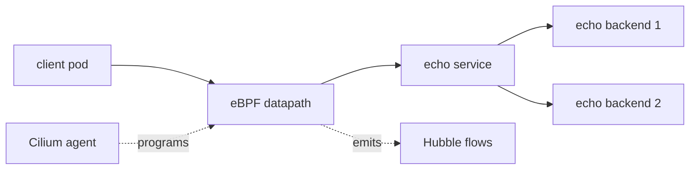

# Cilium eBPF Datapath

This student case creates a Cilium cluster and inspects endpoints from the Cilium agent. The purpose is to connect the theory from the foundation module to a real Kubernetes cluster.

## What You Will Build



## Key Idea

Every Cilium node runs a Cilium agent. The agent is responsible for local endpoints on that node and for programming the eBPF datapath. A Cilium endpoint represents a managed workload and includes labels, identity, policy state, and datapath configuration.

When a pod sends traffic, the packet is handled by eBPF programs attached to the node and pod networking path. Those programs use map state maintained by the agent.

## Step 1: Create The Cluster

```bash
KIND_EXPERIMENTAL_PROVIDER=podman kind create cluster --name cilium-ebpf-datapath --config kind-config.yaml
```

Expected: Kind creates a Kubernetes cluster named `cilium-ebpf-datapath`.

## Step 2: Install Cilium

```bash
helm repo add cilium https://helm.cilium.io/
helm repo update
helm install cilium cilium/cilium --version 1.19.5 \
  --namespace kube-system \
  --set ipam.mode=kubernetes \
  --set kubeProxyReplacement=true \
  --set hubble.enabled=true \
  --set hubble.relay.enabled=true
cilium status --wait
```

What this means:

- `ipam.mode=kubernetes` tells Cilium to use Kubernetes pod CIDR allocation.
- `kubeProxyReplacement=true` makes Cilium handle Service translation in eBPF.
- Hubble is enabled so you can inspect flow events later.

Expected: `cilium status --wait` reports Cilium as ready.

## Step 3: Deploy Workloads

```bash
kubectl apply -f manifests/workloads.yaml
kubectl -n ebpf-lab rollout status deploy/echo
kubectl -n ebpf-lab rollout status deploy/client
```

The manifest creates:

- namespace `ebpf-lab`
- two `echo` backend pods
- one ClusterIP Service named `echo`
- one long-running `client` pod with curl

## Step 4: Inspect Cilium Endpoints

```bash
kubectl -n kube-system exec ds/cilium -- cilium-dbg endpoint list
```

Expected: endpoints from `ebpf-lab` appear with endpoint IDs, identities, labels, IPv4 addresses, and policy state.

Important fields to recognize:

- Endpoint ID: local Cilium endpoint identifier on that node.
- Identity: numeric Cilium security identity derived from labels.
- Labels: workload labels used for policy and identity.
- IPv4/IPv6: pod addressing known by Cilium.
- Policy status: whether ingress or egress policy is enforced.

If no workload endpoints appear, check that the Cilium DaemonSet is ready and the workload pods are running on nodes with Cilium.

## Step 5: Generate Traffic

```bash
kubectl -n ebpf-lab exec deploy/client -- curl -sS http://echo
```

Expected: the command returns `echo`.

This request goes from the client pod to the Kubernetes Service name `echo`. DNS resolves the Service, the request reaches the ClusterIP, and Cilium's datapath translates it to one of the backend pods.

## Step 6: Observe The Flow

```bash
hubble observe -P --namespace ebpf-lab
```

Expected: Hubble shows forwarded flows between the client and echo workloads. You may see DNS flows, TCP flows, and HTTP-related details depending on visibility settings.

Read the output from left to right:

- source workload and namespace
- destination workload, Service, or IP
- protocol and port
- verdict such as `FORWARDED` or `DROPPED`

## Student Check

Answer these before moving on:

1. Which command proves that Cilium knows about the workload endpoints?
2. Which command proves that traffic actually reached the datapath?
3. Why does the Service request still work when kube-proxy is replaced?

## Troubleshooting

If the client cannot reach `echo`, check from the outside in:

```bash
kubectl -n ebpf-lab get pods,svc,endpoints
cilium status
kubectl -n kube-system exec ds/cilium -- cilium-dbg endpoint list
kubectl -n kube-system exec ds/cilium -- cilium-dbg service list
hubble observe -P --namespace ebpf-lab --verdict DROPPED
```

Common meanings:

- No endpoints in Kubernetes: Service selector or pod readiness problem.
- No Cilium endpoint: Cilium did not manage the pod correctly.
- No Cilium service entry: Cilium has not programmed Service state.
- Hubble drop verdict: datapath saw the traffic and rejected or failed it.

## Cleanup

```bash
KIND_EXPERIMENTAL_PROVIDER=podman kind delete cluster --name cilium-ebpf-datapath
```

## Exam Memory Model

This lab proves the basic Cilium lifecycle:

```text
install Cilium -> create workloads -> Cilium creates endpoints -> traffic hits datapath -> Hubble observes flows
```

The key object is the Cilium endpoint. A pod being `Running` is Kubernetes state. A Cilium endpoint existing for that pod is Cilium datapath state. In an exam, do not stop at `kubectl get pods`; prove that Cilium knows about the workload.

## What Each Command Proves

| Command | What it proves |
| --- | --- |
| `cilium status --wait` | Cilium control plane and agents are healthy enough to operate |
| `kubectl get pods,svc,endpoints` | Kubernetes has the desired workloads and Service backends |
| `cilium-dbg endpoint list` | Cilium has created endpoint state for workloads |
| `curl http://echo` | DNS, Service, backend, and datapath forwarding work together |
| `hubble observe -P` | the datapath observed real traffic and emitted flow events |

## Common Exam Trap

A Service request can fail even when pods are running. The failure may be:

- no Kubernetes endpoints
- Cilium did not create endpoint state
- Cilium did not program Service state
- policy drops the request
- routing prevents backend delivery
- Hubble is not enabled, so you cannot observe flows even if traffic exists

Use the command order in the troubleshooting section to narrow the layer.
