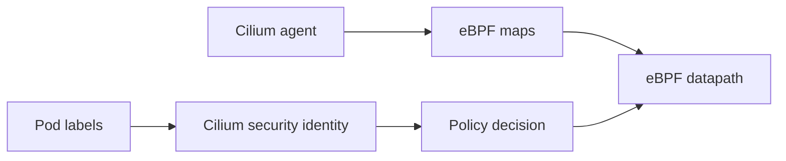

# eBPF Maps And Cilium Identities

This student case shows how Cilium labels become identities and how eBPF maps store datapath state.

## What You Will Build



## Key Idea

Cilium policy is identity-aware. A pod IP can change when a pod is recreated, but the label set often represents the workload's role. Cilium turns relevant labels into a numeric security identity. The datapath can then make policy decisions using identities instead of only IP addresses.

eBPF maps are the runtime lookup tables used by the datapath. The Cilium agent updates maps from Kubernetes and Cilium state; eBPF programs read maps while processing packets.

## Step 1: Create And Install

```bash
KIND_EXPERIMENTAL_PROVIDER=podman kind create cluster --name cilium-ebpf-maps --config kind-config.yaml
helm repo add cilium https://helm.cilium.io/
helm repo update
helm install cilium cilium/cilium --version 1.19.5 \
  --namespace kube-system \
  --set ipam.mode=kubernetes \
  --set kubeProxyReplacement=true
cilium status --wait
```

Expected: Cilium is ready and the cluster has no kube-proxy dependency for Service translation.

## Step 2: Deploy Workloads

```bash
kubectl apply -f manifests/workloads.yaml
kubectl -n ebpf-lab rollout status deploy/echo
kubectl -n ebpf-lab rollout status deploy/client
```

The key labels in this lab are:

- `app=echo`
- `app=client`

Cilium uses labels like these to allocate identities.

## Step 3: Inspect Labels

```bash
kubectl -n ebpf-lab get pods --show-labels
```

Expected: echo pods have `app=echo`; the client pod has `app=client`.

The label set is the stable policy handle. If a pod is deleted and recreated with a new IP but the same labels, it should receive the same logical policy treatment.

## Step 4: Inspect Identities

```bash
kubectl -n kube-system exec ds/cilium -- cilium-dbg identity list
```

Expected: identities are associated with label sets, not pod IPs.

You should be able to point at an identity and explain:

- which labels define it
- which workload likely owns it
- why policy can refer to labels while the datapath uses numeric IDs

## Step 5: Inspect Endpoints

```bash
kubectl -n kube-system exec ds/cilium -- cilium-dbg endpoint list
```

Expected: endpoints show both pod addresses and identity numbers.

This is the bridge between Kubernetes and the datapath:

```text
Pod labels -> Cilium identity -> endpoint state -> eBPF map lookups
```

## Step 6: Inspect Maps

```bash
kubectl -n kube-system exec ds/cilium -- cilium-dbg bpf map list
```

Maps hold service, endpoint, policy, NAT, and connection-tracking state. You do not need to memorize every map name, but you should recognize that Cilium has many maps because different datapath features need different lookup tables.

Useful interpretation:

- Service maps help translate ClusterIP traffic to backends.
- Endpoint maps help locate local workload metadata.
- Policy maps help decide whether identity-to-identity traffic is allowed.
- CT maps track established connections.
- NAT maps support address translation.

## Student Check

Answer these:

1. Why is an identity more stable than a pod IP?
2. Which component updates eBPF maps?
3. Which component reads eBPF maps during packet processing?
4. Why does Cilium need both Kubernetes labels and numeric identities?

## Cleanup

```bash
KIND_EXPERIMENTAL_PROVIDER=podman kind delete cluster --name cilium-ebpf-maps
```

## Exam Memory Model

Keep this chain in your head:

```text
labels -> identity -> endpoint -> policy/map lookup -> datapath decision
```

Kubernetes labels are human-readable. Cilium identities are compact numeric values used by the datapath. eBPF maps store the runtime state that lets the datapath use those identities quickly.

## Why Identities Matter

Pod IPs are temporary. A Deployment can recreate a pod with a different IP at any time. If policy were only built around IPs, every pod replacement would be harder to reason about.

Cilium instead treats a label set as the security meaning of a workload. For example:

```text
app=frontend -> one identity
app=backend -> another identity
app=database -> another identity
```

Policy can say "frontend may talk to backend" while the datapath enforces that as numeric identity checks.

## Map Categories To Recognize

You do not need to memorize every map name, but know why each category exists:

| Map category | Why Cilium needs it |
| --- | --- |
| endpoint | find local workload information |
| identity | connect labels and security identities |
| policy | decide allowed identity, direction, port, and protocol |
| service | translate Service frontends to backends |
| CT | remember established flows |
| NAT | translate replies and external paths correctly |

When you see many maps, that is normal. Cilium has many datapath features, so it needs many state tables.
