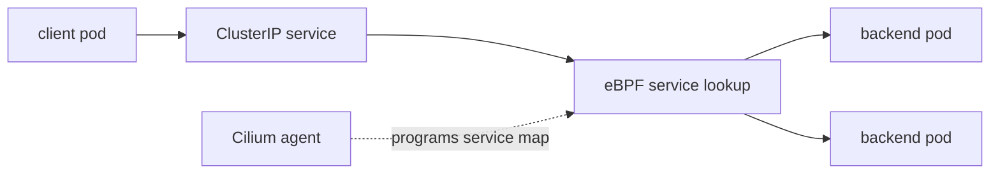

# Kube-Proxy Replacement

This student case explains how Cilium replaces kube-proxy service translation with eBPF.

## What You Will Build



## Key Idea

Kubernetes Services provide stable virtual IPs for changing backend pods. Traditionally kube-proxy programs iptables or IPVS rules so traffic to a Service IP is translated to a backend pod.

With Cilium kube-proxy replacement, Cilium programs eBPF service state instead. Packets are translated by the Cilium datapath using service maps. This can reduce rule-chain complexity and keeps Service handling inside the same identity-aware datapath used for policy and visibility.

## Step 1: Create The Cluster

```bash
KIND_EXPERIMENTAL_PROVIDER=podman kind create cluster --name cilium-kpr --config kind-config.yaml
```

Expected: a Kind cluster named `cilium-kpr`.

## Step 2: Install Cilium With Kube-Proxy Replacement

```bash
helm repo add cilium https://helm.cilium.io/
helm repo update
helm install cilium cilium/cilium --version 1.19.5 \
  --namespace kube-system \
  --set ipam.mode=kubernetes \
  --set kubeProxyReplacement=true
cilium status --wait
```

The important setting is:

```text
kubeProxyReplacement=true
```

That tells Cilium to handle Kubernetes Service translation in eBPF.

## Step 3: Deploy A Service

```bash
kubectl apply -f manifests/workloads.yaml
kubectl -n ebpf-lab get svc,endpoints
```

Expected:

- Service `echo` has a ClusterIP.
- Endpoints point to the echo backend pod IPs.

Kubernetes owns the Service and Endpoint objects. Cilium watches those objects and turns them into datapath state.

## Step 4: Inspect Cilium Service State

```bash
kubectl -n kube-system exec ds/cilium -- cilium-dbg service list
```

Expected: the `echo` service and its backends appear in Cilium service state.

Read the output as:

```text
Service frontend -> backend list
```

The frontend is usually a ClusterIP and port. The backends are pod IPs and target ports. This is the eBPF replacement for kube-proxy's service translation rules.

## Step 5: Test Service Access

```bash
kubectl -n ebpf-lab exec deploy/client -- curl -sS http://echo
```

Expected: `echo`.

If this works, DNS, Service discovery, Cilium service translation, and backend connectivity are all functioning.

## Step 6: Confirm Kube-Proxy Is Not The Data Plane

Depending on the cluster setup, kube-proxy may be absent or not responsible for Service forwarding. Inspect the Cilium config:

```bash
cilium config view | grep kube-proxy-replacement
```

Expected: kube-proxy replacement is enabled.

Do not judge kube-proxy replacement only by whether a `kube-proxy` object exists. The exam-relevant point is whether Cilium is configured to perform Service translation.

## Student Check

Answer these:

1. What Kubernetes objects define Service frontends and backends?
2. What Cilium command shows the Service state programmed into the datapath?
3. What does kube-proxy replacement mean in one sentence?
4. Why is Service handling in eBPF useful for Cilium?

## Exam Notes

Kube-proxy replacement means Service translation is handled by Cilium's eBPF datapath instead of kube-proxy iptables/IPVS rules. If Service access fails, inspect Kubernetes Service and Endpoint objects first, then inspect Cilium service state.

## Cleanup

```bash
KIND_EXPERIMENTAL_PROVIDER=podman kind delete cluster --name cilium-kpr
```

## Exam Memory Model

Kube-proxy replacement is about who performs Service translation.

```text
Without replacement: kube-proxy programs iptables or IPVS.
With Cilium replacement: Cilium programs eBPF service maps.
```

The Kubernetes API object does not change. You still create a normal Service. What changes is the datapath implementation that turns Service traffic into backend traffic.

## Packet Walk

For a request to `http://echo`:

```text
client resolves echo to the Service ClusterIP
packet is sent to ClusterIP:80
Cilium eBPF service lookup finds the Service frontend
Cilium selects or reuses an echo backend
packet is translated toward backend pod IP:5678
reply traffic is translated back consistently
```

This is why the Service works without kube-proxy doing iptables/IPVS translation.

## What To Remember For Troubleshooting

Separate these three states:

| Layer | Command | Meaning |
| --- | --- | --- |
| Kubernetes Service | `kubectl get svc` | frontend exists |
| Kubernetes Endpoints | `kubectl get endpoints` | backend pods are ready |
| Cilium Service State | `cilium-dbg service list` | eBPF datapath has Service translation state |

If Kubernetes has a Service and endpoints but Cilium does not show service state, focus on Cilium programming. If Cilium service state is correct but traffic fails, continue to policy, CT/NAT, routing, or Hubble.

## Common Confusion

Kube-proxy replacement does not mean Kubernetes Services disappear. It means Cilium implements the Service datapath. The API object, DNS name, ClusterIP, and EndpointSlice model are still Kubernetes concepts.
