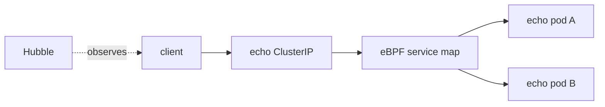

# Service Load Balancing With eBPF

This student case focuses on how traffic to a Kubernetes Service reaches backend pods through Cilium's eBPF service maps.

## What You Will Build



## Key Idea

A Kubernetes Service is a stable frontend. The pods behind it are changing backends. Cilium stores the frontend-to-backend relationship in eBPF maps so packets can be translated directly in the datapath.

Load balancing is not only "pick a pod". It also involves connection tracking so packets from an existing connection keep going to the correct backend.

## Step 1: Create And Install

```bash
KIND_EXPERIMENTAL_PROVIDER=podman kind create cluster --name cilium-ebpf-lb --config kind-config.yaml
helm repo add cilium https://helm.cilium.io/
helm repo update
helm install cilium cilium/cilium --version 1.19.5 \
  --namespace kube-system \
  --set ipam.mode=kubernetes \
  --set kubeProxyReplacement=true \
  --set hubble.enabled=true \
  --set hubble.relay.enabled=true
cilium status --wait
```

Expected: Cilium is ready and kube-proxy replacement is enabled.

## Step 2: Deploy Backends

```bash
kubectl apply -f manifests/workloads.yaml
kubectl -n ebpf-lab rollout status deploy/echo
kubectl -n ebpf-lab get svc,endpoints
```

Expected:

- `echo` has two backend pods.
- The `echo` Service points to both endpoints.

If the Service has no endpoints, Cilium cannot load-balance to pods because Kubernetes has not declared any ready backends.

## Step 3: Send Requests

```bash
for i in $(seq 1 10); do kubectl -n ebpf-lab exec deploy/client -- curl -sS http://echo; done
```

Expected: each request returns `echo`.

This command proves the Service frontend works, but it does not always prove visible round-robin behavior because connection reuse, backend selection, and short-lived requests can make output look identical. Use service state and Hubble to understand the path.

## Step 4: Inspect Service State

```bash
kubectl -n kube-system exec ds/cilium -- cilium-dbg service list
```

Look for:

- the Service frontend for `echo`
- two backend entries
- the backend pod IPs and target port

This output is the best exam-friendly proof that Cilium has translated Kubernetes Service information into datapath state.

## Step 5: Observe With Hubble

```bash
hubble observe -P --namespace ebpf-lab
```

Expected: flows from the client to the echo workload or backend IPs. Depending on how the flow is displayed, you may see the Service frontend, backend identity, or endpoint information.

Useful filters:

```bash
hubble observe -P --namespace ebpf-lab --protocol tcp
hubble observe -P --namespace ebpf-lab --verdict FORWARDED
```

## Step 6: Scale Backends And Recheck

```bash
kubectl -n ebpf-lab scale deploy/echo --replicas=3
kubectl -n ebpf-lab rollout status deploy/echo
kubectl -n ebpf-lab get endpoints echo
kubectl -n kube-system exec ds/cilium -- cilium-dbg service list
```

Expected: Kubernetes endpoints and Cilium service backends both update.

This is the control-plane-to-datapath loop:

```text
Deployment scale -> EndpointSlice update -> Cilium watches update -> eBPF service map update
```

## Student Check

Answer these:

1. What is the Service frontend?
2. What are the Service backends?
3. Why does Cilium need connection-tracking state for load balancing?
4. Which command shows whether Cilium knows about all current backends?

## Cleanup

```bash
KIND_EXPERIMENTAL_PROVIDER=podman kind delete cluster --name cilium-ebpf-lb
```

## Exam Memory Model

Service load balancing has two parts:

```text
selection: choose a backend for new traffic
stickiness/state: keep established traffic on the correct backend
```

Cilium uses service maps for the frontend/backend relationship and connection-tracking/NAT state to keep traffic consistent after the backend is chosen.

## Packet Walk

For the first packet of a TCP connection:

```text
packet enters for ClusterIP:80
datapath finds Service frontend
datapath chooses one backend pod
datapath creates or updates CT/NAT state
packet is forwarded to backend pod targetPort
```

For later packets:

```text
packet matches existing CT state
datapath reuses the established backend decision
packet is forwarded consistently
```

This is why load balancing is not simply random selection for every packet.

## What To Look For In Output

When reading `cilium-dbg service list`, identify:

- Service frontend: ClusterIP and Service port.
- Backend IDs: the available backend entries.
- Backend IPs: pod IPs selected by the Service.
- Backend ports: target ports on the pods.

When reading Kubernetes output, identify:

- Service selector
- Endpoint IPs
- Endpoint port
- ready versus not-ready endpoints

The Service map should match the real ready endpoints.

## Common Exam Trap

If you scale a Deployment, existing connections may continue to use their original backend while new connections use the updated backend list. That can be normal because connection tracking preserves established flows.
