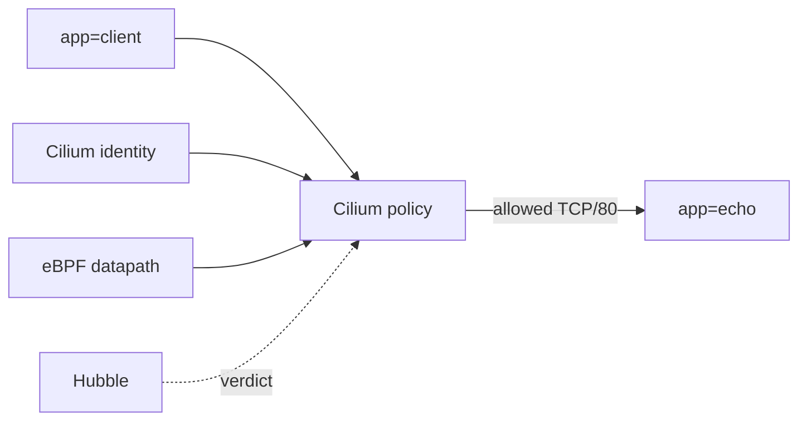

# Network Policy Enforcement With eBPF

This student case connects Cilium policy, identity, and datapath enforcement.

## What You Will Build



## Key Idea

CiliumNetworkPolicy selects endpoints by labels. Cilium converts those labels into identities and programs policy state into the datapath. When packets arrive, eBPF programs can allow or deny traffic based on source identity, destination identity, direction, protocol, and port.

This is different from thinking only in IP addresses. IPs are still present, but identity is the main policy primitive.

## Step 1: Create And Install

```bash
KIND_EXPERIMENTAL_PROVIDER=podman kind create cluster --name cilium-ebpf-policy --config kind-config.yaml
helm repo add cilium https://helm.cilium.io/
helm repo update
helm install cilium cilium/cilium --version 1.19.5 \
  --namespace kube-system \
  --set ipam.mode=kubernetes \
  --set kubeProxyReplacement=true \
  --set hubble.enabled=true \
  --set hubble.relay.enabled=true
cilium status --wait
```

Expected: Cilium and Hubble are ready.

## Step 2: Deploy Workloads

```bash
kubectl apply -f manifests/workloads.yaml
kubectl -n ebpf-lab rollout status deploy/echo
kubectl -n ebpf-lab rollout status deploy/client
```

The important labels are:

- destination: `app=echo`
- source: `app=client`

## Step 3: Test Before Policy

```bash
kubectl -n ebpf-lab exec deploy/client -- curl -sS http://echo
```

Expected: `echo`.

Before a restrictive policy selects the endpoint, traffic is allowed by default. This is important for troubleshooting: a policy only affects endpoints it selects.

## Step 4: Apply Policy

```bash
kubectl apply -f manifests/allow-client-to-echo.yaml
```

The policy selects echo endpoints:

```yaml
endpointSelector:
  matchLabels:
    app: echo
```

It allows ingress from endpoints with `app=client` to TCP port 80. Once the policy selects the echo endpoint, ingress to echo becomes policy-controlled.

## Step 5: Inspect Policy And Endpoints

```bash
kubectl -n ebpf-lab get cnp
kubectl -n kube-system exec ds/cilium -- cilium-dbg endpoint list
hubble observe -P --namespace ebpf-lab
```

Expected:

- the CiliumNetworkPolicy exists
- echo endpoints show policy enforcement for ingress
- Hubble shows forwarded traffic from client to echo

If you see policy drops, read the flow carefully. The useful fields are source, destination, port, direction, and verdict.

## Step 6: Test A Negative Case

Create a temporary pod that does not have `app=client`:

```bash
kubectl -n ebpf-lab run tmp-curl --image=curlimages/curl:8.8.0 --restart=Never --command -- sleep 365d
kubectl -n ebpf-lab wait --for=condition=Ready pod/tmp-curl --timeout=120s
kubectl -n ebpf-lab exec tmp-curl -- curl -m 5 -sS http://echo
hubble observe -P --namespace ebpf-lab --verdict DROPPED
```

Expected: traffic from `tmp-curl` should not be allowed by the policy because it does not match `app=client`.

Clean up the temporary pod:

```bash
kubectl -n ebpf-lab delete pod tmp-curl
```

## Student Check

Answer these:

1. Which endpoints does the policy select?
2. Which source identity is allowed?
3. Why does policy enforcement appear on the destination endpoint for ingress?
4. Which tool shows the final datapath verdict?

## Exam Notes

Cilium policy decisions are based on identities derived from labels, then enforced in the datapath. For policy troubleshooting, inspect:

```bash
kubectl -n ebpf-lab get cnp
kubectl -n kube-system exec ds/cilium -- cilium-dbg identity list
kubectl -n kube-system exec ds/cilium -- cilium-dbg endpoint list
hubble observe -P --verdict DROPPED
```

## Cleanup

```bash
KIND_EXPERIMENTAL_PROVIDER=podman kind delete cluster --name cilium-ebpf-policy
```

## Exam Memory Model

Cilium policy enforcement follows this chain:

```text
policy selects endpoints -> labels become identities -> policy state is programmed -> datapath allows or drops packets -> Hubble shows verdict
```

For ingress policy, focus on the destination endpoint. The policy selects the endpoint receiving traffic and describes which sources may reach it.

## Policy Reading Method

Read every policy in this order:

1. `metadata.namespace`: where the policy exists.
2. `endpointSelector`: which destination endpoints are selected.
3. `ingress` or `egress`: which traffic direction is controlled.
4. `fromEndpoints` or `toEndpoints`: which peer identities are allowed.
5. `toPorts`: which ports and protocols are allowed.

For this lab:

```text
selected endpoint: app=echo
direction: ingress
allowed source: app=client
allowed port: TCP/80
```

Traffic from a pod without `app=client` should not match the allowed source.

## What To Inspect

| Question | Command |
| --- | --- |
| Does the policy exist? | `kubectl -n ebpf-lab get cnp` |
| Which labels do pods have? | `kubectl -n ebpf-lab get pods --show-labels` |
| Which identities exist? | `cilium-dbg identity list` |
| Is policy enforced on endpoints? | `cilium-dbg endpoint list` |
| What did the datapath do? | `hubble observe -P --verdict DROPPED` |

## Common Exam Trap

Applying a policy to `app=echo` does not select the client. It selects the echo endpoint and controls traffic into echo. If the source labels do not match `fromEndpoints`, Cilium should drop the traffic even if DNS and Service translation are working.

Policy failure and Service failure can look similar from curl. Hubble verdicts help separate them.
