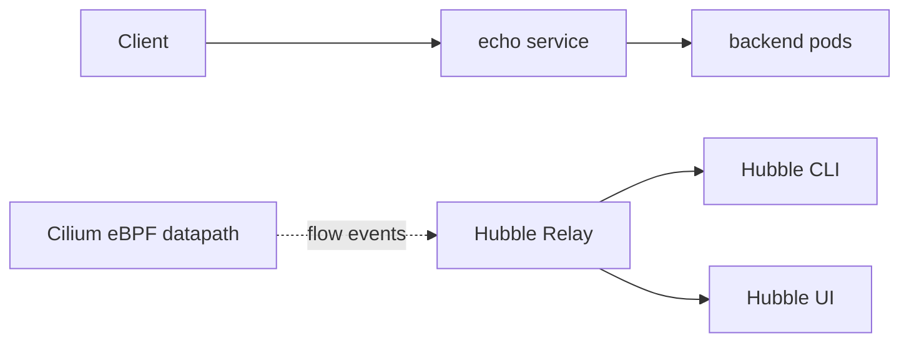

# Hubble Flow Visibility

This student case uses Hubble to inspect flow events produced by the Cilium datapath.

## What You Will Build



## Key Idea

Hubble is the observability layer for Cilium networking. It does not replace Kubernetes object inspection or Cilium state inspection. It answers a different question:

```text
What did the datapath observe for real traffic?
```

Hubble is especially useful when a policy, Service, DNS, or routing problem is not obvious from static configuration.

## Step 1: Create And Install

```bash
KIND_EXPERIMENTAL_PROVIDER=podman kind create cluster --name cilium-hubble-ebpf --config kind-config.yaml
helm repo add cilium https://helm.cilium.io/
helm repo update
helm install cilium cilium/cilium --version 1.19.5 \
  --namespace kube-system \
  --set ipam.mode=kubernetes \
  --set kubeProxyReplacement=true \
  --set hubble.enabled=true \
  --set hubble.relay.enabled=true \
  --set hubble.ui.enabled=true
cilium status --wait
hubble status -P
```

Expected:

- Cilium is ready.
- Hubble Relay is available.
- `hubble status -P` can connect.

## Step 2: Deploy And Generate Traffic

```bash
kubectl apply -f manifests/workloads.yaml
kubectl -n ebpf-lab rollout status deploy/echo
kubectl -n ebpf-lab exec deploy/client -- curl -sS http://echo
```

Expected: the request returns `echo`.

Traffic must exist before Hubble can show useful flow output.

## Step 3: Observe Flows

```bash
hubble observe -P --namespace ebpf-lab
hubble observe -P --verdict FORWARDED
```

Read Hubble output for:

- source namespace and workload
- destination namespace and workload
- protocol and port
- Service or backend information
- verdict

`FORWARDED` means the datapath allowed and forwarded the packet. `DROPPED` means the datapath rejected or could not forward it. Drop reasons are often the most useful part of troubleshooting output.

## Step 4: Use Focused Filters

Run these after generating traffic:

```bash
hubble observe -P --namespace ebpf-lab --protocol tcp
hubble observe -P --namespace ebpf-lab --verdict FORWARDED
hubble observe -P --namespace ebpf-lab --verdict DROPPED
```

Focused filters are important in the exam because busy clusters produce many flows. Start broad to prove traffic exists, then narrow the output.

## Step 5: Open UI

```bash
cilium hubble ui
```

The UI is useful for visual exploration, but the CLI is usually faster and more exam-friendly. Know both, but practice the CLI filters.

## Step 6: Connect Hubble To Other Checks

Hubble tells you what happened to traffic. It does not tell you every reason by itself. Pair it with:

```bash
kubectl -n ebpf-lab get pods,svc,endpoints
kubectl -n kube-system exec ds/cilium -- cilium-dbg endpoint list
kubectl -n kube-system exec ds/cilium -- cilium-dbg service list
kubectl -n kube-system exec ds/cilium -- cilium-dbg identity list
```

Use this pattern:

```text
Kubernetes object state -> Cilium programmed state -> Hubble observed traffic
```

## Student Check

Answer these:

1. What question does Hubble answer better than `kubectl get svc`?
2. What does a `DROPPED` verdict tell you?
3. Why should you filter Hubble output during an exam task?
4. Which Cilium command would you pair with Hubble for a Service problem?

## Exam Notes

Hubble is how you prove what the datapath did: source, destination, verdict, and protocol. Use it after generating traffic, and always compare flow output with Kubernetes and Cilium state.

## Cleanup

```bash
KIND_EXPERIMENTAL_PROVIDER=podman kind delete cluster --name cilium-hubble-ebpf
```

## Exam Memory Model

Hubble answers:

```text
What traffic did Cilium observe, and what verdict did the datapath apply?
```

It does not replace configuration checks. Treat Hubble as observed evidence after you understand the intended state.

## How To Read A Flow

When reading a Hubble line, identify:

- source namespace and workload
- destination namespace and workload
- direction
- protocol and port
- Service or backend information if shown
- verdict
- drop reason if verdict is `DROPPED`

The verdict is the most exam-useful field:

| Verdict | Meaning |
| --- | --- |
| `FORWARDED` | datapath allowed and forwarded traffic |
| `DROPPED` | datapath rejected or could not forward traffic |
| no flow | traffic may not have happened, or Hubble may not be connected/enabled |

## Hubble Workflow

Use this pattern:

```text
generate one fresh request
observe broadly
filter by namespace
filter by verdict
compare with Cilium state
```

Example:

```bash
kubectl -n ebpf-lab exec deploy/client -- curl -sS http://echo
hubble observe -P --namespace ebpf-lab
hubble observe -P --namespace ebpf-lab --verdict DROPPED
```

If the broad observe has too much output, narrow it. If it has no output, check `hubble status -P` and confirm traffic is actually being generated.

## Common Exam Trap

Hubble showing no drops is not the same as proving no problem exists. You may be looking at the wrong namespace, traffic may not be generated, Hubble may not be enabled, or the failure may happen before the datapath observes the packet.
