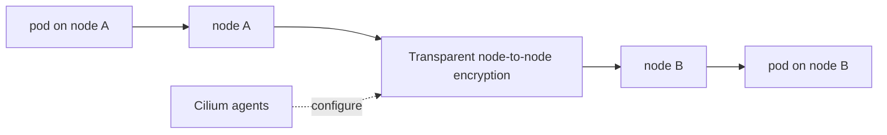
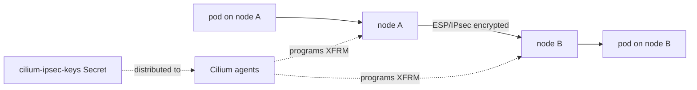
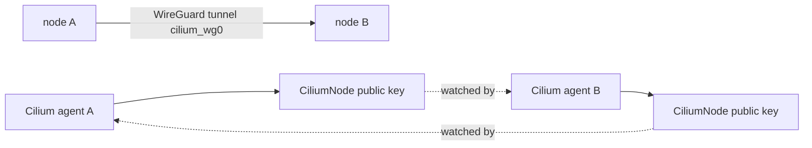

# Transparent Encryption With IPsec And WireGuard

This case compares Cilium transparent encryption modes. IPsec and WireGuard solve the same study goal with different operational tradeoffs.

There is no workload manifest in this module because the main exam skill is understanding installation, status, and operational differences. You can reuse the workload manifest from an earlier lab if you want to generate pod traffic.

## Architecture



## Key Idea

Transparent encryption protects traffic without requiring application changes. Pods still send normal traffic. Cilium and the node networking layer handle encryption between nodes.

The two major modes are:

- IPsec: uses Linux XFRM/IPsec and shared keys stored in a Kubernetes Secret.
- WireGuard: uses WireGuard tunnels and automatically managed node public keys.

## IPsec Transparent Encryption

IPsec is useful to understand because it has explicit key management. Cilium distributes and rotates keys through the `cilium-ipsec-keys` Secret.

### IPsec Architecture



### Step 1: Create The Cluster

```bash
KIND_EXPERIMENTAL_PROVIDER=podman kind create cluster --name ipsec-lab --config kind-config.yaml
```

### Step 2: Generate A Pre-Shared Key

```bash
PSK=($(dd if=/dev/urandom count=20 bs=1 2> /dev/null | xxd -p -c 64))
echo $PSK
```

The key must be available before Cilium starts with IPsec enabled.

### Step 3: Create The IPsec Secret

```bash
kubectl --context kind-ipsec-lab create -n kube-system secret generic cilium-ipsec-keys \
  --from-literal=keys="3+ rfc4106(gcm(aes)) $PSK 128"
```

The key ID matters during rotation. Higher key IDs are preferred for new traffic while older keys can remain available for decryption during transition.

### Step 4: Install Cilium With IPsec

```bash
cilium install --context kind-ipsec-lab --version 1.19.5 \
  --set ipam.mode=kubernetes \
  --set encryption.enabled=true \
  --set encryption.type=ipsec
cilium status --context kind-ipsec-lab --wait
```

### Step 5: Verify

```bash
cilium config view --context kind-ipsec-lab | grep enable-ipsec
kubectl --context kind-ipsec-lab -n kube-system get secret cilium-ipsec-keys
```

Expected:

- Cilium config shows IPsec enabled.
- the `cilium-ipsec-keys` Secret exists.

### Step 6: Practice Key Rotation

High-level rotation process:

1. Generate a new key with a higher key ID.
2. Update the Secret to include both the old and new key.
3. Wait for Cilium agents to load the new key.
4. Remove the old key after the transition window.

Exam-level understanding: do not remove the old key before all nodes can decrypt traffic using it.

### IPsec Cleanup

```bash
KIND_EXPERIMENTAL_PROVIDER=podman kind delete cluster --name ipsec-lab
```

## WireGuard Transparent Encryption

WireGuard is useful to understand because Cilium automates peer discovery and key handling through Cilium node state.

### WireGuard Architecture



### Step 1: Create The Cluster

```bash
KIND_EXPERIMENTAL_PROVIDER=podman kind create cluster --name wireguard-lab --config kind-config.yaml
```

### Step 2: Install Cilium With WireGuard

```bash
cilium install --context kind-wireguard-lab --version 1.19.5 \
  --set ipam.mode=kubernetes \
  --set encryption.enabled=true \
  --set encryption.type=wireguard \
  --set encryption.nodeEncryption=true
cilium status --context kind-wireguard-lab --wait
```

### Step 3: Verify

```bash
CILIUM_POD=$(kubectl -n kube-system get pods -l k8s-app=cilium --context kind-wireguard-lab -o jsonpath='{.items[0].metadata.name}')
kubectl -n kube-system exec $CILIUM_POD -c cilium-agent --context kind-wireguard-lab -- cilium status | grep Encryption
kubectl get ciliumnodes --context kind-wireguard-lab
```

Expected:

- Cilium status reports encryption.
- CiliumNode objects exist and carry node-level metadata used for peer configuration.

### What Happened

Cilium agents generate WireGuard keys, publish public keys through `CiliumNode`, and configure peer tunnels automatically. Compared with IPsec, there is less manual key material for the student to manage.

### WireGuard Cleanup

```bash
KIND_EXPERIMENTAL_PROVIDER=podman kind delete cluster --name wireguard-lab
```

## IPsec Versus WireGuard

| Area | IPsec | WireGuard |
| --- | --- | --- |
| Key handling | Kubernetes Secret with explicit keys | Cilium-managed WireGuard keys |
| Linux integration | XFRM/IPsec stack | WireGuard interface |
| Operational focus | key generation and rotation | peer discovery and tunnel status |
| Student risk | bad or missing Secret | missing encryption config or peer state |

## Student Check

Answer these:

1. What makes encryption "transparent" to pods?
2. Which mode uses the `cilium-ipsec-keys` Secret?
3. Which mode publishes public key information through Cilium node state?
4. Why should old IPsec keys remain during a rotation window?

## Exam Notes

For transparent encryption questions, focus on mode, config, Secret or node state, and status output. You usually do not need to prove cryptography manually; you need to prove Cilium is configured and healthy.

## Exam Memory Model

Transparent encryption means:

```text
pods send ordinary traffic
Cilium/node networking encrypts traffic between nodes
applications do not manage encryption keys
```

Do not confuse transparent encryption with application TLS. TLS is usually application-layer encryption. Cilium transparent encryption protects traffic at the node/network layer.

## IPsec Packet Walk

For pod traffic crossing nodes:

```text
pod A sends packet to pod B
packet reaches node A networking
Cilium/IPsec state applies encryption
encrypted packet crosses the node network
node B decrypts the packet
packet is delivered to pod B
```

The pod does not know that IPsec was used. The operational concern is key distribution and rotation.

## WireGuard Packet Walk

For WireGuard:

```text
Cilium agent creates WireGuard key material
public key information is shared through Cilium node state
nodes configure WireGuard peers
pod traffic between nodes uses WireGuard tunnel paths
```

The operational concern is peer state and whether encryption is enabled in Cilium config.

## What To Compare In The Exam

| Question | IPsec | WireGuard |
| --- | --- | --- |
| Where is key material managed? | Kubernetes Secret | Cilium-managed node keys |
| What object is important? | `cilium-ipsec-keys` Secret | `CiliumNode` peer/key state |
| What is the risk during rotation? | removing old key too early | peer discovery/config issue |
| What should pods change? | nothing | nothing |

## Common Exam Trap

If the question says transparent encryption, do not start changing application manifests. Start by checking Cilium config and Cilium health. Then check the mode-specific evidence: IPsec Secret or WireGuard node/peer state.
