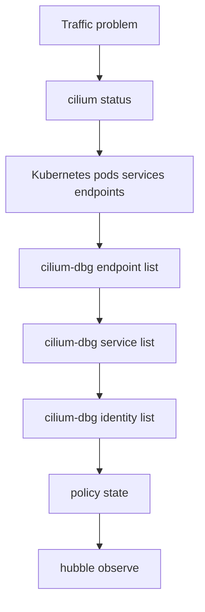

# eBPF Troubleshooting

This student case teaches a repeatable datapath troubleshooting flow.

There is no manifest in this module because the same workflow applies to any of the earlier labs. Keep one of the previous clusters running and use these commands against it.

## Architecture



## Key Idea

Troubleshooting Cilium is easiest when you move from broad health to specific datapath state. Do not start by guessing. Locate the layer where the expected state disappears.

Use this mental model:

```text
Kubernetes desired state -> Cilium programmed state -> eBPF datapath behavior -> Hubble observed flow
```

## Step 1: Check Cilium Health

```bash
cilium status
kubectl -n kube-system get pods -l k8s-app=cilium
kubectl -n kube-system logs ds/cilium
```

Look for:

- Cilium agent readiness
- operator readiness
- Hubble readiness if visibility is part of the task
- crash loops or repeated errors

If Cilium is not healthy, fix that before debugging Service or policy behavior.

## Step 2: Check Kubernetes Objects

```bash
kubectl get nodes
kubectl -n ebpf-lab get pods -o wide
kubectl -n ebpf-lab get svc,endpoints
```

Use this to answer:

- Are the pods running and ready?
- Does the Service selector match the pods?
- Does the Service have endpoints?
- Are pods scheduled on expected nodes?

If Kubernetes has no endpoints, the datapath cannot invent backends.

## Step 3: Check Cilium Endpoints

```bash
kubectl -n kube-system exec ds/cilium -- cilium-dbg endpoint list
kubectl -n kube-system exec ds/cilium -- cilium-dbg endpoint get <endpoint-id>
```

Use endpoint output to confirm:

- Cilium knows about the pod.
- the endpoint has an identity.
- policy enforcement state matches your expectation.
- the endpoint is healthy.

If a pod exists in Kubernetes but not in Cilium endpoint output, investigate Cilium agent health and CNI setup.

## Step 4: Check Services

```bash
kubectl -n kube-system exec ds/cilium -- cilium-dbg service list
kubectl get svc,endpoints -A
```

Compare Kubernetes Service and Endpoint state with Cilium service state.

Common interpretations:

- Kubernetes Service has endpoints, Cilium service list does not: Cilium has not programmed the Service.
- Cilium service has wrong backend count: watch for EndpointSlice or readiness issues.
- Service exists but curl fails: inspect Hubble and connection path next.

## Step 5: Check Identities And Maps

```bash
kubectl -n kube-system exec ds/cilium -- cilium-dbg identity list
kubectl -n kube-system exec ds/cilium -- cilium-dbg bpf map list
```

Identity output helps policy troubleshooting. Map output confirms Cilium has datapath state, but it is usually lower-level than endpoint, service, and identity commands.

Use map inspection when:

- a task specifically asks about eBPF maps
- higher-level Cilium state looks wrong
- you need to prove that Cilium is using eBPF-backed state

## Step 6: Check Policy

```bash
kubectl get cnp,ccnp -A
kubectl -n ebpf-lab describe cnp
kubectl -n kube-system exec ds/cilium -- cilium-dbg endpoint list
```

Policy troubleshooting questions:

- Which endpoints are selected by the policy?
- Is the failing traffic ingress or egress?
- Does the source match the allowed identity or labels?
- Is the port correct?
- Did policy enforcement become enabled on the endpoint?

## Step 7: Use Hubble

```bash
hubble observe -P
hubble observe -P --namespace ebpf-lab
hubble observe -P --verdict DROPPED
```

Hubble confirms what happened to real traffic. Generate a fresh request, then observe.

If Hubble shows no flow:

- traffic may not be generated
- Hubble may not be enabled or connected
- the request may fail before reaching the datapath

If Hubble shows a drop:

- read source, destination, port, direction, and drop reason
- compare with policy, service, and endpoint state

## Fast Exam Workflow

Use this order under time pressure:

```bash
cilium status
kubectl -n <ns> get pods,svc,endpoints
kubectl -n kube-system exec ds/cilium -- cilium-dbg endpoint list
kubectl -n kube-system exec ds/cilium -- cilium-dbg service list
kubectl -n kube-system exec ds/cilium -- cilium-dbg identity list
hubble observe -P --namespace <ns>
hubble observe -P --verdict DROPPED
```

## Student Check

For each symptom, name the first two checks:

1. Service has no backends.
2. Policy denies traffic unexpectedly.
3. Hubble shows no flows.
4. Cilium endpoint is missing for a running pod.
5. Transparent encryption is enabled but node traffic seems broken.

## Exam Notes

Use this order: status, Kubernetes objects, endpoints, services, identities, policy, Hubble. The key skill is comparing expected state with programmed state.

## Exam Memory Model

Troubleshooting is a narrowing exercise:

```text
Is Cilium healthy?
Does Kubernetes have the desired state?
Did Cilium program that state?
Did the datapath allow or drop traffic?
Did routing/encryption/CT/NAT affect delivery?
```

Never jump directly to the deepest layer. Most exam failures are visible through basic state comparison.

## Layered Decision Tree

Use this when you are unsure where to start:

| Symptom | First layer | Next layer |
| --- | --- | --- |
| pod not reachable | pod readiness and IP | Cilium endpoint |
| Service not reachable | Service and endpoints | Cilium service list |
| policy not working | labels and CNP | identity and Hubble verdict |
| cross-node only failure | node/pod placement | routing, tunnel, encryption |
| old connections work, new fail | Service/endpoints | CT/NAT/map pressure |
| no flow output | Hubble status | generate fresh traffic |

## How To Explain A Finding

In an exam or study review, avoid vague statements like "Cilium is broken." Be specific:

```text
Kubernetes has endpoints for the Service, but Cilium service list does not show the frontend.
```

or:

```text
Cilium endpoint policy enforcement is enabled, and Hubble shows DROPPED traffic from an identity not allowed by the policy.
```

Good troubleshooting is matching evidence to the layer.

## Commands To Memorize Versus Understand

Memorize the small set:

```bash
cilium status
cilium config view
kubectl get pods,svc,endpoints -A
kubectl -n kube-system exec ds/cilium -- cilium-dbg endpoint list
kubectl -n kube-system exec ds/cilium -- cilium-dbg service list
kubectl -n kube-system exec ds/cilium -- cilium-dbg identity list
hubble observe -P --verdict DROPPED
```

Understand when to use them. That matters more than memorizing every possible `cilium-dbg` subcommand.
