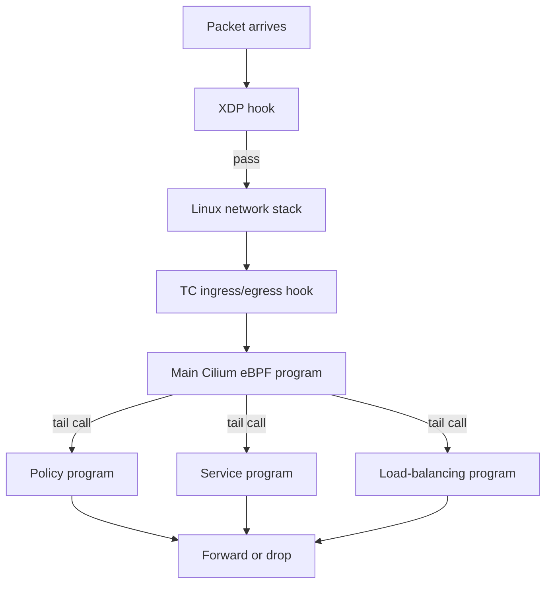

# eBPF Tail Calls And XDP

This module covers two eBPF topics that are easy to miss when studying Cilium: tail calls and XDP. The exam usually does not require writing eBPF code, but you should understand why these features matter in a Cilium datapath.

There is no manifest in this module because these are datapath architecture concepts. You can use any previous Cilium lab cluster to inspect maps and status while studying.

## What You Will Learn

- what an eBPF tail call is
- why tail calls help large datapaths
- what XDP is
- how XDP differs from TC hooks
- how these ideas relate to Cilium troubleshooting and exam explanations

## Architecture



## Tail Calls

An eBPF tail call lets one eBPF program jump to another eBPF program. The jump uses a special eBPF map called a program array. The calling program selects an index in the program array, and the kernel transfers execution to the program stored there.

For Cilium, the important idea is modularity. The datapath has many responsibilities:

- endpoint handling
- policy checks
- service translation
- load balancing
- connection tracking
- NAT
- visibility

Putting all of that into one giant program would be harder to maintain and may hit verifier or program-size limits. Tail calls let Cilium split the datapath into smaller programs and connect them efficiently.

## Tail Call Mental Model

Think of the datapath as a decision pipeline:

```text
packet enters -> endpoint logic -> service logic -> policy logic -> forward/drop
```

Tail calls let Cilium jump between parts of that pipeline without returning to user space. This is still kernel datapath execution.

## What Tail Calls Are Not

- They are not Kubernetes calls.
- They are not function calls to the Cilium agent.
- They do not ask the API server what to do.
- They are not the same thing as Hubble events.

Tail calls are internal eBPF program-to-program jumps.

## XDP

XDP stands for eXpress Data Path. It is an eBPF hook that runs very early, close to the network device driver, before packets travel through much of the normal Linux networking stack.

Because XDP runs early, it is useful for fast packet actions such as:

- dropping unwanted traffic
- redirecting packets
- very early load-balancing paths
- avoiding extra kernel stack processing for certain traffic

The key exam idea:

```text
XDP is earlier than TC. TC is still in the kernel networking path, but after the earliest device-level XDP point.
```

## XDP Versus TC

| Area | XDP | TC |
| --- | --- | --- |
| Hook location | Very early at network device layer | Traffic control ingress/egress path |
| Main strength | extremely early packet handling | flexible packet handling around interfaces |
| Common actions | drop, pass, redirect, transmit | policy, service handling, redirect, shaping-related paths |
| Exam phrasing | "early/fast datapath hook" | "interface ingress/egress datapath hook" |

## How This Relates To Cilium

Cilium uses multiple eBPF hook types depending on the feature and traffic path. You do not need to identify every Cilium internal program during the exam, but you should be able to explain why Cilium's datapath is not a single hook or a single program.

Useful phrasing:

```text
Cilium composes multiple eBPF programs and maps. Tail calls help split complex logic into smaller programs. XDP provides an early hook for fast packet handling before the normal stack.
```

## Optional Inspection

On a running Cilium lab cluster, inspect BPF map names:

```bash
kubectl -n kube-system exec ds/cilium -- cilium-dbg bpf map list
```

You may see many maps because Cilium stores different kinds of datapath state separately. The exact names can vary by Cilium version and configuration, so focus on the concept rather than memorizing every map.

You can also inspect Cilium status and config:

```bash
cilium status
cilium config view
```

## Student Check

Answer these:

1. What problem do tail calls solve for large eBPF datapaths?
2. Does a tail call leave the kernel and ask the Cilium agent for a decision?
3. Why is XDP considered an early hook?
4. How is XDP different from TC?
5. Why should a Cilium student know these concepts even without writing eBPF code?

## Exam Notes

For CCA study, keep tail calls and XDP at the architecture level. Tail calls explain how complex datapath logic can be split across programs. XDP explains where very early packet handling can happen. Both reinforce the larger Cilium idea: the agent programs state, and the kernel datapath executes packet decisions.

## Exam Memory Model

Tail calls answer:

```text
How can Cilium organize a large eBPF datapath without one giant program?
```

XDP answers:

```text
Where can eBPF run as early as possible on packet receive?
```

These are architecture concepts. You are unlikely to write a tail call or XDP program in a CCA task, but you may need to explain why Cilium can have multiple datapath programs and multiple hook points.

## Deeper Tail Call Explanation

An eBPF program has verifier constraints. Complex systems split logic into smaller programs. A tail call lets the current program jump to another program referenced from a program-array map.

Important properties:

- the jump stays in kernel eBPF execution
- user space is not consulted for every packet
- the next program is selected from a map
- this supports modular datapath logic

In simple terms:

```text
tail call = eBPF program jumps to another eBPF program
```

## Deeper XDP Explanation

XDP runs before many normal kernel networking steps. That makes it useful when an action can be taken very early.

Possible XDP actions include:

- pass the packet to the normal stack
- drop the packet
- redirect the packet
- transmit the packet back out

TC hooks are still powerful, but they are later than XDP. Remember:

```text
XDP: earliest device-level handling
TC: ingress/egress handling around network interfaces
```

## Common Exam Trap

Do not say "Cilium uses XDP for everything." Cilium can use multiple hooks and modes. The correct exam-level answer is that XDP is one possible early hook, while TC and other hooks are also important in the Cilium datapath.
