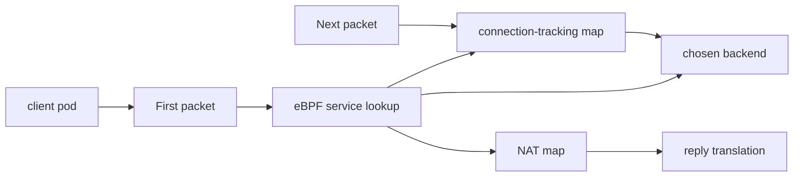

# Connection Tracking And NAT In Cilium eBPF

This module explains how Cilium uses eBPF maps for connection tracking and NAT. It is conceptual and troubleshooting-focused, so there is no manifest folder. Use any earlier lab cluster when you want to inspect maps.

## What You Will Learn

- why Cilium tracks connections
- what connection-tracking maps store
- what NAT maps store
- why first packets and established packets can take different decision paths
- how CT and NAT state affect Service load balancing and troubleshooting

## Architecture



## Key Idea

Many datapath decisions are stateful. The first packet of a connection may require a Service lookup, backend selection, policy decision, and NAT setup. Later packets in the same connection should follow the existing state so traffic remains consistent.

Connection tracking helps Cilium remember that state.

NAT state helps Cilium translate addresses and ports correctly on the forward and return paths.

## Connection Tracking

Connection tracking records active flows. A flow is usually identified by values such as:

- source IP
- destination IP
- source port
- destination port
- protocol
- direction or related reply state

For a Service connection, the first packet may arrive for a ClusterIP. Cilium selects a backend and records enough state so later packets continue to use the correct backend.

This matters because load balancing cannot randomly choose a new backend for every packet in an established connection.

## NAT

NAT means network address translation. In Kubernetes networking, NAT can appear in several places:

- translating Service frontend traffic to backend pod traffic
- translating reply traffic back so the client sees a consistent connection
- source NAT for traffic leaving the cluster, depending on configuration
- node-to-node or external traffic paths, depending on routing mode

Cilium stores NAT-related state in eBPF maps so replies can be translated correctly.

## First Packet Versus Established Packet

Think about two paths:

```text
first packet -> policy check -> service lookup -> backend selection -> CT/NAT state created
later packet -> CT lookup -> existing decision reused
```

This explains a common troubleshooting pattern: a new connection may fail differently from an established connection. It also explains why clearing or changing datapath state can affect active traffic.

## Inspect Maps

On a running Cilium lab cluster:

```bash
kubectl -n kube-system exec ds/cilium -- cilium-dbg bpf map list
```

Look for map names related to CT and NAT. Exact names vary by Cilium version and configuration, so focus on categories, not memorizing every name.

You can also inspect services and endpoints to connect stateful behavior to workload state:

```bash
kubectl -n kube-system exec ds/cilium -- cilium-dbg service list
kubectl -n kube-system exec ds/cilium -- cilium-dbg endpoint list
hubble observe -P --namespace ebpf-lab
```

## Why This Matters For Service Load Balancing

Service load balancing needs stable backend selection for a connection. Without connection tracking, packets from the same TCP connection could be sent to different backends, which would break the connection.

The Cilium datapath uses service maps to choose a backend and CT/NAT maps to remember and translate the flow.

## Troubleshooting Signals

Use CT/NAT as a mental model when:

- a new connection fails but old traffic still works
- Service backend changes do not appear to affect existing connections immediately
- return traffic appears broken
- Hubble shows forwarded traffic in one direction but replies are missing
- traffic behaves differently after pod recreation or backend scaling

Do not start by deleting datapath state during an exam. First inspect Kubernetes objects, Cilium service state, endpoints, identities, and Hubble flows.

## Student Check

Answer these:

1. Why does Cilium need connection tracking?
2. Why should packets from one TCP connection keep using the same backend?
3. What problem does NAT state solve on the reply path?
4. Why can existing traffic behave differently from new traffic?
5. Which commands help you connect Service state, endpoint state, and observed flows?

## Exam Notes

For CCA study, know that Cilium's eBPF datapath is stateful. Service maps choose backends, CT maps remember flows, and NAT maps make address translation work both ways.

## Exam Memory Model

Remember this flow:

```text
first packet creates or validates state
later packets reuse state
reply packets need reverse translation
```

That is the reason CT and NAT matter. Without state, Cilium could choose a backend for the first packet but fail to keep the rest of the connection consistent.

## Service Example

Client sends to:

```text
10.96.10.20:80
```

Cilium chooses backend:

```text
10.244.2.15:5678
```

The client still believes it is talking to the Service. The backend sees traffic delivered to its pod port. Replies must be translated so the client's connection remains valid.

CT/NAT state connects those two views of the same connection.

## What Can Go Wrong

Stateful datapaths introduce stateful failure patterns:

- old backend state can affect existing connections
- new connections may fail while old ones continue
- high connection churn can pressure CT maps
- replies can fail if reverse translation state is missing
- backend scaling may not immediately change existing flows

These are not random behaviors. They come from the fact that Cilium preserves connection state.

## How To Talk About It In An Exam

Good answer:

```text
Cilium uses service maps to select the backend, then CT and NAT maps to remember the connection and translate return traffic.
```

Weak answer:

```text
eBPF just load-balances the packet.
```

The good answer shows that you understand the datapath is stateful.
