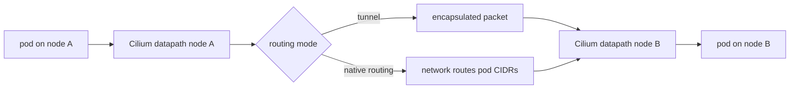

# Host Routing And Native Routing In Cilium

This module explains how Cilium moves packets between pods, nodes, and external networks. It is conceptual and troubleshooting-focused, so there is no manifest folder.

## What You Will Learn

- the difference between pod networking and Service translation
- what routing mode changes in Cilium
- what tunneling and native routing mean
- how host routing relates to the eBPF datapath
- what to inspect when pod-to-pod traffic fails across nodes

## Architecture



## Key Idea

Service translation answers this question:

```text
Which backend should receive traffic for this Service?
```

Routing answers a different question:

```text
How does the packet reach the destination node or pod network?
```

Students often mix these together. Cilium can translate a Service correctly and still fail to deliver traffic if routing between nodes is wrong.

## Routing Modes

Cilium supports different ways to move pod traffic between nodes. The exact configuration depends on cluster environment and install options.

Common concepts:

- Tunnel or encapsulation mode: Cilium wraps pod traffic in an outer packet so the underlay only needs to route node IPs.
- Native routing or direct routing: the network routes pod CIDRs directly without an overlay tunnel.
- Endpoint routes: node routing table entries can point traffic toward local pod endpoints.
- Host routing: traffic may pass through host networking paths where Cilium attaches eBPF programs.

You do not need to memorize every Helm value for the exam, but you should understand how the selected mode changes packet movement.

## Encapsulation

In a tunnel mode, pod traffic crossing nodes is encapsulated. The outer packet travels between node IPs. The receiving node decapsulates and delivers the inner packet to the destination pod.

This is useful when the underlying network does not know how to route pod CIDRs.

Tradeoff:

- simpler underlay requirements
- extra encapsulation overhead
- troubleshooting must consider both inner pod traffic and outer node traffic

## Native Routing

In native routing, pod CIDRs are routable in the underlying network or through node routes. Cilium does not need to encapsulate cross-node pod traffic in the same way.

This is useful when the infrastructure can route pod networks directly.

Tradeoff:

- less overlay overhead
- requires correct network routing for pod CIDRs
- failures often look like missing routes or unreachable node/pod CIDR paths

## Host Routing

Host routing describes how packets move through node networking paths. Cilium can use eBPF to optimize or control parts of that path, depending on features and configuration.

This matters for:

- pod-to-pod traffic on the same node
- pod-to-pod traffic across nodes
- pod-to-Service traffic
- pod-to-external traffic
- host-to-pod and pod-to-host traffic

When a packet leaves a pod, it is not only a Kubernetes object anymore. It becomes a Linux networking packet handled by interfaces, routes, eBPF programs, and sometimes encapsulation.

## What To Inspect

Start with Cilium and Kubernetes state:

```bash
cilium status
kubectl get nodes -o wide
kubectl -n kube-system exec ds/cilium -- cilium-dbg endpoint list
kubectl -n kube-system exec ds/cilium -- cilium-dbg service list
hubble observe -P --namespace ebpf-lab
```

Then inspect node-level routing when the task points in that direction:

```bash
kubectl -n kube-system exec ds/cilium -- ip route
kubectl -n kube-system exec ds/cilium -- ip addr
```

These commands run in the Cilium pod's network context. In some environments, deeper host inspection may require node access or a debug pod.

## Troubleshooting Patterns

Use routing as the suspected area when:

- same-node pod traffic works but cross-node pod traffic fails
- Service state is correct but backend pods on another node are unreachable
- Hubble shows traffic leaving one node but no reply
- node IPs are reachable but pod CIDRs are not
- encryption or tunneling is enabled and cross-node paths fail

Use Service translation as the suspected area when:

- the Service has no Cilium service entry
- the Service has the wrong backend list
- Kubernetes Endpoints or EndpointSlices are missing

## Student Check

Answer these:

1. What question does Service translation answer?
2. What question does routing answer?
3. Why is tunneling useful when the underlay cannot route pod CIDRs?
4. What can go wrong in native routing mode?
5. Why can same-node traffic work while cross-node traffic fails?

## Exam Notes

For CCA study, separate these layers in your head:

```text
Service translation chooses a backend.
Routing delivers the packet to that backend's node or pod network.
Policy decides whether the traffic is allowed.
Hubble shows what the datapath observed.
```

That separation makes Cilium troubleshooting much easier under exam pressure.

## Exam Memory Model

Routing is about reachability after the datapath has made a forwarding decision.

```text
Service translation may choose a backend.
Policy may allow the packet.
Routing still must deliver the packet to the backend's node or pod network.
```

This is why a Service can have correct backends and still fail across nodes.

## Same-Node Versus Cross-Node

Same-node traffic often stays inside one node's networking context. Cross-node traffic must traverse the node network. That introduces more possible failure points:

- node IP reachability
- pod CIDR routing
- tunnel encapsulation
- encryption state
- return path routing
- firewall rules outside Kubernetes

If same-node traffic works but cross-node traffic fails, think routing, tunnel, encryption, or underlay reachability before blaming Service selectors.

## Encapsulation Memory Aid

Tunnel mode hides pod CIDRs from the underlay:

```text
inner packet: pod A -> pod B
outer packet: node A -> node B
```

The physical or virtual network only needs to route node IPs. Cilium handles the pod packet inside the tunnel.

## Native Routing Memory Aid

Native routing exposes pod CIDR reachability to the network:

```text
underlay must know how to reach pod networks
```

This can be efficient, but the network must be configured correctly. Missing routes can break pod-to-pod traffic even when Cilium is healthy.
