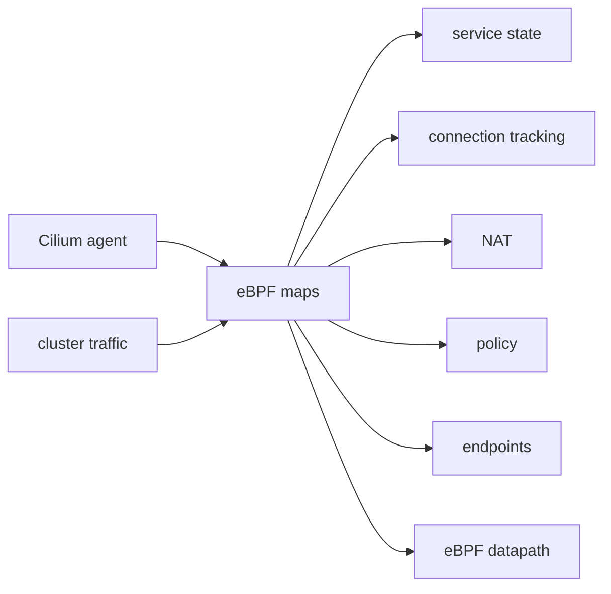

# eBPF Map Pressure And Sizing

This module explains why eBPF map capacity matters in Cilium. It is an operational and troubleshooting topic, so there is no manifest folder.

## What You Will Learn

- why Cilium uses many eBPF maps
- what map pressure means
- which symptoms can point to map capacity issues
- how map sizing relates to cluster scale
- which commands help inspect map state

## Architecture



## Key Idea

eBPF maps are finite data structures. Cilium uses maps to store datapath state such as services, backends, endpoint information, connection tracking entries, NAT entries, and policy state.

In small labs, map capacity is rarely a problem. In larger or busier clusters, too many services, endpoints, connections, or policy entries can put pressure on map capacity.

Map pressure means a map is near capacity or cannot accept new entries reliably. That can cause confusing datapath behavior because the control plane may look mostly correct while the datapath cannot store all required runtime state.

## Common Map Categories

You do not need to memorize every exact map name, but you should recognize the common categories:

- Service maps: Service frontends and backend lists.
- Endpoint maps: local endpoint and addressing information.
- Policy maps: allowed identity, direction, protocol, and port state.
- CT maps: active connection-tracking entries.
- NAT maps: address translation state.
- Metrics or event maps: datapath accounting and event delivery.

Exact names vary by Cilium version, enabled features, and datapath mode.

## What Causes Pressure

Map pressure can come from:

- many concurrent connections
- many Services and backends
- high pod churn
- large policy sets
- large clusters with many nodes and identities
- traffic patterns that create many short-lived connections
- map sizing values that are too small for the environment

Connection-tracking maps are a common place to think about pressure because busy clusters can create many active flow entries.

## Symptoms

Possible symptoms include:

- new connections fail while some established connections still work
- intermittent Service connectivity
- datapath logs mention map update failures
- Cilium status or metrics indicate map pressure
- drops appear without an obvious Kubernetes object problem
- behavior worsens under load

Do not assume every intermittent network issue is map pressure. First check Cilium health, Kubernetes objects, Cilium endpoint/service state, policy, and Hubble drops.

## Commands To Inspect

Start broad:

```bash
cilium status
kubectl -n kube-system get pods -l k8s-app=cilium
kubectl -n kube-system logs ds/cilium
```

Inspect map categories:

```bash
kubectl -n kube-system exec ds/cilium -- cilium-dbg bpf map list
```

Connect map concerns to higher-level state:

```bash
kubectl -n kube-system exec ds/cilium -- cilium-dbg service list
kubectl -n kube-system exec ds/cilium -- cilium-dbg endpoint list
kubectl -n kube-system exec ds/cilium -- cilium-dbg identity list
hubble observe -P --verdict DROPPED
```

## Sizing Mental Model

Map sizing should match expected workload scale. Think about:

```text
number of pods
number of services
number of service backends
number of identities
number of active connections
policy complexity
```

If the cluster grows but map sizing remains too small, datapath state can become a bottleneck.

## Exam-Level Understanding

For CCA study, the key point is not tuning every map value from memory. The key point is recognizing that Cilium stores runtime datapath state in finite eBPF maps, and that pressure on those maps can cause real traffic symptoms.

You should be able to explain:

```text
Cilium's datapath depends on eBPF maps. If maps are full or undersized, the datapath may fail to store service, policy, CT, or NAT state needed for traffic.
```

## Student Check

Answer these:

1. Why can eBPF maps become a scaling concern?
2. Which Cilium feature commonly creates many runtime entries during high traffic?
3. Why should you inspect higher-level Cilium state before blaming map pressure?
4. What kinds of cluster growth can increase map usage?
5. Which command lists Cilium eBPF maps?

## Exam Notes

Map pressure is an operational troubleshooting concept. Know what maps are used for, know that they are finite, and know how to connect symptoms back to Cilium status, map inspection, Hubble, and datapath logs.

## Exam Memory Model

Think of eBPF maps as finite tables in the datapath:

```text
finite map capacity + growing cluster state = possible pressure
```

The Cilium agent may know what it wants to program, but the datapath still needs room in the relevant maps. If maps cannot accept entries, traffic behavior can become intermittent or incomplete.

## Why This Matters In Real Clusters

Small labs rarely hit map limits. Production clusters can have:

- thousands of pods
- many Services
- many backends per Service
- many identities
- many concurrent connections
- many short-lived connections
- complex policy rules

Each of those can increase the amount of state Cilium must keep in maps.

## Map Pressure Versus Bad Configuration

Do not confuse map pressure with a simple configuration error.

| Problem | Typical evidence |
| --- | --- |
| bad Service selector | Kubernetes Service has no endpoints |
| bad policy | Hubble drops with policy-related context |
| routing problem | same-node traffic works, cross-node fails |
| map pressure | errors or metrics indicate map capacity or update failures |

Map pressure is usually a later suspicion after basic state checks are correct.

## How To Explain It In An Exam

Good answer:

```text
Cilium stores datapath state in eBPF maps. If a busy cluster exhausts a CT, NAT, service, or policy map, new datapath entries may fail, causing traffic symptoms even when Kubernetes objects look correct.
```

Weak answer:

```text
The map is broken.
```

The good answer names the state, the capacity problem, and why traffic is affected.

## Practical Study Advice

For CCA-level study, focus on recognition:

- know maps are finite
- know CT/NAT maps can grow with connection count
- know service/backend maps grow with Services and endpoints
- know policy maps grow with identity and rule complexity
- know to inspect Cilium logs, status, map list, and Hubble

You do not need to tune every map value from memory unless your course explicitly requires it.
