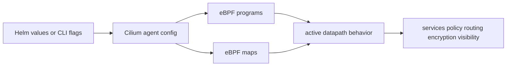

# Datapath Modes And Feature Flags

This module explains how Cilium install options change datapath behavior. It is conceptual and configuration-focused, so there is no manifest folder.

## What You Will Learn

- why install flags matter for datapath behavior
- which Cilium features commonly affect eBPF behavior
- how to connect Helm values to troubleshooting output
- how to verify active Cilium configuration
- why two Cilium clusters can behave differently

## Architecture



## Key Idea

Cilium is not one fixed datapath. The active datapath depends on enabled features and install values.

For example, a cluster with kube-proxy replacement, Hubble, WireGuard, and native routing enabled can behave differently from a cluster using tunneling, no encryption, and partial Service handling.

When troubleshooting, always check what Cilium is actually configured to do.

## Important Feature Areas

These settings and feature areas commonly affect exam-relevant behavior:

- kube-proxy replacement
- routing mode
- tunnel or native routing mode
- IPAM mode
- Hubble enablement
- transparent encryption
- host firewall
- bandwidth manager
- L7 policy or proxy features
- load-balancing behavior

You do not need to memorize every Helm value. You do need to know that these settings change which datapath programs, maps, and paths are active.

## Kube-Proxy Replacement

When kube-proxy replacement is enabled, Cilium handles Kubernetes Service translation with eBPF.

Verify:

```bash
cilium config view | grep kube-proxy
kubectl -n kube-system exec ds/cilium -- cilium-dbg service list
```

Troubleshooting question:

```text
Is Service traffic being handled by Cilium's eBPF datapath?
```

## Routing Mode

Routing mode affects how packets move between nodes and pod networks.

Common mental model:

```text
tunnel mode: pod traffic is encapsulated between nodes
native/direct routing: the network routes pod CIDRs
```

Verify general config:

```bash
cilium config view
cilium status
```

Troubleshooting question:

```text
Is the problem Service translation, policy, or packet delivery between nodes?
```

## Hubble

Hubble must be enabled and reachable before it can show flows.

Verify:

```bash
hubble status -P
cilium status
```

Troubleshooting question:

```text
Is there no traffic, or is Hubble not enabled/connected?
```

## Transparent Encryption

Encryption changes node-to-node packet handling. IPsec and WireGuard have different operational checks.

Verify:

```bash
cilium config view | grep encryption
cilium status
kubectl -n kube-system get secret cilium-ipsec-keys
kubectl get ciliumnodes
```

Use the Secret check for IPsec and CiliumNode peer/key state for WireGuard.

## Host Firewall And L7 Features

Some features add additional enforcement points. For example:

- host firewall can affect host-to-pod or pod-to-host traffic
- L7 policy can involve proxy behavior in addition to pure L3/L4 datapath checks

Troubleshooting question:

```text
Is this traffic being affected by a feature beyond basic L3/L4 forwarding?
```

## How To Inspect Active Configuration

Use:

```bash
cilium status
cilium config view
kubectl -n kube-system get cm cilium-config -o yaml
helm -n kube-system get values cilium
```

Depending on how Cilium was installed, Helm values may or may not be available. `cilium config view` and the `cilium-config` ConfigMap are usually the most direct starting points.

## Why This Matters

Two clusters can both be "Cilium clusters" but have different behavior:

- one uses kube-proxy replacement, one does not
- one uses tunneling, one uses native routing
- one has Hubble enabled, one does not
- one encrypts node-to-node traffic, one does not
- one has L7 policy enabled for selected traffic

The exam may give you a cluster where behavior depends on configuration. Inspect first, then reason.

## Student Check

Answer these:

1. Why should you check Cilium config before troubleshooting deeply?
2. Which feature changes Service translation behavior?
3. Which feature changes visibility through `hubble observe`?
4. Which features change cross-node packet handling?
5. Why can two Cilium clusters behave differently with the same Kubernetes manifests?

## Exam Notes

Do not assume Cilium is installed with the same feature set in every task. Use `cilium status`, `cilium config view`, the Cilium ConfigMap, and focused datapath commands to confirm active behavior.

## Exam Memory Model

Cilium behavior is controlled by installed features:

```text
same manifests + different Cilium config = different datapath behavior
```

Before troubleshooting deeply, identify which datapath you are actually using.

## Feature-To-Behavior Map

| Feature or setting | What it changes |
| --- | --- |
| kube-proxy replacement | whether Cilium handles Service translation |
| routing mode | how packets move between nodes |
| tunnel mode | whether pod traffic is encapsulated |
| native routing | whether the underlay routes pod CIDRs |
| Hubble | whether flow observation is available |
| transparent encryption | whether node-to-node traffic is encrypted |
| host firewall | whether host-facing traffic can be policy-controlled |
| L7 policy | whether proxy-level protocol enforcement may be involved |
| bandwidth manager | whether bandwidth-related eBPF features may affect traffic |

You do not need to memorize every flag name, but you should be able to connect a behavior to the relevant feature area.

## How To Read Config During Troubleshooting

Use this order:

```bash
cilium status
cilium config view
kubectl -n kube-system get cm cilium-config -o yaml
helm -n kube-system get values cilium
```

Then ask:

```text
Is the feature I expect actually enabled?
Is the cluster using the datapath mode I assumed?
Does the symptom match that mode?
```

For example, if Hubble is disabled, `hubble observe` is not the right proof tool. If kube-proxy replacement is disabled, Cilium service maps may not tell the whole Service datapath story.

## Common Exam Trap

Students often assume all Cilium clusters are installed the same way because the workload manifests look identical. The workload may be identical while the datapath is different.

Always inspect Cilium config before concluding:

- Service translation is eBPF-based
- Hubble should show flows
- encryption is active
- routing is native or tunneled
- L7 proxy behavior is involved

## How To Explain It In An Exam

Good answer:

```text
I first checked Cilium config because the active feature flags determine whether Service translation, routing, Hubble, encryption, or host policy behavior is expected in the datapath.
```

Weak answer:

```text
It is Cilium, so eBPF does everything the same way.
```

Cilium uses eBPF broadly, but the active behavior depends on configuration.
