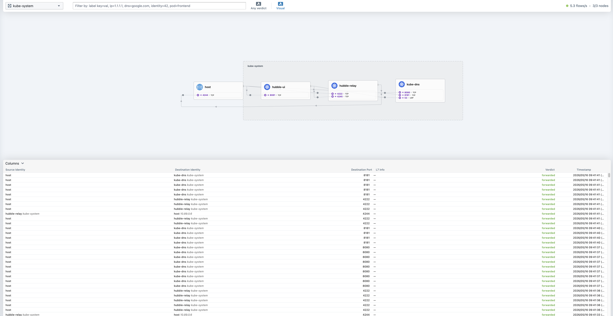

# CCA Exam Preparation: Monitoring Applications With Hubble

This guide shows how to enable and use Hubble in a Cilium cluster.

Hubble gives you observability for Cilium network traffic. You can use it to see:
- pod-to-pod traffic
- DNS requests
- HTTP flows
- dropped packets
- allowed and denied traffic
- traffic by namespace, pod, service, or label

## Prerequisites

Before starting, you should already have a local Cilium cluster running from: [Cilium Test Environment Setup](../test-environment-setup/README.md)

Check that Cilium is healthy:

```bash
cilium status --wait
kubectl get nodes
```

The nodes should be `Ready`, and Cilium should report as healthy.

## Enable Hubble

If Cilium was installed with Helm, enable Hubble Relay and the Hubble UI with:

```bash
helm upgrade cilium cilium/cilium \
  --version 1.18.4 \
  --namespace kube-system \
  --reuse-values \
  --set hubble.relay.enabled=true \
  --set hubble.ui.enabled=true
```

Wait for Cilium to roll out:

```bash
cilium status --wait
```

Check the Hubble pods:

```bash
kubectl get pods -n kube-system | grep hubble
```

You should see pods for:
- `hubble-relay`
- `hubble-ui`

## Open The Hubble UI

The easiest way to open the UI is:

```bash
cilium hubble ui
```

This starts a local port-forward and opens Hubble UI in your browser.

In the UI:
- change the namespace to `kube-system` to see Cilium system traffic
- change the namespace to your application namespace to inspect app traffic
- click flows to inspect source, destination, verdict, protocol, and labels



## Use Hubble From The Terminal

For CLI-based study, start a Hubble Relay port-forward:

```bash
cilium hubble port-forward &
```

The `&` runs the port-forward in the background, so you can keep using the same terminal.

By default, this forwards Hubble Relay to:

```text
localhost:4245
```

Check that the Hubble API is reachable:

```bash
hubble status
```

Observe recent flows:

```bash
hubble observe --last 20
```

Watch live flows:

```bash
hubble observe --follow
```

Filter by namespace:

```bash
hubble observe --namespace kube-system --last 20
```

Show only dropped traffic:

```bash
hubble observe --verdict DROPPED --last 20
```

Show DNS traffic:

```bash
hubble observe --protocol dns --last 20
```

Show HTTP traffic:

```bash
hubble observe --protocol http --last 20
```

## Generate Test Traffic

If there is not much traffic in the cluster, run a connectivity test:

```bash
cilium connectivity test
```

Then check Hubble again:

```bash
hubble observe --last 30
```

You can also watch traffic live while the test runs:

```bash
hubble observe --follow
```

Run the traffic command from another terminal.

## Stop The Hubble Port-Forward

If you started the port-forward with `&`, list background jobs:

```bash
jobs
```

Stop the first background job:

```bash
kill %1
```

If there are multiple jobs, use the job number shown by `jobs`.

## If Port 4245 Is Already In Use

If you see an error that the port is already allocated, something is already using port `4245`.

Find the process:

```bash
lsof -i :4245
```

Example output will include a `PID`. Stop that process:

```bash
kill <PID>
```

If it does not stop, force it:

```bash
kill -9 <PID>
```

Then start the Hubble port-forward again:

```bash
cilium hubble port-forward &
```

## If The Hubble UI Port Is Already In Use

The Hubble UI command also starts a local port-forward. If the UI port is stuck, find the process:

```bash
lsof -i :12000
```

Stop it:

```bash
kill <PID>
```

Then run:

```bash
cilium hubble ui
```

## Useful Checks

Check Hubble status from Cilium:

```bash
cilium hubble status
```

Check Hubble Relay:

```bash
kubectl get pods -n kube-system -l k8s-app=hubble-relay
kubectl logs -n kube-system -l k8s-app=hubble-relay
```

Check Hubble UI:

```bash
kubectl get pods -n kube-system -l k8s-app=hubble-ui
kubectl logs -n kube-system -l k8s-app=hubble-ui
```

Check Cilium agents:

```bash
kubectl get pods -n kube-system -l k8s-app=cilium
cilium status
```

## Good Study Checks

After this lab, make sure you can:

1. Enable Hubble Relay and Hubble UI with Helm
2. Open Hubble UI with `cilium hubble ui`
3. Start Hubble Relay locally with `cilium hubble port-forward &`
4. Use `hubble observe` to inspect recent and live flows
5. Filter flows by namespace, protocol, and verdict
6. Find and stop a stuck process when port `4245` or `12000` is already in use

## Troubleshooting

If `hubble status` cannot connect:
- Make sure `cilium hubble port-forward &` is running
- Check port `4245` with `lsof -i :4245`
- Check Hubble Relay with `kubectl get pods -n kube-system -l k8s-app=hubble-relay`

If the UI does not open:
- Run `cilium hubble ui` again
- Check port `12000` with `lsof -i :12000`
- Check Hubble UI pods with `kubectl get pods -n kube-system -l k8s-app=hubble-ui`

If no flows appear:
- Generate traffic with `cilium connectivity test`
- Try the `kube-system` namespace first
- Use `hubble observe --follow` while traffic is running
