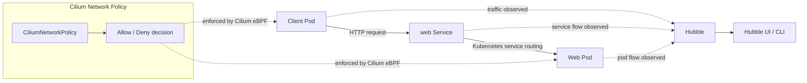

# Network Policy Observability with Hubble

This lab teaches how to use Hubble to see the effect of a network policy change.
You will create a small client and web workload, confirm traffic is allowed, apply
a Cilium deny policy, and then use Hubble flow records to explain why the request
stopped working.

The important idea is that network policy is not only a configuration object. It
changes the data path. Hubble lets you observe that change by showing flow
verdicts such as `FORWARDED` and `DROPPED`.

## Learning Goals

By the end of this lab, you should be able to:

- Create a local `kind` Kubernetes cluster for Cilium practice.
- Install Cilium and enable Hubble in that cluster.
- Deploy a simple client-to-service traffic path.
- Use Hubble to confirm that traffic is initially allowed.
- Apply a `CiliumNetworkPolicy` that denies a specific path.
- Use Hubble verdicts and flow fields to prove which traffic was denied.
- Remove the policy and confirm that traffic works again.

## What You Will Build

The lab uses one namespace named `hubble-demo`.

Inside that namespace you will create:

- `web`: an NGINX pod with the label `app=web`.
- `web`: a Kubernetes Service that sends traffic to the web pod.
- `client`: a curl pod with the label `app=client`.
- `deny-client-to-web`: a `CiliumNetworkPolicy` that denies ingress from the
  client pod to the web pod.

The normal path is:



After the deny policy is applied, Cilium should drop the request before it
reaches the web pod. Hubble should then report a `DROPPED` verdict for that
traffic.

## 1. Create a Kind Cluster for Cilium

Create a `kind` cluster without the default CNI plugin. This matters because
Cilium will be the CNI for the cluster.

The cluster configuration is stored in `kind-config.yaml` at the root of this
lab. It creates one control-plane node and one worker node.

```bash
kind create cluster --config kind-config.yaml
```

Confirm that `kubectl` is pointing at the new cluster:

```bash
kubectl cluster-info --context kind-hubble-demo
kubectl config current-context
```

The current context should be `kind-hubble-demo`.

At this point the node may show as `NotReady`. That is expected until Cilium is
installed, because the cluster does not yet have a CNI plugin.

## 2. Install Cilium

Install Cilium into the `kind` cluster:

```bash
cilium install
cilium status --wait
```

You can also check the Cilium pods directly:

```bash
kubectl -n kube-system get pods -l k8s-app=cilium
kubectl get nodes
```

The node should become `Ready` after Cilium is running.

## 3. Enable Hubble

Enable Hubble relay and the Hubble UI components:

```bash
cilium hubble enable --ui
cilium status --wait
```

## 4. Create the Demo Workloads

Apply the namespace, web pod, web service, and client pod:

```bash
kubectl apply -f manifests/namespace.yaml
kubectl apply -f manifests/web-pod.yaml
kubectl apply -f manifests/web-service.yaml
kubectl apply -f manifests/client-pod.yaml
```

Wait for both pods to become ready:

```bash
kubectl -n hubble-demo wait pod/web --for=condition=Ready --timeout=120s
kubectl -n hubble-demo wait pod/client --for=condition=Ready --timeout=120s
```

Inspect the objects:

```bash
kubectl -n hubble-demo get pods --show-labels
kubectl -n hubble-demo get service web
```

The labels are important. The policy in this lab selects traffic by labels:

- The destination pod has `app=web`.
- The source pod has `app=client`.

## 5. Confirm Traffic Works Before the Policy

From the client pod, send an HTTP request to the `web` Service:

```bash
kubectl -n hubble-demo exec client -- curl -sS http://web
```

You should receive the default NGINX HTML response.

Generate one more request, but discard the response body:

```bash
kubectl -n hubble-demo exec client -- curl -sS http://web >/dev/null
```

Now observe the client-to-web traffic in Hubble:

```bash
hubble observe -P \
  --from-pod hubble-demo/client \
  --to-pod hubble-demo/web
```

Look for these details in the output:

- `VERDICT`: should be `FORWARDED`.
- `SOURCE`: should identify the client pod.
- `DESTINATION`: should identify the web pod.
- `TCP` and port `80`: show that this is HTTP traffic to the web container.

This proves that the traffic path works before any deny policy is added.

## 6. Read the Deny Policy

Open `manifests/deny-client-to-web.yaml` and read it before applying it:

```bash
kubectl apply --dry-run=client -o yaml -f manifests/deny-client-to-web.yaml
```

The policy contains:

```yaml
endpointSelector:
  matchLabels:
    app: web
ingressDeny:
  - fromEndpoints:
      - matchLabels:
          app: client
```

This means:

- `endpointSelector` chooses the protected destination endpoints.
- `app=web` means the policy applies to the web pod.
- `ingressDeny` denies incoming traffic to that selected endpoint.
- `fromEndpoints` with `app=client` means the denied source is the client pod.

The policy does not deny all traffic to the web pod. It denies traffic from pods
matching `app=client` to pods matching `app=web`.

## 7. Apply the Deny Policy

Apply the policy:

```bash
kubectl apply -f manifests/deny-client-to-web.yaml
```

Confirm that Kubernetes accepted it:

```bash
kubectl -n hubble-demo get ciliumnetworkpolicy
kubectl -n hubble-demo describe ciliumnetworkpolicy deny-client-to-web
```

The policy is now part of Cilium policy enforcement.

## 8. Generate Blocked Traffic

Try the same request again:

```bash
kubectl -n hubble-demo exec client -- curl -m 3 -sS http://web
```

This request should fail or time out. The `-m 3` option limits curl to three
seconds so the command does not wait too long.

The application symptom is simple: the client cannot reach the web service.
Hubble is what lets you prove that the reason is policy enforcement.

## 9. Observe the Drop in Hubble

Show dropped flows in the namespace:

```bash
hubble observe -P --namespace hubble-demo --verdict DROPPED
```

Then narrow the query to the exact client-to-web path:

```bash
hubble observe -P \
  --from-pod hubble-demo/client \
  --to-pod hubble-demo/web
```

Look for:

- `VERDICT: DROPPED`.
- Source pod: `hubble-demo/client`.
- Destination pod: `hubble-demo/web`.
- Destination port: `80`.
- A policy-related drop reason.

The exact wording of the drop reason can vary by Cilium version, but it should
indicate that policy denied the traffic.

This is the key troubleshooting workflow:

1. Confirm the application symptom.
2. Observe the flow.
3. Check the verdict.
4. Identify the source, destination, port, and reason.
5. Connect the observed drop back to the policy that was applied.

## 10. Remove the Policy and Retest

Delete the deny policy:

```bash
kubectl -n hubble-demo delete ciliumnetworkpolicy deny-client-to-web
```

Run the request again:

```bash
kubectl -n hubble-demo exec client -- curl -sS http://web >/dev/null
```

Observe the path again:

```bash
hubble observe -P \
  --from-pod hubble-demo/client \
  --to-pod hubble-demo/web
```

You should see `FORWARDED` flows again. This confirms that the deny policy was
the cause of the failed request.

## Troubleshooting

If `hubble status` cannot connect, make sure the port-forward command is still
running:

```bash
cilium hubble port-forward
```

If the pods are not ready, check events and pod status:

```bash
kubectl -n hubble-demo get pods -o wide
kubectl -n hubble-demo describe pod web
kubectl -n hubble-demo describe pod client
```

If the node is not ready, check Cilium:

```bash
cilium status
kubectl -n kube-system get pods -l k8s-app=cilium
kubectl -n kube-system logs -l k8s-app=cilium --tail=100
```

If you do not see drops after applying the policy, generate new traffic and then
run the Hubble query again. Hubble shows observed flows; it does not create
traffic by itself.

## Student Check

You should be able to answer these questions:

- Why was the `kind` cluster created with `disableDefaultCNI: true`?
- What command enabled Hubble?
- Which labels identify the client and web pods?
- What was the Hubble verdict before the policy was applied?
- What was the Hubble verdict after the policy was applied?
- Which policy field selected the destination pod?
- Which policy field selected the denied source pod?
- Which Hubble fields prove that the blocked path was client to web on port 80?
- Why is Hubble useful when debugging network policy?

## Cleanup

Delete the lab namespace:

```bash
kubectl delete namespace hubble-demo
```

If you created a dedicated `kind` cluster for this lab and no longer need it,
delete it:

```bash
kind delete cluster --name hubble-demo
```
