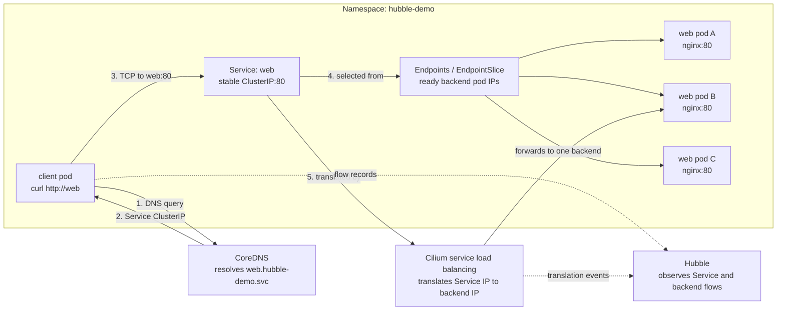
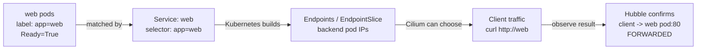

# CCA Exam Preparation: Network Observability - Service and Load-Balancing Flows

This lab shows what happens when a pod talks to a Kubernetes Service instead of
talking directly to a pod IP.

The important idea is that the client calls one stable name, `http://web`, but
the request is delivered to one of several backend pods. Hubble helps you see
both sides of that path: the Service translation and the backend pod that
actually receives the traffic.

## Learning Goals

- Create a Service with multiple backend pods.
- Generate traffic through a Kubernetes Service name.
- Observe which backend pod receives each request.
- Connect Service objects, Endpoint objects, and Hubble flow output.
- Understand why Service debugging often requires checking both the Service and
  its selected endpoints.

## 1. Set Up a kind Cluster with Cilium and Hubble

This lab uses a local kind cluster with Cilium as the CNI and Hubble enabled for
flow visibility.

Create the kind cluster with the shared Cilium-ready kind config:

```bash
kind create cluster --name hubble-lab --config kind-config.yaml
```

Confirm that `kubectl` points at the new cluster:

```bash
kubectl config current-context
kubectl get nodes
```

Expected context:

```text
kind-hubble-lab
```

The nodes may show `NotReady` until Cilium is installed. Install Cilium:

```bash
cilium install --version 1.19.5
cilium status --wait
```

Enable Hubble and Hubble Relay:

```bash
cilium hubble enable
cilium status --wait
```

Validate Hubble API access:

```bash
hubble status -P
```

Expected result:

```text
Healthcheck (via 127.0.0.1:4245): Ok
Connected Nodes: <ready>/<total>
```

The `-P` flag lets the Hubble CLI create a temporary port-forward to Hubble
Relay.

## How Traffic Flows Through the Service

This lab creates one namespace, one client pod, one Deployment with three NGINX
pods, and one Service named `web`.



The request path looks like this:

1. The `client` pod resolves the name `web`.
2. Kubernetes DNS returns the ClusterIP for the `web` Service.
3. The client opens a TCP connection to the Service on port `80`.
4. Cilium translates the Service destination to one selected backend endpoint.
5. One of the `web` pods receives the request on container port `80`.

The Service is stable, but the backend pod can vary between requests. That is
why Service traffic can be confusing at first: the client asks for `web`, while
Hubble may show the final destination as a specific `web-...` pod.

## 2. Create the Demo Workloads

Apply the manifests:

```bash
kubectl apply -f manifests/namespace.yaml
kubectl apply -f manifests/web-deployment.yaml
kubectl apply -f manifests/web-service.yaml
kubectl apply -f manifests/client-pod.yaml
```

Wait until the workloads are ready:

```bash
kubectl -n hubble-demo wait deployment/web --for=condition=Available --timeout=120s
kubectl -n hubble-demo wait pod/client --for=condition=Ready --timeout=120s
```

What each manifest creates:

- `namespace.yaml`: creates the `hubble-demo` namespace.
- `web-deployment.yaml`: creates three NGINX backend pods with the label
  `app=web`.
- `web-service.yaml`: creates the `web` Service. The Service selects pods with
  `app=web` and forwards port `80` to backend port `80`.
- `client-pod.yaml`: creates a long-running curl pod so you can send requests
  from inside the cluster.

Check what Kubernetes created:

```bash
kubectl -n hubble-demo get pods -o wide
kubectl -n hubble-demo get service web
kubectl -n hubble-demo get endpoints web
kubectl -n hubble-demo get endpointslice -l kubernetes.io/service-name=web
```

The important things to notice:

- There should be three `web-...` pods.
- The `web` Service has one ClusterIP and exposes port `80`.
- The `web` Endpoints object should list the IP addresses of the three backend
  pods.
- The EndpointSlice for `web` should also list backend addresses. EndpointSlice
  is the newer scalable API Kubernetes uses for Service backends.

If the Endpoints object is empty, the Service is not selecting any backend pods.
That usually means the Service selector does not match the pod labels, or the
backend pods are not ready.

## 3. Generate Service Traffic

Run a single request from the client pod:

```bash
kubectl -n hubble-demo exec client -- curl -sS http://web >/dev/null
```

This command runs `curl` inside the cluster. The client does not know or choose
one of the backend pod IPs. It only calls the Service name `web`.

The response body is redirected to `/dev/null` because the NGINX HTML page is
not important for this lab. The useful result is the network flow that Hubble
can observe.

## 4. Observe the Client Flow

Start with a broad view of recent traffic involving the client:

```bash
hubble observe -P --namespace hubble-demo
```

Then focus on port `80`:

```bash
hubble observe -P --namespace hubble-demo --port 80
```

Look for output with these patterns:

```text
hubble-demo/client:<port> <> hubble-demo/web:80 ... TRACED (TCP)
hubble-demo/client:<port> -> hubble-demo/web-...:80 ... FORWARDED (TCP Flags: SYN)
hubble-demo/client:<port> <- hubble-demo/web-...:80 ... FORWARDED (TCP Flags: SYN, ACK)
```

Your exact output may differ by Cilium and Hubble version, but the meaning is
the same:

- `client:<port>`: the client used a temporary source port.
- `web:80`: the Service name and Service port the client called.
- `web-...:80`: the backend pod that received the translated traffic.
- `TRACED`: Cilium traced the service/socket translation path.
- `FORWARDED`: Cilium allowed and forwarded the packet.
- `SYN`, `SYN, ACK`, `ACK`: the TCP connection handshake.

Do not worry if you see DNS lines to CoreDNS before the HTTP flow. The client
may need to resolve `web` before it can connect to the Service.

## 5. Connect Hubble Output to Kubernetes Objects

List the backend pods and their IP addresses:

```bash
kubectl -n hubble-demo get pods -l app=web -o wide
```

List the Service:

```bash
kubectl -n hubble-demo get service web
```

List the selected endpoints:

```bash
kubectl -n hubble-demo get endpoints web
```

On newer Kubernetes clusters, also check the EndpointSlice:

```bash
kubectl -n hubble-demo get endpointslice -l kubernetes.io/service-name=web
```

Compare the backend pod IPs with the Endpoint IPs. They should match.

This is the key debugging relationship:



If a Service exists but traffic does not reach any backend pod, check this chain
in order:

1. Do the pods exist?
2. Are the pods ready?
3. Do the pod labels match the Service selector?
4. Does the Endpoints or EndpointSlice object contain backend pod IPs?
5. Does Hubble show traffic reaching one of those backend pods?

## 6. Watch Load Distribution

Open a live Hubble watch in one terminal:

```bash
hubble observe -P --from-pod hubble-demo/client --follow
```

In another terminal, generate repeated traffic:

```bash
kubectl -n hubble-demo exec client -- sh -c 'for i in $(seq 1 20); do curl -sS http://web >/dev/null; done'
```

Watch the destination pods in the Hubble output.

You may see traffic go to one backend or to several backends. Either result can
be valid depending on connection reuse, timing, and the load-balancing behavior
in your environment. The important observation is that the Service is the stable
entry point, while the selected backend endpoint is one of the ready `web` pods.

To make backend selection easier to see, list only the web pods in another
terminal:

```bash
kubectl -n hubble-demo get pods -l app=web -o wide
```

Then compare pod names and IPs with the Hubble destination fields.

## 7. Useful Filters

Show all recent flows in the lab namespace:

```bash
hubble observe -P --namespace hubble-demo
```

Show flows that start from the client:

```bash
hubble observe -P --from-pod hubble-demo/client
```

Show flows going to any pod with the name prefix `web` by filtering in the
namespace and checking destination names:

```bash
hubble observe -P --namespace hubble-demo --port 80
```

Show live client traffic while you run requests:

```bash
hubble observe -P --from-pod hubble-demo/client --follow
```

Use these filters to answer different questions:

- `--namespace hubble-demo`: What is happening in this lab?
- `--pod client`: What traffic involves the client in either direction?
- `--from-pod hubble-demo/client`: What did the client try to send?
- `--port 80`: Which flows are part of the web request?
- `--follow`: What is happening right now?

## 8. Troubleshooting Empty or Confusing Output

If `curl http://web` fails, check DNS and Service state:

```bash
kubectl -n hubble-demo exec client -- nslookup web
kubectl -n hubble-demo get service web
kubectl -n hubble-demo get endpoints web
kubectl -n hubble-demo get endpointslice -l kubernetes.io/service-name=web
```

If the Service exists but Endpoints are empty, check labels:

```bash
kubectl -n hubble-demo get deployment web --show-labels
kubectl -n hubble-demo get pods -l app=web --show-labels
kubectl -n hubble-demo describe service web
```

If Hubble output is empty:

- Start the `--follow` command before generating traffic.
- Generate traffic again after the Hubble watch is running.
- Confirm the client pod is ready.
- Confirm the web Deployment is available.
- Confirm Hubble itself works with `hubble status -P`.

If Hubble shows `web` in one line and `web-...` in another line, that is normal.
The Service is the logical destination the client requested. The backend pod is
the real endpoint selected after Service translation.

## Student Check

You should be able to answer:

- Which Service did the client call?
- Which backend pod received a request?
- Did repeated requests go to one backend or several?
- How does the Service selector decide which pods become endpoints?
- Why can Hubble show both Service and backend pod details for one request?
- Why can Service debugging require checking both Service and Endpoint or
  EndpointSlice objects?

## Cleanup

Keep the namespace if you are continuing to another lab that reuses
`hubble-demo`.

If you want to reset:

```bash
kubectl delete namespace hubble-demo
```

If you also want to remove the local cluster:

```bash
kind delete cluster --name hubble-lab
```
