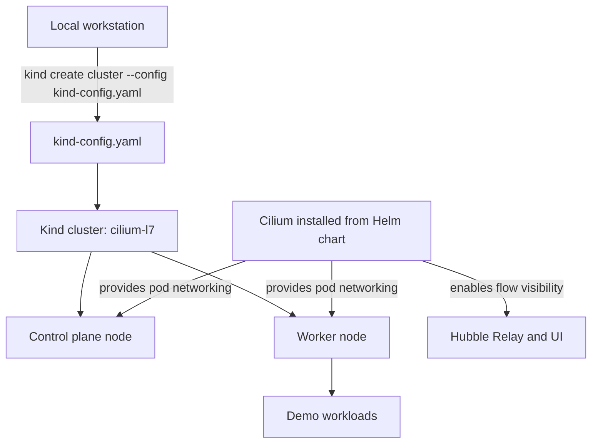
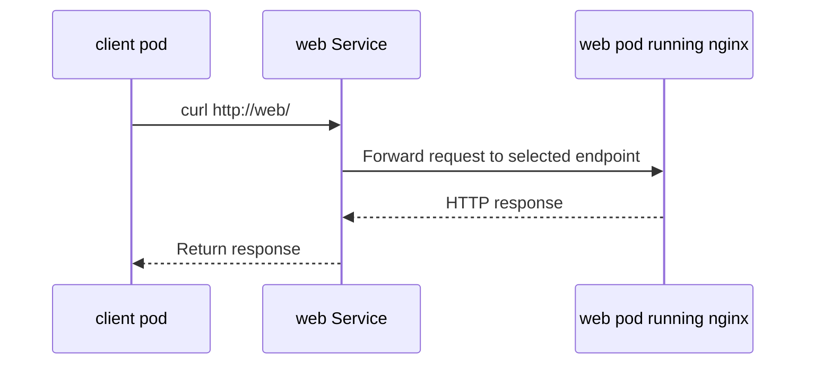
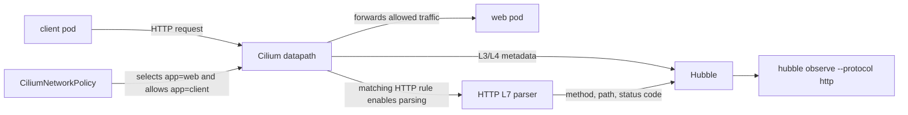
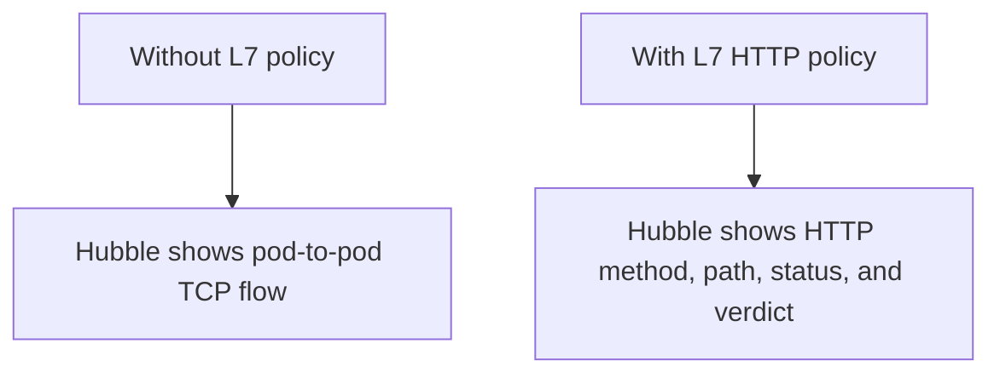

# HTTP L7 Visibility

This lab shows how Cilium and Hubble expose Layer 7 HTTP information. At L3/L4
you can see that one pod opened a TCP connection to another pod on port 80. At
L7 you can also see HTTP details such as the method, path, response code, source
pod, destination pod, and policy verdict.

The important exam idea is that HTTP fields do not appear just because traffic
uses port 80. Cilium must be configured to inspect the traffic at Layer 7. In
this lab, that happens through a `CiliumNetworkPolicy` with HTTP rules.

## Architecture

The lab uses one Kind cluster with one control plane node and one worker node.
The cluster is created without the default Kind CNI so Cilium can be installed
from its Helm chart and become the cluster CNI.



What this architecture means:

- The local workstation is where you run `kind`, `kubectl`, `helm`, `cilium`,
  and `hubble`.
- `kind-config.yaml` defines the cluster shape. This lab intentionally uses one
  control plane node and one worker node so students see a realistic split
  between Kubernetes control-plane components and application workloads.
- `disableDefaultCNI: true` means Kind does not install its normal networking
  plugin. The nodes start as `NotReady` because Kubernetes has no pod network
  yet.
- Cilium is installed from the Helm chart and becomes the cluster CNI. After
  Cilium starts, pods can receive IP addresses, nodes become `Ready`, and pod
  traffic can move through the Cilium datapath.
- Hubble is enabled as part of the Cilium install. Hubble reads flow events from
  Cilium and exposes them through Hubble Relay so the local `hubble` CLI can
  observe traffic.

Inside the cluster, the request flow is:



What this request flow means:

- The `client` pod does not call the `web` pod IP directly. It calls
  `http://web`, which is the Kubernetes Service name inside the `hubble-demo`
  namespace.
- Kubernetes service discovery resolves `web` to the `web` Service. The Service
  selects pods with `app=web`.
- The Service forwards the request to the nginx pod behind it. In this lab there
  is only one backend pod, but the same pattern works with many replicas.
- The nginx pod returns an HTTP response to the client. For `/`, nginx should
  normally return a successful response. For `/not-found`, nginx should normally
  return a missing-page response.
- This request path is useful for observability because it creates traffic with
  a clear source, destination, method, path, and status code.

The observability flow is:



What this observability flow means:

- The packet still travels from the `client` pod to the `web` pod, but Cilium is
  on the data path because it is the cluster CNI.
- At baseline, Cilium can observe L3/L4 information such as source identity,
  destination identity, IPs, ports, protocol, and verdict.
- The `CiliumNetworkPolicy` selects the `web` endpoint with `app=web` and allows
  ingress from endpoints with `app=client`.
- The policy includes an HTTP rule under `toPorts`. That rule is what makes this
  an L7 visibility lab. It tells Cilium to parse matching TCP port 80 traffic as
  HTTP.
- Once HTTP parsing is active, Hubble can show fields like `GET`, `/`,
  `/not-found`, `200`, and `404`. Without that policy, Hubble may show the TCP
  flow but not the HTTP method, path, or status code.
- The `hubble observe --protocol http` command filters the flow stream so the
  student focuses only on HTTP events.

## Learning Goals

- Understand the difference between L3/L4 visibility and L7 HTTP visibility.
- Build a Kind cluster with a control plane and worker node.
- Install Cilium from the Helm chart instead of using Kind's default CNI.
- Enable Hubble for flow inspection.
- Enable HTTP visibility with a `CiliumNetworkPolicy`.
- Observe HTTP method, path, response status, source, destination, and verdict.
- Practice filtering Hubble output by protocol.

## 1. Create The Kind Cluster

From this lab directory, create the cluster:

```bash
kind create cluster --name cilium-l7 --config kind-config.yaml
kubectl cluster-info --context kind-cilium-l7
```

Confirm both nodes exist:

```bash
kubectl get nodes -o wide
```

Expected shape:

```text
NAME                       STATUS     ROLES           AGE   VERSION
cilium-l7-control-plane    NotReady   control-plane   ...   ...
cilium-l7-worker           NotReady   <none>          ...   ...
```

`NotReady` is expected before Cilium is installed because the cluster has no CNI
yet.

## 2. Install Cilium From Helm

Add the Cilium Helm repository:

```bash
helm repo add cilium https://helm.cilium.io/
helm repo update
```

Install Cilium and enable Hubble:

```bash
helm install cilium cilium/cilium \
  --namespace kube-system \
  --set kubeProxyReplacement=true \
  --set hubble.enabled=true \
  --set hubble.relay.enabled=true \
  --set hubble.ui.enabled=true
```

Wait for Cilium to become ready:

```bash
cilium status --wait
kubectl get nodes
```

The nodes should now be `Ready`.

Enable access to Hubble Relay from your local `hubble` CLI:

```bash
cilium hubble port-forward &
hubble status
```

## 3. Deploy The Demo Workloads

Apply the namespace, web pod, web service, and client pod:

```bash
kubectl apply -f manifests/namespace.yaml
kubectl apply -f manifests/web-pod.yaml
kubectl apply -f manifests/web-service.yaml
kubectl apply -f manifests/client-pod.yaml

kubectl -n hubble-demo wait pod/web --for=condition=Ready --timeout=120s
kubectl -n hubble-demo wait pod/client --for=condition=Ready --timeout=120s
```

The demo creates:

- `web`: an nginx pod with label `app=web`.
- `web` Service: a ClusterIP service that sends traffic to the nginx pod.
- `client`: a curl pod with label `app=client`.

## 4. Check Baseline Traffic

Generate one HTTP request:

```bash
kubectl -n hubble-demo exec client -- curl -sS http://web >/dev/null
```

Observe TCP traffic:

```bash
hubble observe -P --namespace hubble-demo --protocol tcp
```

Now try HTTP traffic:

```bash
hubble observe -P --namespace hubble-demo --protocol http
```

If HTTP output is empty, that is the expected teaching point. Cilium can see the
connection at L3/L4, but it has not been told to parse this flow as HTTP yet.

## 5. Enable HTTP Visibility

Apply the Cilium policy:

```bash
kubectl apply -f manifests/web-http-visibility.yaml
```

The policy selects the destination pod:

```text
endpointSelector:
  app: web
```

It allows traffic from the client pod:

```text
fromEndpoints:
  app: client
```

It enables L7 HTTP parsing for TCP port 80:

```text
toPorts:
  ports:
    port: "80"
    protocol: TCP
  rules:
    http:
      method: GET
      path: "/.*"
```

This is the key step. The HTTP rule is not only an allow rule; it also tells
Cilium to inspect matching traffic at Layer 7 so Hubble can display HTTP fields.

## 6. Generate HTTP Requests

Send a successful request:

```bash
kubectl -n hubble-demo exec client -- curl -sS http://web/ >/dev/null
```

Send a request for a missing path:

```bash
kubectl -n hubble-demo exec client -- curl -sS http://web/not-found >/dev/null
```

These two requests should create different HTTP paths and likely different
response status codes, which makes the Hubble output easier to read.

## 7. Observe HTTP Flows

```bash
hubble observe -P --namespace hubble-demo --protocol http
```

Look for these fields:

- Source: `hubble-demo/client`
- Destination: `hubble-demo/web`
- HTTP method: `GET`
- HTTP path: `/` or `/not-found`
- HTTP status code: for example `200` or `404`
- Verdict: usually `FORWARDED` when the policy allows the request

The mental model is:



How to remember this:

- `--protocol tcp` answers the transport question: which workload connected to
  which workload, and on which TCP port?
- `--protocol http` answers the application question: what HTTP request was
  made, which path was requested, and what response code came back?
- Port 80 is not enough by itself. A TCP flow on port 80 is still just TCP until
  Cilium is configured to parse it as HTTP.
- The Cilium HTTP policy is the switch that changes the lab from connection
  visibility to request visibility.

## 8. Watch Live HTTP Traffic

Open a live watch in one terminal:

```bash
hubble observe -P --namespace hubble-demo --protocol http --follow
```

Generate traffic in another terminal:

```bash
kubectl -n hubble-demo exec client -- curl -sS http://web/ >/dev/null
kubectl -n hubble-demo exec client -- curl -sS http://web/not-found >/dev/null
```

You should see the HTTP flows appear as the requests happen.

## Troubleshooting

If nodes stay `NotReady`, check Cilium:

```bash
cilium status
kubectl -n kube-system get pods -l k8s-app=cilium
```

If `hubble observe` cannot connect, restart the port-forward:

```bash
cilium hubble port-forward
```

If `--protocol http` is empty after applying the policy, generate new traffic.
Hubble will not invent old HTTP details for flows that happened before L7
visibility was enabled.

If DNS or service access fails, verify the service and endpoints:

```bash
kubectl -n hubble-demo get svc web
kubectl -n hubble-demo get endpoints web
```

## Student Check

You should be able to answer:

- Why are the Kind nodes initially `NotReady` when `disableDefaultCNI: true` is
  used?
- Why is Cilium installed from Helm in this lab?
- What is the difference between `--protocol tcp` and `--protocol http`?
- Why might HTTP output be empty before the Cilium policy exists?
- Which pod does `endpointSelector` select in the policy?
- Which source pod is allowed by `fromEndpoints`?
- Which HTTP paths did Hubble show?
- Which response status codes did you see?
- What would happen if the client sent a method other than `GET`?

## Cleanup

Delete the demo namespace:

```bash
kubectl delete namespace hubble-demo
```

Delete the Kind cluster:

```bash
kind delete cluster --name cilium-l7
```
