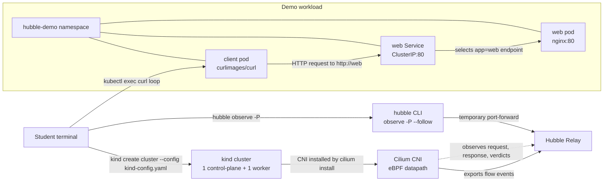

# Live Debugging with `--follow`

This lab teaches a live debugging workflow with Hubble. Instead of generating
traffic first and reading old flows later, you will keep `hubble observe`
running while requests are happening. This is closer to how you debug a real
incident, because you can change filters and immediately see whether new traffic
matches your question.

## Learning Goals

- Create a local two-node kind cluster for Hubble practice.
- Install Cilium without the default kind CNI.
- Enable Hubble and confirm the Hubble CLI can reach Hubble Relay.
- Use `--follow` to stream flows while traffic is generated.
- Narrow a live stream with namespace, pod, and verdict filters.
- Explain what an empty live stream means during troubleshooting.

## Architecture Flow



The important path is `client -> web Service -> web pod`. Cilium observes that
path on the nodes and sends flow events to Hubble Relay. The `hubble` CLI reads
those events through a temporary port-forward when you use `-P`.

## 1. Create the kind Cluster

Create the cluster from that file:

```bash
kind create cluster --name hubble-follow-lab --config kind-config.yaml
```

The config creates one control-plane node and one worker node. It also disables
the default kind CNI and kube-proxy mode so Cilium can own the networking path.
That matters for this lab because Hubble observes flows from Cilium.

Validate the cluster context:

```bash
kubectl config current-context
kubectl get nodes
```

Expected context:

```text
kind-hubble-follow-lab
```

The nodes can be `NotReady` until Cilium is installed. That is expected because
the cluster does not have a CNI yet.

## 2. Install Cilium and Enable Hubble

Install Cilium into the kind cluster:

```bash
cilium install --set kubeProxyReplacement=true
cilium status --wait
```

This deploys the Cilium agent, operator, and networking components. After this
step, the kind nodes should become `Ready` because the cluster now has a CNI.
The `kubeProxyReplacement=true` setting is important because this kind cluster
was created with `kubeProxyMode: none`.

Enable Hubble:

```bash
cilium hubble enable
cilium status --wait
```

Hubble Relay should report `OK`. Relay is the component the Hubble CLI talks to
when it asks for flow data across the cluster.

Confirm CLI access:

```bash
hubble status -P
```

The `-P` flag creates a temporary local port-forward to Hubble Relay. This keeps
the lab simple because you do not need to expose Relay with a Service.

## 3. Deploy the Demo Workload

Apply the local manifests in dependency order. The namespace must exist before
the pod and Service manifests are created:

```bash
kubectl apply -f manifests/namespace.yaml
kubectl apply -f manifests/web-pod.yaml
kubectl apply -f manifests/web-service.yaml
kubectl apply -f manifests/client-pod.yaml
```

Wait until both pods are ready:

```bash
kubectl -n hubble-demo wait pod/web --for=condition=Ready --timeout=120s
kubectl -n hubble-demo wait pod/client --for=condition=Ready --timeout=120s
```

This creates:

- `hubble-demo/client`, a long-running curl pod used to generate requests.
- `hubble-demo/web`, an nginx pod that receives HTTP traffic.
- The `web` ClusterIP Service, which gives the web pod a stable DNS name inside
  the `hubble-demo` namespace.

Run one smoke test request:

```bash
kubectl -n hubble-demo exec client -- curl -sS http://web >/dev/null
```

This proves the Service name resolves, the Service selects the web pod, and the
HTTP path is working before you start live observation.

## 4. Start a Broad Live Watch

Start with a namespace-level watch:

```bash
hubble observe -P --namespace hubble-demo --follow
```

Leave this command running. It asks Hubble to stream every new flow in the
`hubble-demo` namespace. This is useful at the start of an investigation because
you may not yet know which source, destination, port, or verdict matters.

## 5. Generate Traffic While Watching

Open a second terminal and run a small request loop:

```bash
kubectl -n hubble-demo exec client -- sh -c 'for i in $(seq 1 5); do curl -sS http://web >/dev/null; sleep 1; done'
```

Return to the first terminal and watch the flow stream update. You should see
new entries involving `hubble-demo/client` and `hubble-demo/web`.

This step teaches the main value of `--follow`: the observation window stays
open while the test is running, so you can connect an action to the exact flows
it produced.

## 6. Narrow the Stream to the Client Pod

Stop the broad watch with `Ctrl-C`, then start a source-pod watch:

```bash
hubble observe -P --namespace hubble-demo --from-pod hubble-demo/client --follow
```

Generate traffic again from the second terminal:

```bash
kubectl -n hubble-demo exec client -- sh -c 'for i in $(seq 1 5); do curl -sS http://web >/dev/null; sleep 1; done'
```

This filter removes noise from other workloads in the namespace. Use this
approach when you know the source workload involved in the issue.

## 7. Watch Only Forwarded Traffic

Stop the previous watch and run:

```bash
hubble observe -P \
  --from-pod hubble-demo/client \
  --verdict FORWARDED \
  --follow
```

Generate traffic again if the stream is quiet.

`FORWARDED` means Cilium allowed the packet to continue through the datapath.
This is useful when you want to prove that traffic is passing and focus on the
successful request path.

## 8. Watch Only Dropped Traffic

Stop the previous watch and start with a broad drop watch:

```bash
hubble observe -P --namespace hubble-demo --verdict DROPPED --follow
```

This shows any dropped flow involving the `hubble-demo` namespace. It can still
produce output in a healthy lab because it is not limited to the HTTP request
path. For example, you may see drops from startup traffic, DNS-related traffic,
or other traffic involving one of the demo pods.

For a cleaner check of the client-to-web path, narrow the drop watch:

```bash
hubble observe -P \
  --from-pod hubble-demo/client \
  --to-pod hubble-demo/web \
  --verdict DROPPED \
  --follow
```

Generate traffic again from the second terminal. In this healthy demo, the
client-to-web drop stream should normally stay empty. Empty output is useful: it
means Hubble did not observe matching drops for that filtered path during the
watch window.

Use this filter when debugging suspected network policy issues, routing
problems, or unexpected connection failures.

## 9. Compare Filters

Run these commands one at a time and generate traffic after each one:

```bash
hubble observe -P --namespace hubble-demo --follow
hubble observe -P --namespace hubble-demo --from-pod hubble-demo/client --follow
hubble observe -P --namespace hubble-demo --from-pod hubble-demo/client --to-pod hubble-demo/web --follow
hubble observe -P --namespace hubble-demo --from-pod hubble-demo/client --to-pod hubble-demo/web --verdict FORWARDED --follow
```

Each command asks a more precise question:

- Show me all live traffic in the demo namespace.
- Show me only traffic that starts from the client pod.
- Show me only traffic from the client pod to the web pod.
- Show me only allowed traffic from the client pod to the web pod.

Good troubleshooting usually starts broad enough to avoid missing the problem,
then narrows the stream until the output directly answers the question.

## Student Check

You should be able to answer:

- Why does this kind config disable the default CNI?
- What does `hubble observe -P` do differently from exposing Hubble Relay?
- Why is `--follow` useful during live debugging?
- Which filter reduced the most noise in this lab?
- What does an empty `DROPPED` stream tell you?
- When would you watch `FORWARDED` traffic instead of `DROPPED` traffic?

## Cleanup

Delete the demo namespace:

```bash
kubectl delete namespace hubble-demo
```

Delete the kind cluster if you created it only for this lab:

```bash
kind delete cluster --name hubble-follow-lab
```
