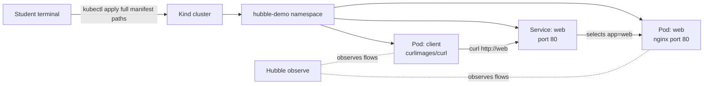
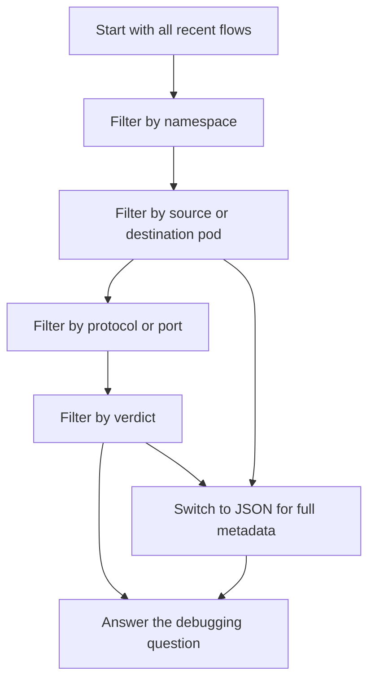
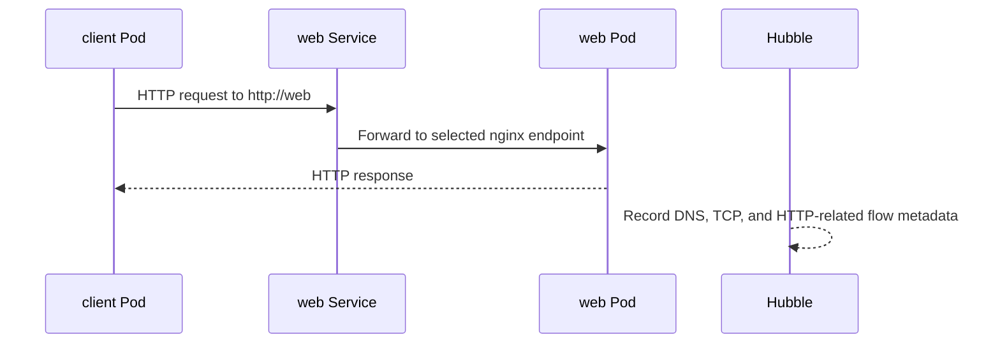

# Filtering and Output Formats

This lab teaches how to make Hubble output smaller, more precise, and easier to
process. You will create a Kind cluster, deploy a small client and web
workload, generate traffic, and then use Hubble filters to answer specific
network-observability questions.

## Learning Goals

- Create a Kind cluster from a root-level Kind config file.
- Deploy the demo namespace, Pods, and Service with full manifest paths.
- Generate traffic from `client` to `web`.
- Filter flows by namespace, pod, direction, verdict, protocol, and port.
- Combine filters to answer one precise debugging question.
- Use JSON output when compact text output hides important details.

## Architecture

The demo has one namespace, one client Pod, one web Pod, and one Service in
front of the web Pod. Hubble observes the network flows produced when the
client calls the Service.



The filtering workflow should move from broad to narrow:



## 1. Create the Kind Cluster

The Kind config file is required and is provided at the lab root as
`kind-config.yaml`. It must stay in the root directory, not inside `manifests/`.

Create the cluster with that root-level config file:

```bash
kind create cluster --config kind-config.yaml
```

Confirm that `kubectl` is pointing at the new cluster:

```bash
kubectl cluster-info --context kind-hubble-filtering
kubectl get nodes
```

The nodes may show `NotReady` until Cilium is installed because the Kind
cluster was created without the default CNI.

## 2. Install Cilium with Hubble

Install Cilium and enable Hubble:

```bash
cilium install --set hubble.enabled=true --set hubble.relay.enabled=true --set hubble.ui.enabled=true
```

Wait until Cilium reports healthy:

```bash
cilium status --wait
```

Enable Hubble port forwarding for the local `hubble` CLI:

```bash
cilium hubble port-forward
```

Keep that command running in its terminal. Open a second terminal from the lab
root and continue:

```bash
hubble status
```

## 3. Deploy the Demo

Apply each manifest with its full path. This makes it clear exactly which file
creates each resource and avoids relying on `kubectl apply -f manifests/`.

```bash
kubectl apply -f manifests/namespace.yaml
kubectl apply -f manifests/web-pod.yaml
kubectl apply -f manifests/web-service.yaml
kubectl apply -f manifests/client-pod.yaml
```

Wait for both Pods:

```bash
kubectl -n hubble-demo wait pod/web --for=condition=Ready --timeout=120s
kubectl -n hubble-demo wait pod/client --for=condition=Ready --timeout=120s
```

Check the resources:

```bash
kubectl -n hubble-demo get pods -o wide
kubectl -n hubble-demo get service web
```

Expected result:

- `client` is a curl Pod used to generate requests.
- `web` is an nginx Pod listening on port `80`.
- `web` Service selects the `web` Pod through the `app=web` label.

## 4. Generate Traffic

Run a request from the client Pod to the web Service:

```bash
kubectl -n hubble-demo exec client -- curl -sS http://web
```

Run it a few times so there are recent flows to observe:

```bash
kubectl -n hubble-demo exec client -- curl -sS http://web >/dev/null
kubectl -n hubble-demo exec client -- curl -sS http://web >/dev/null
kubectl -n hubble-demo exec client -- curl -sS http://web >/dev/null
```

The traffic path is:



## 5. Filter by Namespace

Start with the broadest useful filter:

```bash
hubble observe -P --namespace hubble-demo
```

This removes most cluster background traffic and keeps only flows where Hubble
can associate the flow with the `hubble-demo` namespace.

Use this when the debugging question is:

- "What is happening inside this namespace?"
- "Can I ignore system namespace traffic?"

## 6. Filter by Pod

Filter flows related to one known Pod:

```bash
hubble observe -P --namespace hubble-demo --pod client
hubble observe -P --namespace hubble-demo --pod web
```

Use this when you know one workload involved in the problem but you do not yet
know the exact source, destination, port, or verdict.

## 7. Filter by Direction

Use direction filters when the path matters.

Show flows where `client` is the source:

```bash
hubble observe -P --from-pod hubble-demo/client
```

Show flows where `web` is the destination:

```bash
hubble observe -P --to-pod hubble-demo/web
```

These filters are useful for separating request traffic from unrelated traffic
that only happens to involve the same namespace.

## 8. Filter by Verdict

Show forwarded traffic:

```bash
hubble observe -P --namespace hubble-demo --verdict FORWARDED
```

Show dropped traffic:

```bash
hubble observe -P --namespace hubble-demo --verdict DROPPED
```

Use `FORWARDED` to confirm traffic is allowed. Use `DROPPED` when
investigating network policy, routing, or packet drops.

If no dropped flows appear, that is normal for this demo because no deny policy
is installed.

## 9. Filter by Protocol and Port

Show TCP flows in the namespace:

```bash
hubble observe -P --namespace hubble-demo --protocol tcp
```

Show DNS flows in the namespace:

```bash
hubble observe -P --namespace hubble-demo --protocol dns
```

Show flows that use port `80`:

```bash
hubble observe -P --namespace hubble-demo --port 80
```

Protocol and port filters are useful when the namespace is still too noisy.
For this lab, port `80` maps to the `web` Service and nginx container.

## 10. Combine Filters

Combine filters when you can describe the exact question in one sentence.

```bash
hubble observe -P \
  --from-pod hubble-demo/client \
  --to-pod hubble-demo/web \
  --port 80 \
  --verdict FORWARDED
```

This asks:

"Did traffic from `client` to `web` on port `80` get forwarded?"

If you see matching flows, the answer is yes. If you do not see matching flows,
generate traffic again and rerun the command:

```bash
kubectl -n hubble-demo exec client -- curl -sS http://web >/dev/null
```

## 11. Use JSON Output

Compact text output is good for quick inspection. JSON output is better when
you need the full flow object.

```bash
hubble observe -P --namespace hubble-demo --output json
```

Pretty-print with `jq`:

```bash
hubble observe -P --namespace hubble-demo --output json | jq .
```

Extract only selected fields:

```bash
hubble observe -P --namespace hubble-demo --output json \
  | jq '{time: .flow.time, verdict: .flow.verdict, source: .flow.source.pod_name, destination: .flow.destination.pod_name, port: (.flow.l4.TCP.destination_port // .flow.l4.UDP.destination_port)}'
```

Use JSON when:

- You need fields hidden by the compact text output.
- You want to collect evidence for a report.
- You need to pipe Hubble output into another tool.
- You want exact source, destination, labels, ports, verdicts, or timestamps.

## Student Tasks

Complete these tasks without changing the manifests:

1. Generate one request from `client` to `web`.
2. Show only flows in the `hubble-demo` namespace.
3. Show only flows where `client` is the source Pod.
4. Show only flows where `web` is the destination Pod.
5. Show only forwarded flows in the namespace.
6. Show only port `80` flows in the namespace.
7. Produce JSON output and identify the verdict field.

## Student Check

You should be able to answer:

- Why must the Kind config file be placed in the lab root?
- Which full manifest path creates the namespace?
- Which full manifest path creates the `web` Service?
- Which filter would you use for one namespace?
- Which filter would you use for a known source Pod?
- Which filter shows only drops?
- When is JSON output better than text output?
- Why is combining filters better than searching through all flows manually?

## Cleanup

Keep the namespace and cluster if you are continuing to other labs.

To remove only the demo resources, use full manifest paths:

```bash
kubectl delete -f manifests/client-pod.yaml
kubectl delete -f manifests/web-service.yaml
kubectl delete -f manifests/web-pod.yaml
kubectl delete -f manifests/namespace.yaml
```

To delete the Kind cluster:

```bash
kind delete cluster --name hubble-filtering
```
