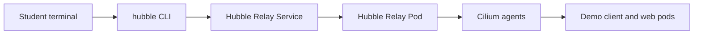
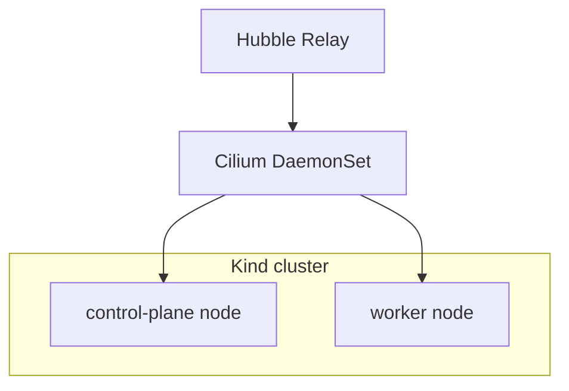
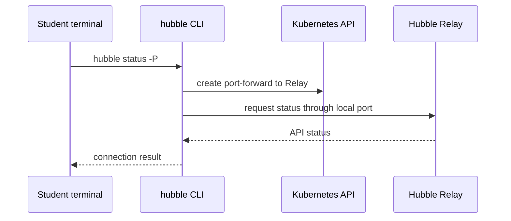
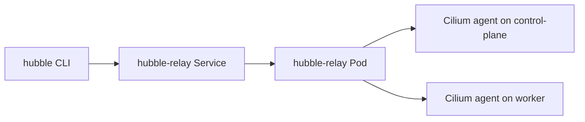
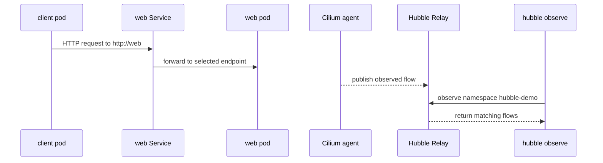

# Troubleshooting Hubble Itself

This lab teaches how to troubleshoot Hubble as a system, not only how to read
flows. In real clusters, "Hubble is broken" can mean several different things:
the CLI cannot reach Hubble Relay, Relay cannot reach the Cilium agents, the
Cilium agents are unhealthy, or the workload simply has not produced any traffic
that matches your filters.

The goal is to move from the outside inward:



When you troubleshoot in this order, you avoid guessing. You first prove the
observability path is healthy, and only then investigate the application traffic.

## Learning Goals

- Check Cilium and Hubble component health.
- Debug Hubble Relay access.
- Inspect Hubble Relay and Cilium pods.
- Separate Hubble access problems from workload traffic problems.

## Prerequisites

- `kubectl` points at the target cluster.
- `kind`, `cilium`, and `hubble` CLIs are available.
- Cilium should be installed with Hubble support available.
- If you need a local lab cluster, create it from the root YAML file in this
  exercise:

```bash
kind create cluster --name hubble-troubleshooting --config kind-config.yaml
```

The Kind config intentionally creates one control-plane node and one worker node.
It also disables Kind's default CNI so Cilium can become the cluster network
plugin. That gives students a small but realistic cluster shape for checking
where Cilium agents are running.



Install Cilium before starting the troubleshooting steps:

```bash
cilium install
cilium status --wait
```

If Cilium is already installed in your environment, do not reinstall it; use the
existing cluster.

## 1. Check Cilium Status

```bash
cilium status
```

Start with the broadest health check. `cilium status` summarizes whether the
control plane pieces, Cilium agents, and Hubble components agree that the system
is healthy.

Look for these lines:

- `Cilium: OK`
- `Operator: OK`
- `Hubble Relay: OK`

If `Cilium` or `Operator` is not healthy, pause here. Hubble depends on Cilium's
agent and operator state, so Relay troubleshooting is usually a distraction
until the base Cilium installation is healthy.

If Hubble Relay is missing, enable it and wait for Cilium to reconcile:

```bash
cilium hubble enable
cilium status --wait
```

Student reasoning checkpoint:

- If Cilium is unhealthy, troubleshoot Cilium first.
- If Cilium is healthy but Hubble Relay is missing, enable Hubble Relay.
- If all components are healthy, continue to testing CLI access.

## 2. Check Hubble CLI Access

```bash
hubble status -P
```

This command checks whether your local `hubble` CLI can connect to Hubble Relay.
The `-P` flag asks the CLI to use port-forwarding for the connection. This is
often the simplest local lab path because you do not need to expose Relay outside
the cluster.

Expected result: the CLI reports that it can reach the server and shows Hubble
API information.

If this fails, try a manual port-forward so you can separate "port-forward setup"
from "Hubble API is unavailable":

```bash
cilium hubble port-forward
```

In another terminal:

```bash
hubble status
```

If `hubble status` works with the manual port-forward, the Relay API is usable
and the issue is likely how the CLI tried to create or use the port-forward.



Student reasoning checkpoint:

- If `hubble status -P` fails before connecting, inspect port-forwarding and
  Kubernetes API access.
- If port-forwarding succeeds but `hubble status` fails, inspect Relay itself.
- If `hubble status` succeeds, the CLI path to Relay works.

## 3. Check Hubble Relay

```bash
kubectl -n kube-system get pods -l k8s-app=hubble-relay
kubectl -n kube-system get service hubble-relay
kubectl -n kube-system logs deploy/hubble-relay
```

Hubble Relay is the in-cluster service that aggregates flow data from the Cilium
agents. The CLI does not talk directly to every node's Cilium agent; it talks to
Relay, and Relay fans out to the agents.

Common issues:

- Hubble Relay pod is not running.
- The service does not exist.
- Port-forwarding cannot connect.
- Relay cannot connect to Cilium agents.

Use the pod check to confirm scheduling and readiness. Use the service check to
confirm there is a stable Kubernetes Service for the CLI port-forward. Use logs
to find connection problems between Relay and the Cilium agents.



Student reasoning checkpoint:

- If the pod is missing, Hubble Relay may not be enabled or its Deployment may
  not have reconciled.
- If the service is missing, port-forwarding has no stable target.
- If Relay logs show agent connection errors, move to Cilium agent checks.

## 4. Check Cilium Agents

```bash
kubectl -n kube-system get pods -l k8s-app=cilium -o wide
```

There should be a Cilium agent on each Kind node. With the provided
`kind-config.yaml`, that means one Cilium pod on the control-plane node and one
Cilium pod on the worker node.

Inspect the agents:

```bash
kubectl -n kube-system describe pod -l k8s-app=cilium
```

Check logs if needed:

```bash
kubectl -n kube-system logs -l k8s-app=cilium --tail=100
```

The Cilium agents are where flow events are observed. If an agent is crash
looping, not ready, or unable to serve Hubble data, Relay may be running but
still unable to return useful flows.

Student reasoning checkpoint:

- Every node should have a running Cilium agent.
- Agent readiness matters more than pod existence alone.
- Relay depends on the agents for flow data, so agent problems can look like
  Hubble problems from the CLI.

## 5. Check Whether Traffic Exists

If Hubble works but no relevant flows appear, generate fresh traffic:

```bash
kubectl apply -f manifests/namespace.yaml
kubectl apply -f manifests/web-pod.yaml
kubectl apply -f manifests/web-service.yaml
kubectl apply -f manifests/client-pod.yaml
kubectl -n hubble-demo wait pod/web --for=condition=Ready --timeout=120s
kubectl -n hubble-demo wait pod/client --for=condition=Ready --timeout=120s
kubectl -n hubble-demo exec client -- curl -sS http://web >/dev/null
hubble observe -P --namespace hubble-demo
```

Apply each manifest directly. This is intentional for the lab: students should
see the namespace, backend pod, service, and client pod as separate pieces
instead of treating the whole `manifests/` directory as a black box.

The demo traffic path is:



If the curl command works but no flows appear, broaden your observe command:

```bash
hubble observe -P --namespace hubble-demo --last 20
hubble observe -P --last 50
```

This helps you tell the difference between "Hubble sees no traffic" and "my
filter is too narrow."

Student reasoning checkpoint:

- Successful curl proves the application path works.
- Hubble output proves the observability path sees that traffic.
- If the app works but flows are missing, check filters, Relay logs, and Cilium
  agent health again.

## 6. Common Symptom Map

| Symptom | First check |
|---|---|
| `hubble status -P` fails | Hubble Relay pod and port-forwarding |
| `Hubble Relay` is missing in `cilium status` | Run `cilium hubble enable` |
| No flows appear | Generate fresh traffic and remove narrow filters |
| DNS flows are missing | DNS visibility may not be enabled |
| HTTP flows are missing | L7 HTTP visibility may not be enabled |
| Drops are missing | The failure may not be a Cilium drop |

Use this table only after completing the earlier checks. Symptom maps are useful
for choosing the next command, but they are not a replacement for proving each
part of the path.

## Student Check

You should be able to answer:

- Is the problem Hubble access or application traffic?
- Is Hubble Relay running?
- Can the CLI connect to Relay?
- Are Cilium agents healthy?
- Did you generate fresh traffic before checking `hubble observe`?
- Are your observe filters broad enough to show the traffic?

## Cleanup

```bash
kubectl delete namespace hubble-demo
```

If you created the local Kind cluster only for this exercise, delete it when you
are finished:

```bash
kind delete cluster --name hubble-troubleshooting
```
