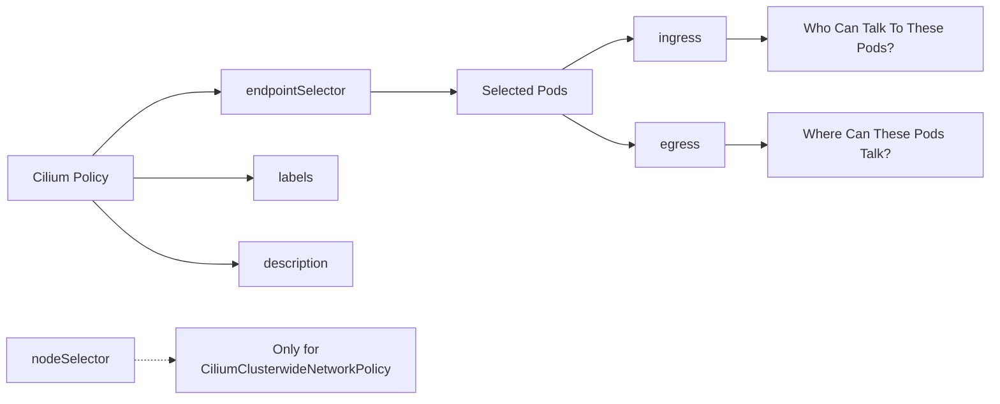

# Cilium Rule Basics

Cilium policy rules are allow rules. This means each rule describes traffic that is permitted. Traffic that is not allowed by any matching rule is dropped when policy enforcement applies.

For the Cilium Certified Associate (CCA) exam, remember this sentence:

> Cilium policies use a whitelist model: selected endpoints allow only traffic that matches policy rules.

## What A Rule Does

A Cilium policy rule is evaluated in three logical steps:

1. Identify the target endpoints using `endpointSelector`.

   * Which Pods or endpoints does this policy apply to?

2. Evaluate ingress rules.

   * Which sources are allowed to communicate with the selected endpoints?
   * Which ports and protocols are permitted?

3. Evaluate egress rules.

   * Which destinations can the selected endpoints communicate with?
   * Which ports and protocols are permitted?

Additional fields provide metadata and specialized targeting:

* `labels` help identify and organize policies.
* `description` provides human-readable documentation and is not used for enforcement.
* `nodeSelector` targets nodes instead of Pods and is only used with `CiliumClusterwideNetworkPolicy`.

When reading a Cilium policy, always start with the `endpointSelector`, then evaluate `ingress`, and finally evaluate `egress`.



The most important fields are:

| Field | Meaning |
| --- | --- |
| `endpointSelector` | Selects the Pods/endpoints the rule applies to. |
| `nodeSelector` | Selects nodes for node-level policy. This is used with `CiliumClusterwideNetworkPolicy`, not normal namespaced Pod policy. |
| `ingress` | Allows traffic entering the selected endpoints. |
| `egress` | Allows traffic leaving the selected endpoints. |
| `labels` | Metadata labels used to identify policy rules. Kubernetes policy imports also get policy-name labels from Cilium. |
| `description` | Human-readable explanation of the rule. Cilium does not use it for enforcement. |

## Whitelist Model

Cilium follows an additive whitelist model. Each policy contributes additional allowed traffic, and the effective policy is the combination of all matching allow rules.

When multiple policies apply to the same endpoint, Cilium creates a union of all allowed traffic rather than choosing one policy over another.

Example:

Policy A allows: `frontend` → `web`

Policy B allows: `metrics` → `web`

The resulting effective policy becomes:

- `frontend` → `web`
- `metrics`  → `web`

Both traffic flows are allowed because they are included in the combined whitelist.

If the web endpoint is subject to ingress default-deny, any traffic not explicitly allowed by a matching policy is denied.

- `frontend` → `web`   ✓ Allowed
- `metrics`  → `web`   ✓ Allowed
- `database` → `web`   ✗ Denied

Policies do not override or cancel each other. Instead, Cilium merges all matching allow rules into a single effective policy. Traffic is denied only when no allow rule matches, or when an explicit deny policy blocks the traffic.

## `endpointSelector`

The `endpointSelector` identifies the set of endpoints to which the policy rule applies. Only traffic associated with the selected endpoints is evaluated against the policy.

Example:

```yaml
endpointSelector:
  matchLabels:
    app: web
```

This means:

- find endpoints with label `app=web`
- apply this rule to those endpoints
- if the rule has `ingress`, enforce ingress policy on those endpoints
- if the rule has `egress`, enforce egress policy on those endpoints

The selector does not select the source by itself. It selects the endpoint being protected by the rule.

## `ingress`

`ingress` describes traffic entering the selected endpoint.

Example:

```yaml
endpointSelector:
  matchLabels:
    app: web

ingress:
  - fromEndpoints:
      - matchLabels:
          role: allowed
```

This means:

- apply the rule to endpoints with `app=web`
- allow traffic into `web` from endpoints with `role=allowed`
- other ingress traffic to `web` is denied if no other rule allows it

## `egress`

`egress` describes traffic leaving the selected endpoint.

Example:

```yaml
endpointSelector:
  matchLabels:
    role: client

egress:
  - toEndpoints:
      - matchLabels:
          app: web
```

This means:

- apply the rule to endpoints with `role=client`
- allow those clients to send traffic to endpoints with `app=web`
- other egress traffic from those clients is denied if no other rule allows it

## Empty Ingress and Egress Rules

The presence of an `ingress` or `egress` section determines which traffic direction is governed by the policy.

- If a policy selects an endpoint and defines an `ingress` section, ingress policy enforcement is enabled for the selected endpoint.
- If a policy selects an endpoint and defines an `egress` section, egress policy enforcement is enabled for the selected endpoint.
- If both `ingress` and `egress` are omitted, the policy selects endpoints but does not affect network traffic.

### Direction Matters

When reading Cilium policies, always evaluate the traffic direction carefully:

- **Ingress** controls traffic entering the selected endpoint.
- **Egress** controls traffic leaving the selected endpoint.

```text
Ingress:  Source  ──► Selected Endpoint

Egress:   Selected Endpoint ──► Destination
```

### Exam Tip

A common mistake is to focus on the source or destination Pod instead of the selected endpoint. Always start by identifying the endpoint selected by the `endpointSelector`, then determine whether the policy is controlling traffic entering it (`ingress`) or leaving it (`egress`).

## Step 1: Create A Kind Cluster

Create a local Kind cluster without the default CNI. Cilium will provide the CNI.

```bash
KIND_EXPERIMENTAL_PROVIDER=podman kind create cluster --name cilium-rule-basics --config kind-config.yaml
```

## Step 2: Install Cilium With Helm

Install Cilium with default policy enforcement behavior.

```bash
helm repo add cilium https://helm.cilium.io/
helm repo update

helm install cilium cilium/cilium \
  --namespace kube-system \
  --set ipam.mode=kubernetes \
  --set policyEnforcementMode=default
```

Wait until Cilium is ready:

```bash
cilium status --wait
kubectl get nodes
```

## Step 3: Deploy Test Pods

Create a namespace, one nginx server, and two clients.

```bash
kubectl apply -f manifests/workloads.yaml

kubectl -n rule-lab wait --for=condition=Ready pod/web --timeout=120s
kubectl -n rule-lab wait --for=condition=Ready pod/good-client --timeout=120s
kubectl -n rule-lab wait --for=condition=Ready pod/bad-client --timeout=120s
```

## Step 4: Test Before Policy

Both clients should reach `web`.

```bash
kubectl -n rule-lab exec good-client -- curl -sS --connect-timeout 3 web
kubectl -n rule-lab exec bad-client -- curl -sS --connect-timeout 3 web
```

Expected result:

- both commands return the nginx welcome page
- no policy selects `web` yet
- `web` has not entered default-deny for ingress

## Step 5: Add A Basic Ingress Rule

Create a Cilium policy that selects `web` and allows ingress only from `good-client`.

```bash
kubectl -n rule-lab apply -f manifests/web-ingress-from-good-client.yaml
```

## Step 6: Test The Ingress Rule

The allowed client should work:

```bash
kubectl -n rule-lab exec good-client -- curl -sS --connect-timeout 3 web
```

The blocked client should fail:

```bash
kubectl -n rule-lab exec bad-client -- curl -sS --connect-timeout 3 web
```

Expected result:

- `good-client` reaches nginx
- `bad-client` times out or fails to connect

## Step 7: Explain The Ingress Rule

This part selects the protected endpoint:

```yaml
endpointSelector:
  matchLabels:
    app: web
```

This part allows the source:

```yaml
fromEndpoints:
  - matchLabels:
      role: allowed
```

This part limits the allowed traffic to TCP port 80:

```yaml
toPorts:
  - ports:
      - port: "80"
        protocol: TCP
```

The rule does not say "deny `bad-client`." It says "allow `role=allowed` to reach `app=web` on TCP port 80." Because `web` is selected by an ingress policy, other ingress traffic is denied unless another rule allows it.

## Step 8: Add An Egress Rule

Now select `good-client` for egress and allow it to reach only DNS and `web`.

This demonstrates that ingress and egress are separate directions.

```bash
kubectl -n rule-lab apply -f manifests/good-client-egress-to-web.yaml
```

## Step 9: Test The Egress Rule

`good-client` should still reach `web` because both directions are allowed:

```bash
kubectl -n rule-lab exec good-client -- curl -sS --connect-timeout 3 web
```

Try to reach an external address from `good-client`:

```bash
kubectl -n rule-lab exec good-client -- curl -sS --connect-timeout 3 https://example.com
```

Expected result:

- `good-client` can reach `web`
- `good-client` cannot reach arbitrary external destinations

## Step 10: Explain The Egress Rule

The egress policy selects `good-client`:

```yaml
endpointSelector:
  matchLabels:
    role: allowed
```

It allows DNS because the client needs to resolve Service names:

```yaml
rules:
  dns:
    - matchPattern: "*"
```

It allows application traffic to `web`:

```yaml
toEndpoints:
  - matchLabels:
      app: web
```

This policy affects traffic leaving `good-client`. It does not replace the ingress policy on `web`. For the request to work cleanly, the client egress path and the server ingress path must both be allowed.

## Optional: View The Policies

List the Cilium policies:

```bash
kubectl -n rule-lab get cnp
```

Show one policy:

```bash
kubectl -n rule-lab describe cnp web-ingress-from-good-client
```

Notice the metadata labels:

```bash
kubectl -n rule-lab get cnp -l lesson=rule-basics
```

Labels help identify policy objects. The `description` field documents intent for humans, but it does not affect enforcement.

## CCA Exam Notes

- Cilium policy rules are allow rules.
- `endpointSelector` selects the endpoint the rule applies to.
- `ingress` controls traffic entering the selected endpoint.
- `egress` controls traffic leaving the selected endpoint.
- In `default` policy enforcement mode, a selected endpoint becomes default-deny for the selected direction.
- Multiple allow rules are additive.
- If both `ingress` and `egress` are omitted, the rule has no traffic effect.
- `description` is for humans, not enforcement.
- `nodeSelector` is for node-level policy and is used with clusterwide policy.

## Cleanup

```bash
KIND_EXPERIMENTAL_PROVIDER=podman kind delete cluster --name cilium-rule-basics
```
