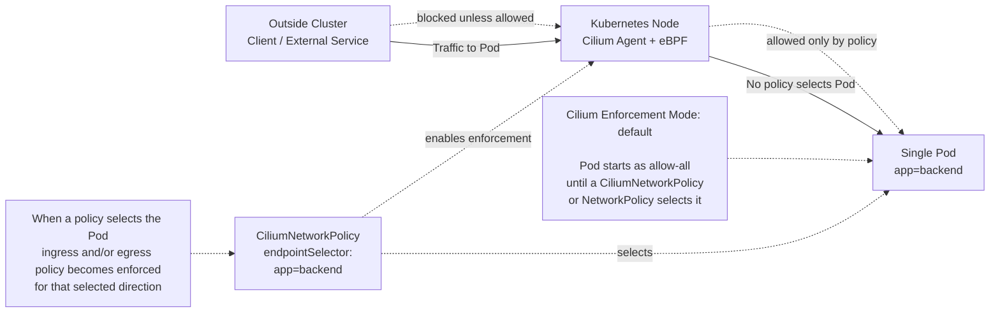
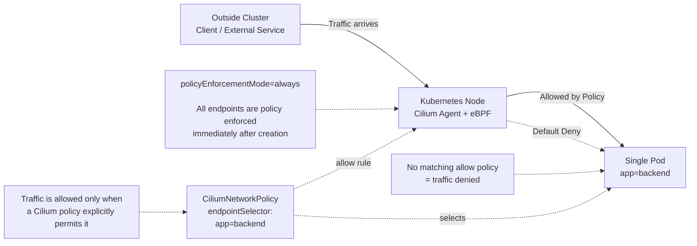
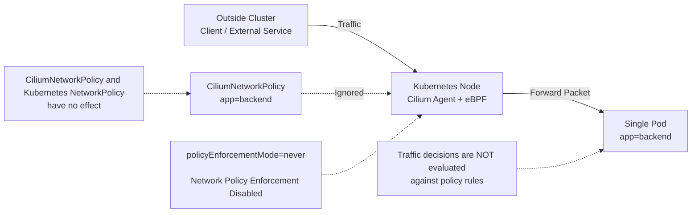

# Cilium Policy Enforcement Modes

This lab introduces the three Cilium policy enforcement modes through a series of independent, hands-on exercises designed to demonstrate how and when Cilium begins enforcing network policy within a Kubernetes cluster.

Understanding policy enforcement is a fundamental requirement for troubleshooting connectivity issues, designing secure network architectures, and working effectively with Cilium Network Policies.

The lab focuses on the following enforcement modes:

- **`default`** — Policy enforcement is activated only after a network policy selects an endpoint. Endpoints remain unrestricted until they become policy subjects.
- **`always`** — Policy enforcement is enabled for all endpoints immediately, regardless of whether any network policies currently exist.
- **`never`** — Policy enforcement is completely disabled. Traffic is not restricted, even when valid policy resources are present in the cluster.

Throughout these exercises, you will learn:

- When an endpoint transitions from unrestricted communication to policy-controlled communication.
- How policy enforcement differs between the three modes.
- How selected and non-selected endpoints behave under each mode.
- How ingress and egress policy enforcement is activated.
- How to validate enforcement behavior using Cilium tooling and Kubernetes resources.
- Common troubleshooting scenarios related to policy enforcement.

To ensure a clear understanding of each mode, every exercise uses:

- A dedicated Kind cluster configuration.
- A separate set of Kubernetes manifests.
- An isolated environment that can be created and destroyed independently.

Work through each section individually and verify the expected traffic behavior before moving on to the next enforcement mode.

## Quick Comparison

| Mode | Starting behavior | What policy objects do |
| --- | --- | --- |
| `default` | Traffic is allowed until a policy selects an endpoint. | Selected endpoints become default-deny for the selected direction. |
| `always` | Every endpoint starts default-deny. | Policies are required to allow needed traffic. |
| `never` | Traffic is always allowed. | Policies can exist, but they do not block traffic. |

The table shows the starting point for each mode. The exercises below then prove that behavior by running traffic tests before and after policy is applied.

## Choose An Exercise

Use these links to jump directly to the mode you want to study:

- [Exercise 1: Default Enforcement Mode](#exercise-1-default-enforcement-mode) - start here first; this is the normal Cilium behavior and the most important exam case.
- [Exercise 2: Always Enforcement Mode](#exercise-2-always-enforcement-mode) - use this to see strict deny-by-default behavior for every endpoint.
- [Exercise 3: Never Enforcement Mode](#exercise-3-never-enforcement-mode) - use this to prove that policy objects can exist without being enforced.

## Exercise 1: Default Enforcement Mode

### What You Are Testing

In `default` mode, Cilium does not deny traffic just because it is installed.

An endpoint becomes policy-enforced only after a policy selects it. If the policy has an `ingress` section, ingress to that endpoint becomes default-deny. If the policy has an `egress` section, egress from that endpoint becomes default-deny.

Remember for the exam:

> In `default` mode, policy enforcement is enabled only for endpoints selected by policy.



### Step 1: Create The Cluster

```bash
KIND_EXPERIMENTAL_PROVIDER=podman kind create cluster --name cilium-policy-default --config kind-config.yaml
```

### Step 2: Install Cilium In Default Mode

```bash
helm repo add cilium https://helm.cilium.io/
helm repo update

helm install cilium cilium/cilium \
  --namespace kube-system \
  --set ipam.mode=kubernetes \
  --set policyEnforcementMode=default
```

Wait for Cilium:

```bash
cilium status --wait
kubectl get nodes
```

### Step 3: Deploy The Test Pods

This creates:

- `web`: nginx server
- `good-client`: client with label `role=allowed`
- `bad-client`: client with label `role=blocked`

```bash
kubectl apply -f manifests/default/workloads.yaml

kubectl -n policy-lab wait --for=condition=Ready pod/web --timeout=120s
kubectl -n policy-lab wait --for=condition=Ready pod/good-client --timeout=120s
kubectl -n policy-lab wait --for=condition=Ready pod/bad-client --timeout=120s
```

### Step 4: Test Before Any Policy Exists

```bash
kubectl -n policy-lab exec good-client -- curl -sS --connect-timeout 3 web
kubectl -n policy-lab exec bad-client -- curl -sS --connect-timeout 3 web
```

Expected result:

- both clients reach nginx
- both commands return the nginx welcome page

Why this happens:

- no policy selects `web`
- no policy selects the clients
- `default` mode has not turned on policy enforcement for these endpoints yet

### Step 5: Apply An Ingress Policy For Web

```bash
kubectl -n policy-lab apply -f manifests/default/allow-good-client-to-web.yaml
```

This policy selects the `web` endpoint:

```yaml
endpointSelector:
  matchLabels:
    app: web
```

It allows ingress only from endpoints with:

```yaml
role: allowed
```

### Step 6: Test Again

The allowed client should work:

```bash
kubectl -n policy-lab exec good-client -- curl -sS --connect-timeout 3 web
```

The blocked client should fail:

```bash
kubectl -n policy-lab exec bad-client -- curl -sS --connect-timeout 3 web
```

Expected result:

- `good-client` reaches nginx
- `bad-client` times out or fails to connect

### Step 7: Explain The Result

The policy selected `web` and contained an `ingress` rule.

That means:

- ingress policy enforcement turned on for `web`
- traffic entering `web` became default-deny
- `good-client` was explicitly allowed
- `bad-client` was not allowed

The clients are not selected by an egress policy in this exercise. This test is about ingress enforcement on the server Pod.

### Cleanup

```bash
KIND_EXPERIMENTAL_PROVIDER=podman kind delete cluster --name cilium-policy-default
```

## Exercise 2: Always Enforcement Mode

### What You Are Testing

In `always` mode, every endpoint starts in default-deny.

This means a normal request can fail for several reasons:

- the client may not be allowed to perform DNS lookup
- the client may not be allowed to send egress traffic to the server
- the server may not be allowed to receive ingress traffic from the client

Remember for the exam:

> In `always` mode, every endpoint starts in default-deny, even before you create a policy.



### Step 1: Create The Cluster

```bash
KIND_EXPERIMENTAL_PROVIDER=podman kind create cluster --name cilium-policy-always --config kind-config.yaml
```

### Step 2: Install Cilium In Always Mode

```bash
helm repo add cilium https://helm.cilium.io/
helm repo update

helm install cilium cilium/cilium \
  --namespace kube-system \
  --set ipam.mode=kubernetes \
  --set policyEnforcementMode=always
```

Wait for Cilium:

```bash
cilium status --wait
kubectl get nodes
```

### Step 3: Deploy The Test Pods

This creates:

- `web`: nginx server
- `client`: curl client

```bash
kubectl apply -f manifests/always/workloads.yaml

kubectl -n policy-lab wait --for=condition=Ready pod/web --timeout=120s
kubectl -n policy-lab wait --for=condition=Ready pod/client --timeout=120s
```

### Step 4: Test Before Any Policy Exists

```bash
kubectl -n policy-lab exec client -- curl -sS --connect-timeout 3 web
```

Expected result:

- the request fails

Why this happens:

- DNS egress is not allowed
- HTTP egress from `client` is not allowed
- HTTP ingress into `web` is not allowed

### Step 5: Allow DNS Between The Client And CoreDNS

The client uses the Service name `web`, so it needs DNS access to CoreDNS.

In `always` mode, CoreDNS is also a default-deny endpoint. The DNS policy therefore has three parts:

- egress from `client` to CoreDNS
- ingress into CoreDNS from `client`
- egress from CoreDNS to the Kubernetes API server, so CoreDNS can resolve Kubernetes Services

```bash
kubectl apply -f manifests/always/allow-client-dns.yaml
```

Test again:

```bash
kubectl -n policy-lab exec client -- curl -sS --connect-timeout 3 web
```

Expected result:

- the request still fails

Why this happens:

- DNS is now allowed, and CoreDNS can reach the Kubernetes API server
- HTTP egress from `client` is still not allowed
- HTTP ingress into `web` is still not allowed

### Step 6: Allow Client Egress To Web

```bash
kubectl -n policy-lab apply -f manifests/always/allow-client-egress-to-web.yaml
```

Test again:

```bash
kubectl -n policy-lab exec client -- curl -sS --connect-timeout 3 web
```

Expected result:

- the request still fails

Why this happens:

- DNS is allowed
- HTTP egress from `client` to `web` is allowed
- HTTP ingress into `web` is still not allowed

### Step 7: Allow Web Ingress From Client

```bash
kubectl -n policy-lab apply -f manifests/always/allow-web-ingress-from-client.yaml
```

Test again:

```bash
kubectl -n policy-lab exec client -- curl -sS --connect-timeout 3 web
```

Expected result:

- the request succeeds
- nginx returns its welcome page

### Step 8: Explain The Result

The successful request needed these permissions:

- DNS egress from `client` to CoreDNS, DNS ingress into CoreDNS from `client`, and CoreDNS egress to the Kubernetes API server
- HTTP egress from `client` to `web`
- HTTP ingress into `web` from `client`

This is the main difference from `default` mode. In `default` mode, endpoints become default-deny only after policy selects them. In `always` mode, endpoints are default-deny from the beginning.

### Cleanup

```bash
KIND_EXPERIMENTAL_PROVIDER=podman kind delete cluster --name cilium-policy-always
```

## Exercise 3: Never Enforcement Mode

### What You Are Testing

In `never` mode, Cilium policy enforcement is disabled.

Policy objects can still be created, but they do not block traffic.

Remember for the exam:

> In `never` mode, Cilium does not enforce policy, even if policy objects exist.



### Step 1: Create The Cluster

```bash
KIND_EXPERIMENTAL_PROVIDER=podman kind create cluster --name cilium-policy-never --config kind-config.yaml
```

### Step 2: Install Cilium In Never Mode

```bash
helm repo add cilium https://helm.cilium.io/
helm repo update

helm install cilium cilium/cilium \
  --namespace kube-system \
  --set ipam.mode=kubernetes \
  --set policyEnforcementMode=never
```

Wait for Cilium:

```bash
cilium status --wait
kubectl get nodes
```

### Step 3: Deploy The Test Pods

This creates:

- `web`: nginx server
- `good-client`: client with label `role=allowed`
- `bad-client`: client with label `role=blocked`

```bash
kubectl apply -f manifests/never/workloads.yaml

kubectl -n policy-lab wait --for=condition=Ready pod/web --timeout=120s
kubectl -n policy-lab wait --for=condition=Ready pod/good-client --timeout=120s
kubectl -n policy-lab wait --for=condition=Ready pod/bad-client --timeout=120s
```

### Step 4: Test Before Any Policy Exists

```bash
kubectl -n policy-lab exec good-client -- curl -sS --connect-timeout 3 web
kubectl -n policy-lab exec bad-client -- curl -sS --connect-timeout 3 web
```

Expected result:

- both clients reach nginx
- both commands return the nginx welcome page

### Step 5: Apply A Policy That Would Normally Block Bad-Client

```bash
kubectl -n policy-lab apply -f manifests/never/allow-good-client-to-web.yaml
```

This policy looks like the `default` mode policy. It selects `web` and allows ingress only from `role=allowed`.

In `default` mode, this would block `bad-client`.

In `never` mode, it does not block anything.

### Step 6: Test Again

```bash
kubectl -n policy-lab exec good-client -- curl -sS --connect-timeout 3 web
kubectl -n policy-lab exec bad-client -- curl -sS --connect-timeout 3 web
```

Expected result:

- `good-client` still reaches nginx
- `bad-client` also still reaches nginx

### Step 7: Explain The Result

Cilium was installed with:

```bash
--set policyEnforcementMode=never
```

That disables endpoint policy enforcement.

The policy object exists in Kubernetes, but it does not change traffic behavior.

### Cleanup

```bash
KIND_EXPERIMENTAL_PROVIDER=podman kind delete cluster --name cilium-policy-never
```

## Exam Notes

- `default` is the most common mode.
- In `default` mode, selected endpoints become default-deny only for the policy direction being enforced.
- In `always` mode, every endpoint starts default-deny.
- In `never` mode, policy objects do not block traffic.
- Ingress policy controls traffic entering the selected endpoint.
- Egress policy controls traffic leaving the selected endpoint.
- DNS is often required before HTTP tests using Service names can work.

## Optional Checks

Use these commands while studying if you want to inspect objects during the lab:

```bash
kubectl -n policy-lab get pods --show-labels
kubectl -n policy-lab get svc
kubectl -n policy-lab get ciliumnetworkpolicies
kubectl -n kube-system get pods -l k8s-app=cilium
```
